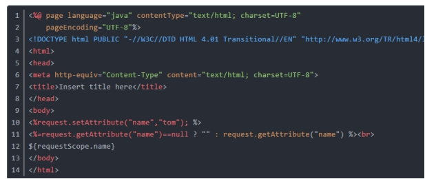
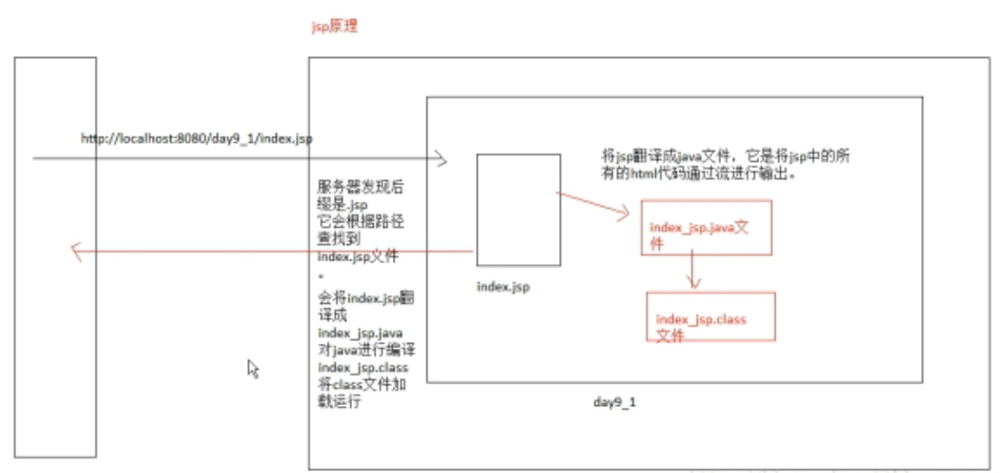

# 1. 什么是JSP

​	JSP全名为Java Server Pages，中文名叫java服务器页面，其根本是一个简化的Servlet设计，它 是由Sun Microsystems公司倡导、许多公司参与一起建立的一种动态网页技术标准。JSP技术有点类似ASP技术，它是在传统的网页HTML文件(\*.htm,\*.html)中插入Java程序段(Scriptlet)和JSP标记(tag)，从而形成JSP文件，后缀名为(*.jsp)。 用JSP开发的Web应用是跨平台的，既能在Linux下运行，也能在其他操作系统上运行。

​     JSP将网页逻辑与网页设计的显示分离，支持可重用的基于组件的设计，使基于Web的应用程序的开发变得迅速和容易。

*.html  静态页面(包含固定的页面内容)

*.jsp     动态页面(页面数据可以动态更新,支持嵌套java代码和html代码)

# 2. JSP为什么会出现

```
1.servlet展示信息的不方便，引入了JSP。
2.JSP本质上也是一个servlet！！！！！！
3.JSP就是在HTML页面中嵌入了java代码。
```

#  3.JSP中如何嵌套java代码

答案:小脚本(<% java代码%>)

```
声明标签     <%!变量或者方法声明%> 
表达式标签	 <%= 表达式%> 在页面上显示的效果
程序代码标签	<%java代码%>  页面上动态展示内容
```

page指令:

​	<%@ page language="java" import="java.util.*" pageEncoding="UTF-8"%>

```
 <body>
    <%! int i=10;%><!--成员变量-->
    <%! public void show(){}%>  <!--成员方法-->
    <%=i%> <!--输出变量值-->
  </body>
```

如果把一个数据存在request域中，取值操作如下：

 

jsp中的注释

```
<!-- html注释内容,查看源码时能看到 -->
<%-- jsp注释,查看页面源码时看不到 --%>
```

# 4. JSP的原理

 

当浏览器访问http://localhost:8080/day9_1/index.jsp。服务器发现后缀为.jsp，它会根据路径找到index.jsp文件，会将index.jsp翻译成index_jsp.java文件，对这个java文件进行编译，产生一个index_jsp.class文件，将class文件加载运行。将JSP翻译成java文件，它是将JSP中的所有的HTML代码通过流进行输出，也就是说最终翻译成class，被虚拟机加载，它本质是servlet，它就会往回响应，响应回去就是把JSP中的HTML代码以流的方式写回浏览器。所以在JSP中展示出了HTML代码

# 5. JSP的内置对象

 JSP中一共预先定义了9个这样的对象，分别为：request、response、session、application、out、pagecontext、config、page、exception

**1、request对象**

　　		request 对象是 javax.servlet.httpServletRequest类型的对象。 该对象代表了客户端的请求信息，主要用于接受通过HTTP协议传送到服务器的数据。（包括头信息、系统信息、请求方式以及请求参数等）。request对象的作用域为一次请求。

**2、response对象**

　　		response 代表的是对客户端的响应，主要是将JSP容器处理过的对象传回到客户端。response对象也具有作用域，它只在JSP页面内有效。所属类型:HttpServletResponse

**3、session对象**

　　		session 对象是由服务器自动创建的与用户请求相关的对象。服务器为每个用户都生成一个session对象，用于保存该用户的信息，跟踪用户的操作状态。session对象内部使用Map类来保存数据，因此保存数据的格式为 “Key/value”。 session对象的value可以使复杂的对象类型，而不仅仅局限于字符串类型。HttpSession

**4、application对象**

 　		application 对象可将信息保存在服务器中，直到服务器关闭，否则application对象中保存的信息会在整个应用中都有效。与session对象相比，application对象生命周期更长，类似于系统的“全局变量” ServletContext

 区别：

   request:单次请求

   session:浏览器访问期间(会话期间)

   application:服务器启动期间,所存的数据可以跨浏览器

**5、out 对象**

　　		out 对象用于在Web浏览器内输出信息，并且管理应用服务器上的输出缓冲区。在使用 out 对象输出数据时，可以对数据缓冲区进行操作，及时清除缓冲区中的残余数据，为其他的输出让出缓冲空间。待数据输出完毕后，要及时关闭输出流。

示例:

```
out.print("<script type='text/javascript'>alert('用户名不存在');location.href='index.jsp'</script>");
```

**6、pageContext 对象**

　	　		pageContext 对象的作用是取得任何范围的参数，通过它可以获取 JSP页面的out、request、reponse、session、application 等对象。pageContext对象的创建和初始化都是由容器来完成的，在JSP页面中可以直接使用 pageContext对象。

**7、config 对象**

　　config 对象的主要作用是取得服务器的配置信息。通过 pageConext对象的 getServletConfig() 方法可以获取一个config对象。当一个Servlet 初始化时，容器把某些信息通过config对象传递给这个 Servlet。 开发者可以在web.xml 文件中为应用程序环境中的Servlet程序和JSP页面提供初始化参数。

```
//将image路径转换成服务器端的路径
String url= config.getServletContext().getRealPath("/image");
<h1>url=<%=url %></h1>
```

**8、page 对象**

　　		page 对象代表JSP本身，只有在JSP页面内才是合法的。 page隐含对象本质上包含当前 Servlet接口引用的变量，类似于Java编程中的 this 指针。

**9、exception 对象**

　　exception 对象的作用是显示异常信息，只有在包含 isErrorPage="true" 的页面中才可以被使用，在一般的JSP页面中使用该对象将无法编译JSP文件。excepation对象和Java的所有对象一样，都具有系统提供的继承结构。exception 对象几乎定义了所有异常情况。在Java程序中，可以使用try/catch关键字来处理异常情况； 如果在JSP页面中出现没有捕获到的异常，就会生成 exception 对象，并把 exception 对象传送到在page指令中设定的错误页面中，然后在错误页面中处理相应的 exception 对象。

(1)先在可能发生错误的页面中添加errorPage属性:

```
<%@ page pageEncoding="utf-8"
        errorPage="error.jsp"
         contentType="text/html;charset=UTF-8" language="java" %>
```

(2) 在error.jsp页面中设置isErrorPage="true" 的属性

   (使用exception对象之前，需要先将当前页面设置成错误页面）

```
<%@ page language="java" isErrorPage="true" import="java.util.*" pageEncoding="UTF-8"%>
```

jsp的作用域:

pageContext   ->     request           ->       session      ->        application

 当前页面                单次请求有效         当前会话期间        服务器运行期间有效

# 6. JSP的指令

JSP指令用来设置整个JSP页面相关的属性，如网页的编码方式和脚本语言。

语法格式如下：

```
<%@ directive attribute="value" %>
directive：指令名称  attribute 属性名 value:属性值
```

| **指令名称** | **描述**                                                    |
| ------------ | ----------------------------------------------------------- |
| **page**     | **定义网页依赖属性，比如脚本语言、error页面、缓存需求等等** |
| **include**  | **包含其他文件**                                            |
| **taglib**   | **引入标签库的定义**                                        |

 **(1)Page指令**

Page指令为容器提供当前页面的使用说明**一个JSP页面可以包含多个page指令**

Page指令的语法格式：

**<%@ page attribute="value" %>**

| **属性名**       | **属性值**                | **描述**                                                     |
| ---------------- | ------------------------- | ------------------------------------------------------------ |
| **language**     | **java**                  | **解释该JSP文件时采用的语言，一般为java语言，默认为java**    |
| **extends**      | **任何类的全名**          | 编译该JSP文件时继承哪个类，JSP为Servlet，因此当指明继承普通类时需要实现Servlet的init、destroy等方法 |
| **import**       | **任何包名、类名**        | **引入该JSP中用到的类、包等，import是唯一可以声明多次的page指令属性，一个import可以引用uogelei，中间用英文逗号隔开<%@ page import=包名.类名，包名.类名%>** |
| **session**      | **true、false**           | **该JSP内是否内置Session对象，如果为true，则内置Session对象，可直接使用，否则反之，默认为true** |
| **autoFlush**    | **true，false**           | 是否运行缓存，如果为true，则使用out.println()等方法输出的字符串并不是立刻到达客户端服务器的，而是暂时存到缓存里，缓存满了或者程序行完毕或者执行out.flush()操作时才到客户端，默认为true。 |
| **buffer**       | **none或者数字KB**        | **指定缓存大小，当autoFlush设为true时有效，例如<%@ page buffer=10kb%>** |
| **isThreadSafe** | **true，false**           | **是否线程安全，如果为true，则运行多个线程同时运行该jsp程序，否则只运行一个线程，其余线程等待，默认为false** |
| **isErrorPage**  | **true，false**           | **指定该页面是否为错误显示页面，如果为true，则该JSP内置有一个Exception对象exception，可直接使用，否则没有，默认为false** |
| **errorPage**    | **某个JSP页面的相对路径** | **指明一个错误页面，如果该JSP程序抛出一个未捕捉的异常，则转到errorPage指定的页面，errorPage指定的页面通常isErrorPage属性为true，且内置的exception对象为未捕捉的异常** |
| **contentType**  | **有效的文档类型**        | **客户端浏览器根据该属性判断文档类型，例如 HTML格式为text/html、纯文本格式为text/plain、JPG图像为image/jpeg、GIF图像为image/gifWORD文档为application/msword，该属性常跟着charset设置编码一起，作用是通知服务器和浏览器都使用同一个码表** |
| **pageEncoding** | **UTF-8,ISO-8859-1等**    |                                                              |

 **(2) Include指令**

JSP可以通过include指令来包含其他文件。**被包含的文件可以是JSP文件、HTML文件或文本文件**。包含的文件就好像是该JSP文件的一部分，会被同时编译执行。

Include指令的语法格式如下：

```java
<%@ include file="文件相对 url 地址" %>
```

include 指令中的文件名实际上是一个相对的 URL 地址。

如果您没有给文件关联一个路径，JSP编译器默认在当前路径下寻找。

**(3)Taglib指令**

​			JSP API允许用户自定义标签，一个自定义标签库就是自定义标签的集合。

​			Taglib指令引入一个自定义标签集合的定义，包括库路径、自定义标签。

```java
<%@ taglib uri="uri" prefix="" %>
```

uri属性确定标签库的位置，prefix属性指定标签库的前缀(可自定义)。

# 7. JSP出现的状态码

| 状态码 | 消息                       | 描述                                                         |
| ------ | -------------------------- | ------------------------------------------------------------ |
| 100    | Continue                   | 只有一部分请求被服务器接收，但只要没被服务器拒绝，客户端就会延续这个请求 |
| 101    | Switching Protocols        | 服务器交换机协议                                             |
| 200    | OK                         | 请求被确认                                                   |
| 201    | Created                    | 请求时完整的，新的资源被创建                                 |
| 202    | Accepted                   | 请求被接受，但未处理完                                       |
| 300    | Multiple Choices           | 一个超链接表，用户可以选择一个超链接并访问，最大支持5个超链接 |
| 301    | Moved Permanently          | 被请求的页面已经移动到了新的URL下                            |
| 302    | Found                      | 被请求的页面暂时性地移动到了新的URL下                        |
| 303    | See Other                  | 被请求的页面可以在一个不同的URL下找到                        |
| 400    | Bad Request                | 服务器无法识别请求                                           |
| 403    | Forbidden                  | 禁止访问所请求的页面                                         |
| 404    | Not Found                  | 服务器无法找到所请求的页面                                   |
| 405    | Method Not Allowed         | 请求中所指定的方法不被允许                                   |
| 500    | Internal Server Error      | 请求不完整，服务器遇见了出乎意料的状况                       |
| 501    | Not Implemented            | 请求不完整，服务器不提供所需要的功能                         |
| 502    | Bad Gateway                | 请求不完整，服务器从上游服务器接受了一个无效的响应           |
| 503    | Service Unavailable        | 请求不完整，服务器暂时重启或关闭                             |
| 504    | Gateway Timeout            | 网关超时                                                     |
| 505    | HTTP Version Not Supported | 服务器不支持所指定的HTTP版本                                 |

# **8.** EL表达式

**（1）什么Expression Language 表达式语言**

最初定义于JSTL1.0部分

在JSP2.0中，EL从JSTL中剥离出来，放置在JSP规范中，称为JSP2.0规范的一部分

在JSP中使用EL表达式，可以简化对象和变量的访问是EL表达式

**（2）EL表达式语法**

​	语法格式：**${需要展示信息的名字}**

​	注意：

**当表达式没有指定变量或者对象的范围时，**

**那么容器会依次从pageContext—>request—>session—>application中查找该变量或对象,我们可以通过隐含对象获得指定作用域的值:**

pageScope对象，用于获取当前页面的属性值

requestScope对象，用于获取请求范围的属性值

sessionScope对象，用于获取会话范围的属性值

applicationScope对象，用于获取程序范围的属性值

语法:

  ${requestScope.key}


**（3）EL中基础操作符**

| 术语   | 定义                                                         |
| ------ | ------------------------------------------------------------ |
| 算术型 | + 、-、 * /(div) 除 、 %(mod) 余数                           |
| 逻辑型 | and、&&、or、\|\|、!、not                                    |
| 关系型 | ==、eq、!=、ne、、gt、<=、le、>=、ge。可以与其他值进行比较，或与布尔型、字符串型、整型或浮点型文字进行比较。 |
| Empty  | Empty操作符是一个前缀操作符用于判断一个值是否为null或者为empty如String str = “”; ${empty str} 返回值为true; |
| 条件型 | A ?B :C。根据 A 赋值的结果来赋值 B 或 C。                    |

示例:

```
单个变量：${a+10}<br>
单个变量：${s}<br> 
单个对象：${key.属性名}
    //对象类型 
      Users u=new Users();
      u.setName("王老五");
      u.setPass("abc");
      pageContext.setAttribute("u1",u);
       user.name=${u1.name}
       user.pass=${u1.pass} 
 // list集合对象:   
   	  List list=new ArrayList();
          list.add("刘能");
          list.add(30);
          list.add(u);
      pageContext.setAttribute("list2",list);
       list1=${list2[0]}<br/>
       list2=${list2[1]}<br/>
       list3=${list2[2].pass}<br/>

// map集合:  
       k1=${map1.k1}<br> 
       k2=${map1.k2.username}---  ${map1.k2.password}

 判断变量是否有值或是否存在:${empty key值}
         List list2=new ArrayList();
         list2.add("aa");
         request.setAttribute("list222",list2);

判断list中是否有数据:${empty list222}        
```

# **9.** **JSTL**

#### **(1)** 什么是JSTL

JSP标准标签库（JSTL）是一个**JSP标签集合，它封装了JSP应用的通用核心功能。**

JSTL支持通用的、结构化的任务，比如**迭代，条件判断，XML文档操作，国际化标签，SQL标签。 除了这些，它还提供了一个框架来使用集成JSTL的自定义标签。**

根据JSTL标签所提供的功能，可以将其分为5个类别。**核心标签 格式化标签 sql标签 xml标签 jstl函数（后面详细解释）**

 

#### **(2)** **JSTL的作用和语法格式**

**作用：简化jsp页面编写代码**

**语法格式：**

1. 下载 jakarta-taglibs-standard-1.1.2.zip 包并解压，将 jakarta-taglibs-standard-1.1.2/lib/ 下的两个 jar 文件：standard.jar 和 jstl.jar 文件拷贝到 /WEB-INF/lib/ 下。

2. 在JSP页面中引入<%@ taglib prefix=”页面使用的名称” uri=”功能范围的路径”%>

| 功能范围  | Uri                                   | 前缀 |
| --------- | ------------------------------------- | ---- |
| core      | http://java.sun.com/jsp/jstl/core     | c    |
| i18n      | http://java.sun.com/jsp/jstl/fmt      | fmt  |
| sql       | http://java.sun.com/jsp/jstl/sql      | sql  |
| xml       | http://java.sun.com/jsp/jstl/xml      | x    |
| functions | http://java.sun.com/jsp/jstl/function | fn   |

#### **(3)** 核心标签

①核心标签是最常用的 JSTL标签。引用核心标签库的语法如下：

```java
<%@ taglib prefix="c" uri="http://java.sun.com/jsp/jstl/core" %>
```

**② 核心标签的分类**

**表达式操作 out、set、remove、catch** 

**流程控制 if、choose、when、otherwise** 

**迭代操作 forEach、forTokens** 

**URL操作 import、param、url、redirect**

**Set标签**

**＜c:set> 主要用来将变量存储至JSP范围中 或是JavaBean的属性或Map对象中** 

| 名称     | 说明                 | 是否必须写 | 默认值 |
| -------- | -------------------- | ---------- | ------ |
| Value    | 要被存储的值         | 否         | 无     |
| var      | 存入的变量名称       | 否         | 无     |
| scope    | var变量的JSP范围     | 否         | Page   |
| target   | JavaBean或Map对象    | 否         | 无     |
| property | 指定target对象的属性 | 否         | 无     |

**＜c:out>主要用来显示数据的内容**

| 名称      | 说明                                   | 是否必须写 | 默认值 |
| --------- | -------------------------------------- | ---------- | ------ |
| value     | 需要显示出来的值                       | 是         | 无     |
| default   | 如果value的值为null，则显示default的值 | 否         | 无     |
| escapeXml | 是否转换特殊字符，如：＜转换成 & lt;   | 否         | True   |

**＜c:remove> 主要负责移除变量** 

| 名称  | 说明             | 是否必须写 | 默认值 |
| ----- | ---------------- | ---------- | ------ |
| Var   | 欲移除的变量名称 | 是         | 无     |
| Scope | var变量的jsp范围 | 否         | Page   |

**＜c:if> 主要用于进行if判断,如果为true,则输出标签体中的内容**   

| 名称  | 说明                                          | 是否必须写 | 默认值 |
| ----- | --------------------------------------------- | ---------- | ------ |
| Test  | 表达式的结果为true，则执行体内容，false则相反 | 是         | 无     |
| var   | 如果  用来存储test运算的结果(true或false)     | 否         | 无     |
| scope | Var变量的JSP范围                              | 否         | page   |

 

**＜c:choose>,＜c:when>,＜c:otherwise> 作用相当于if-else**   

| 名称 | 说明                                              | 必须 | 默认 |
| ---- | ------------------------------------------------- | ---- | ---- |
| test | 如果表达式的结果为true，则执行体内容，false则相反 | 是   | 无   |

 

**＜c:forEach> 循环控制，它可以将数组,集合(Collection)中的成员循序浏览一遍。**          

| 名称      | 说明                         | 必须 | 默认值       |
| --------- | ---------------------------- | ---- | ------------ |
| var       | 用来存放现在指定的成员       | 是   | 无           |
| items     | 被迭代的集合对象             | 否   | 无           |
| varStatus | 用来存放现在指的相关成员信息 | 否   | 无           |
| begin     | 开始的位置                   | 否   | 0            |
| end       | 结束的位置                   | 否   | 最后一个成员 |
| step      | 每次迭代的间隔数             | 否   | 1            |

 

#### **(4)格式化标签**

**1、fmt:formatDate 作用：将日期类型格式化为指定模式的字符串** 

属性 

value:将要被格式化的数据 

pattern：格式化的模式，与SimpleDateFormat的参数设置一样 

var:格式化后的字符串所要存放的变量，若不指定var，则会将格式化的结果直接显示在页面 

scope：变量存放的域属性空间，默认page 

type：其取值为date、time、both，表示给出的value是日期、时间、还是两者都包含，默认是date

**2、fmt:parseDate 作用：用于将指定字符串转化为日期类型** 

<fmt:parseDate value="${now }" pattern="yyyy-MM-dd" var="today"/>

Value服务器获取的时间

Pattern:转换的格式

Var:页面显示的变量

**3、fmt:formatNumber 按照指定格式对数字进行格式化** 

属性 

maxIntegerDigits：整数部分最多的位数 

minIntegerDigits：整数部分最少的位数 

maxFrctionDigits：小数部分最多的位数 

minFrctionDigits：小数部分最少的位数 

var：存储格式化结果的变量 

scope：var属性的作用域 

integerOnly：是否只解析整型数true或者浮点数false 


