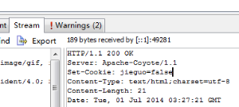
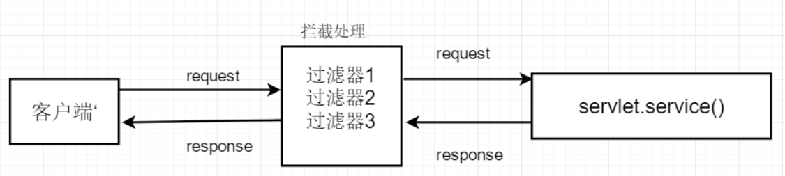
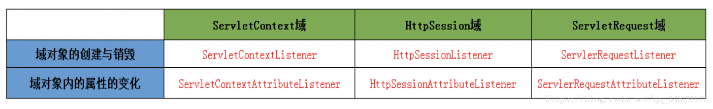

# Session和Cookie

## 什么是会话跟踪技术	

会话跟踪是Web程序中常用的技术，用来跟踪用户的整个会话。保持对用户会话期间的数据管理。常用的会话跟踪技术是Cookie与Session。

Cookie通过在客户端记录信息确定用户身份

Session通过在服务器端记录信息确定用户身份。

## Cookie

### 		1.什么是cookie				

```
	Cookie是客户端(一般指浏览器)请求服务器后,服务器发给客户端的一个辨认标识，保存在客户端，当客户端再次向服务器发送请求时，会携带着这个辨认标识，服务器就可以通过这个标识来识别客户端的身份或状态等。
   Cookie的作用：跟踪会话，记录一次会话中(即Session，一次会话可能会有多次请求，当然也可以有多个Cookie来跟踪不同的信息)的信息，这样服务器就会知道用户的状态，比如有没有登录成功，付款时购物车中的东西等，就相当于贴在客户端脑门上的纸条，浏览器看不到，但服务器看得到。
```

### 		2.Cookie的应用

**2.1 保持用户登录状态**

将用户的信息保存到Cookie中，并发送给浏览器，并且将有效时间设置为一个较长的时间，这样浏览器在以后访问网站时，都会带着该Cookie，服务器以此来辨识用户，用户就不再需要输入用户名和密码等信息。

**2.2  记录用户名**

​		一旦用户登录成功以后，下次再登录时，直接将Cookie中的用户名读取并显示出来，这样用户就不需要再次输入用户名，只输入密码即可。							

### 	   3. Cookie的设置和获取

**3.1 、通过HttpServletResponse.addCookie的方式设置Cookie**

​	注意:new Cookie()时两个参数都是字符串

```java
		Cookie cookie = new Cookie("jieguo","true");
		response.addCookie(cookie);
```

**3.2、浏览器中查看cookie的内容**



**3.3、服务端获取客户端携带的cookie：通过HttpServletRequest获取**    

```java
<%				
				Cookie[] cookies = request.getCookies();
					if(cookies != null)
						for(Cookie c : cookies){
							String name = c.getName();//获取Cookie名称
							if("jieguo".equals(name)){
								String value = c.getValue();//获取Cookie的值
								bool = Boolean.valueOf(value);//将值转为Boolean类型
							}
						}
%>
```

### **4.删除Cookie**

通过设置同名Cookie的最大存活时间为0，删除Cookie是指使浏览器不再保存Cookie，使Cookie立即失效

举例：使name为username的Cookie立即失效

```java
//1.创建一个name为username的Cookie
Cookie cookie = new Cookie("username", "aaa");
//2.设置Cookie的有效时间为0
cookie.setMaxAge(0);//删除cookie的关键
//3.将cookie发送给浏览器，来替换同名Cookie
response.addCookie(cookie);           
```

**Cookie的有效时间**

 Cookie发送给浏览器以后，浏览器并不会永久保存，也就是到了一定的时间以后浏览器会自动销毁Cookie。Cookie的默认有效时间为一次会话(一次打开关闭浏览器的过程)，我们也可以手动指定Cookie的有效时间

```java
   			//setMaxAge用来设置Cookie的最大有效时间，需要int型的参数，代表有效的秒数
   			cookie.setMaxAge(秒数)；
   			//当参数大于0时，会设置为指定的秒数
   			cookie.setMaxAge(30);
   			//当参数等于0时,浏览器不会保存Cookie,Cookie立即失效
   			cookie.setMaxAge(0);
   			//当参数小于0时，和不设置是一样，当前会话有效
   			cookie.setMaxAge(-100);
   			//设置一个永久有效的Cookie，并非永久，只是使Cookie的生命很长而已
   			cookie.setMaxAge(60*60*24*365*10);

```

## Session

#### 1.什么是Session

Session是另一种记录客户状态的机制，不同的是Cookie保存在客户端浏览器中，而Session保存在服务器上。客户端浏览器访问服务器的时候，服务器把客户端信息以某种形式记录在服务器上。这就是Session。客户端浏览器再次访问时只需要从该Session中查找该客户的状态就可以了。

如果说Cookie机制是通过检查客户身上的“通行证”来确定客户身份的话，那么Session机制就是通过检查服务器上的“客户明细表”来确认客户身份。Session相当于程序在服务器上建立的一份客户档案，客户来访的时候只需要查询客户档案表就可以了。

#### 2.创建Session的格式

​		Session对应的类为javax.servlet.http.HttpSession类。每个来访者对应一个Session对象，所有该客户的状态信息都保存在这个Session对象里。**Session对象是在客户端第一次请求服务器的时候创建的**。

 		Session也是一种key-value的属性对，通过getAttribute(Stringkey)和setAttribute(String key，Objectvalue)方法读写客户状态信息。Servlet里通过request.getSession()方法获取该客户的 Session

例如：

```java
HttpSession session = request.getSession();    // 获取Session对象
session.setAttribute("loginTime", new Date());   // 设置Session中的属性
out.println("登录时间为：" +(Date)session.getAttribute("loginTime"));   // 获取Session属性
```

#### 3.Session的生命周期

Session保存在服务器端。**为了获得更高的存取速度，服务器一般把Session放在内存里。每个用户都会有一个独立的Session。如果Session内容过于复杂，当大量客户访问服务器时可能会导致内存溢出。因此，Session里的信息应该尽量精简。**

Session在用户第一次访问服务器的时候自动创建。需要注意只有访问JSP、Servlet等程序时才会创建Session，只访问HTML、IMAGE等静态资源并不会创建Session。如果尚未生成Session，也可以使request.getSession(true)强制生成Session。

Session生成后，只要用户继续访问，服务器就会更新Session的最后访问时间，并维护该Session。用户每访问服务器一次，无论是否读写Session，服务器都认为该用户的Session“活跃（active）”了一次。

由于会有越来越多的用户访问服务器，因此Session也会越来越多。**为防止内存溢出，服务器会把长时间内没有活跃的Session从内存删除。这个时间就是Session的超时时间。如果超过了超时时间没访问过服务器，Session就自动失效了。**

Session的超时时间为maxInactiveInterval属性，可以通过对应的getMaxInactiveInterval()获取，通过			setMaxInactiveInterval(longinterval)修改。

Session的超时时间也可以在web.xml中修改。另外，通过调用Session的invalidate()方法可以使Session失效。	

```java
<session-config>   
    <session-timeout>30</session-timeout> 
</session-config>
```

#### 4.Session常用的方法	

| 方 法 名                                          | 描  述                                                       |
| ------------------------------------------------- | ------------------------------------------------------------ |
| void setAttribute(String attribute, Object value) | 设置Session属性。value参数可以为任何Java Object。通常为Java Bean。value信息不宜过大 |
| String getAttribute(String attribute)             | 返回Session属性                                              |
| Enumeration getAttributeNames()                   | 返回Session中存在的属性名                                    |
| void removeAttribute(String attribute)            | 移除Session属性                                              |
| String getId()                                    | 返回Session的ID。该ID由服务器自动创建，不会重复              |
| long getCreationTime()                            | 返回Session的创建日期。返回类型为long，常被转化为Date类型，例如：Date createTime = new Date(session.get CreationTime()) |
| long getLastAccessedTime()                        | 返回Session的最后活跃时间。返回类型为long                    |
| int getMaxInactiveInterval()                      | 返回Session的超时时间。单位为秒。超过该时间没有访问，服务器认为该Session失效 |
| void setMaxInactiveInterval(int second)           | 设置Session的超时时间。单位为秒                              |
| boolean isNew()                                   | 返回该Session是否是新创建的                                  |
| void invalidate()                                 | 使该Session失效                                              |

#### 5.Session的应用场景

​		代码演示：1.登录  2.退出(创建Session和消除Session)

#### 6.Session和Cookie的区别

(1) Cookie数据保存在客户端，Session数据保存在服务器端。

(2) Session是由应用服务器维持的一个服务器端的存储空间，用户在连接服务器时，会由服务器生成一个唯一的SessionID,用该SessionID 为标识符来存取服务器端的Session存储空间。而SessionID这一数据则是保存到客户端，用Cookie保存的，用户提交页面时，会将这一SessionID提交到服务器端，来存取Session数据。这一过程，是不用开发人员干预的。所以一旦客户端禁用Cookie，那么Session也会失效。

(3) Cookies是属于Session对象的一种。但有不同，Cookies不会占服务器资源，是存在客服端内存或者一个Cookie的文本文件中；而Session则会占用服务器资源。所以，尽量不要使用Session，而使用Cookies。但是我们一般认为Cookie是不可靠的，Cookies是保存在本机上的，但是其信息的完全可见性且易于本地编辑性，往往可以引起很多的安全问题Session是可靠地。但是目前很多著名的站点也都用Cookie。


# 过滤器(Filter)

## 	1.什么是过滤器		

​		过滤器实际上就是对web资源进行拦截，做一些处理后再交给下一个过滤器或servlet处理，通常都是用来拦截request进行处理的，也可以对返回的response进行拦截处理

## 	  2.过滤器的语法格式

2.1.创建一个类实现Filter接口

```java
public class CharSetFilter implements Filter{}
```

2.2.重写接口中的方法

```java
public void destroy() { //销毁的方法}
public void doFilter(ServletRequest req, ServletResponse resp, FilterChain chain) throws ServletException, IOException {
   					//过滤方法 主要是对request和response进行一些处理，然后交给下一个过滤器或Servlet处理
    				chain.doFilter(req, resp);
			}

public void init(FilterConfig config) throws ServletException {
					/*初始化方法  接收一个FilterConfig类型的参数 该参数是对Filter的一些配置*/
            }
```

2.3.在web.xml文件中配置

```java
			<filter>
    				<filter-name>过滤器名称</filter-name>
    				<filter-class>过滤器所在的路径</filter-class>
			</filter>
			<filter-mapping>
    				<filter-name>过滤器名称</filter-name>
    				<url-pattern>需要过滤的资源</url-pattern>
			</filter-mapping>
```
##       3.使用场景
3.1.如何防止用户未登录就执行后续操作

​          String name=(String)session.getAttribute("key");

​          if(name==null){

​                   //跳转到登录页面

​          }

3.2.设置编码方式--统一设置编码

3.3.加密解密(密码的加密和解密)

3.4.非法文字筛选

3.5.下载资源的限制				

 过滤器的特点:在servlet之前和之后都会被执行			


# 监听器(Listener)

### 	1.什么是监听器

​		监听器就是监听某个域对象的的状态变化的组件
​		监听器的相关概念： 
​				事件源：被监听的对象(三个域对象 request、session、servletContext)
​				监听器：监听事件源对象事件源对象的状态的变化都会触发监听器
​				注册监听器：将监听器与事件源进行绑定
​				响应行为：监听器监听到事件源的状态变化时所涉及的功能代码（程序员编写代码）

### 	2.监听器分类

​			第一维度按照被监听的对象划分：ServletRequest域、HttpSession域、ServletContext域
​			第二维度按照监听的内容分：监听域对象的创建与销毁的、监听域对象的属性变化的

###       3.监听三大域对象的创建与销毁的监听器

**监听器的编写步骤（重点）：**

​							编写一个监听器类去实现监听器接口
​							覆盖监听器的方法
​							需要在web.xml中进行配置—注册									

```java
	<listener>
       <listener-class>监听器所在的路径</listener-class> 									</listener>
```

ServletContextListener					

​						监听ServletContext域的创建与销毁的监听器

Servlet域的生命周期

​							何时创建：服务器启动创建
​							何时销毁：服务器关闭销毁

ServletContextListener监听器的主要作用

​							初始化的工作：初始化对象、初始化数据（加载数据库驱动、连接池的初始化）
​							加载一些初始化的配置文件(spring的配置文件）
​							任务调度(定时器—Timer/TimerTask）

HttpSessionListener					

​						监听Httpsession域的创建和销毁的监听器

HttpSession对象的生命周期

​							何时创建：第一次调用request.getSession时创建
​							何时销毁：服务器关闭销毁、session过期（默认30分钟，修改默认的30分钟是在Tomcat的web.xml，修改当前项目的过期时间是在自己项目的web.xml中）、手动销毁

HttpSessionListener监听器的主要作用：

​				由于每次访问网站都会默认创建session对象（jsp页面中page指令中的session属性默认为true，即被访问时创建session），可以用于计数网站访问过的人

ServletRequestListener				

​						监听ServletRequest域创建与销毁的监听器

ServletRequest的生命周期

 							创建：每一次请求都会创建request

​							 销毁：请求结束

​							用法同上，用处不是很大，此处省略。

