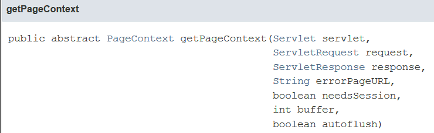
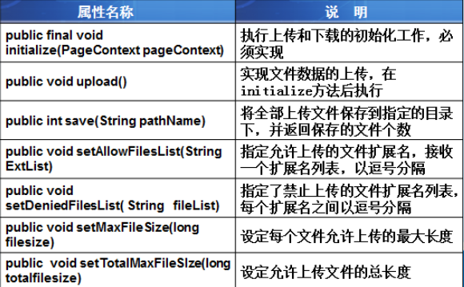

# 使用smartupload.jar实现文件上传  

1.将jar包添加到项目中:smartupload.jar

 2.准备上传的页面

```
 <form action="toUpload" method="post"  enctype="multipart/form-data" >
	书名:<input type="text" name="bookName"/><br>
 	图片:<input type="file" name="自定义名称"/><br>
	<input type="submit" value="提交"/>
</form>
```

 注:(1)form标签中要添加enctype属性

​      (2)提交方式必须是post

3.开始获取数据,保存文件

实例代码：

```java
public void upload(HttpServletRequest request, HttpServletResponse response)
	throws ServletException, IOException {
		try {
			//上传文件
			SmartUpload su=new SmartUpload();
			//获得pageContext对象
			JspFactory factory=JspFactory.getDefaultFactory();
			PageContext pagecontext=
				factory.
				getPageContext(this, request,response,
                                 null,false,1024,true);
			su.initialize(pagecontext);
			su.setCharset("utf-8");
			//实现文件数据的上传
			su.upload();
			
			File file = su.getFiles().getFile(0);
			//得到文件的基本信息
			String filename=file.getFileName();
			String type=file.getContentType();
			System.out.println("type="+type);
			String url="uploadfile/"+filename;
			//将上传文件保存到指定目录
			file.saveAs(url, SmartUpload.SAVE_VIRTUAL);
			request.setAttribute("filename",filename);
			
			String uname=su.getRequest().getParameter("uname");
			System.out.println("uname="+uname);
			request.getRequestDispatcher("success.jsp").forward(request, response);	
			
		} catch (SmartUploadException e) {
			// TODO Auto-generated catch block
			e.printStackTrace();
		}	
	}
```

注：(1)此时如果表单中有其他数据时，不能通过request直接获取，需要通过SmartUpload对象获取

​           String name=su.getRequest().getParameter("bookName");

​            并且该代码要在SmartUpload操作完成后添加

​     (2)解决乱码:

​          new String(name.getBytes("GBK"),"utf-8")

注:斜杠方向:/

注意:



| 参数          | 含义                                                         |
| ------------- | ------------------------------------------------------------ |
| servlet       | 请求的servlet，在servlet中传this即可                         |
| request       | servlet上挂起的当前请求                                      |
| response      | servlet上挂起的当前响应                                      |
| errorPageURL  | 请求JSP的错误页面的URL，或null                               |
| needsSSession | 是否需要session                                              |
| buffer        | 以字节为单位的缓冲区大小                                     |
| autoflush     | 缓冲区应该在缓冲区溢出时自动刷新到输出流，还是抛出IOException |

smartupload常用方法




**文件下载**

```
String name=request.getParameter("filename");
   String url="uploadfile/"+name;
    //将响应的内容设置为通用的二进制流
response.setContentType("application/octet-stream");
//attachment 告诉浏览器以附件的方式下载文件(弹出下载框)
name=URLEncoder.encode(name,"utf-8");
response.addHeader("Content-Disposition","attachment;filename="+name);

request.getRequestDispatcher(url).forward(request, response);
//清空缓冲区:将服务端缓冲区的文件内容,立即权并不传送给客户端
response.flushBuffer();
```


1024，