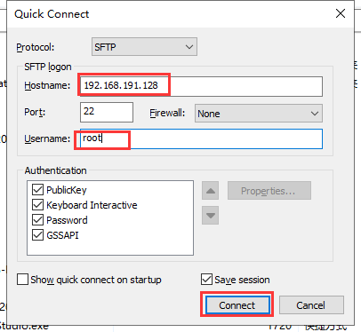

# Linux课堂笔记

# 1、Linux概述

## 1.1 Linux简介

```
Unix是1969年在AT&T的贝尔实验室开发研发出的一个强大的多用户、多任务操作系统。
UNIX的商标权由国际开放标准组织（The Open Group）所拥有。
   UNIX操作系统是商业的、收费的，价格比Microsoft Windows还要贵一点。
```

Linux 是一套免费使用和自由传播的类 Unix 操作系统，是一个基于 POSIX 和 UNIX 的多用户、多任务、支持多线程和多 CPU 的操作系统。

Linux 内核最初只是由芬兰人林纳斯·托瓦兹（Linus Torvalds）在1991 年赫尔辛基大学上学时出于个人爱好而编写的。


## 1.2 Linux 的版本

Linux的版本分为两种：**内核版本和发行版本**。

内核版本是指在Linus领导下的内核小组开发维护的系统内核的版本号 。

发行版本是一些组织和公司根据自己发行版的不同而自定的 ，说的简单点就是将 Linux 内核与应用软件做一个打包。


目前市面上较知名的发行版有：Ubuntu、RedHat、CentOS、Debian、Fedora、SuSE、OpenSUSE、Arch Linux、SolusOS 等。


## 1.3 Linux的应用

我们现在常用的系统是Windows操作系统，简单易用。但是不是很适合做服务器。而Linux在这方面就很有优势。

Linux在服务器系统、嵌入式系统、桌面应用系统、移动手持系统等方面都有很广泛的应用。

# 2、Linux的安装

## 2.1 虚拟机安装

### 2.1.1 什么是虚拟机？

虚拟机可以认为是一台虚拟的电脑。就是用软件虚拟出来的电脑。

虚拟机软件也有多种，例如有免费的virtualBox、收费的VMware。本课程中我们选择的是VMware12.

### 2.1.2 VMware介绍

VMware是一个“虚拟pc”软件公司，**提供服务器，桌面虚拟化**的解决方案。它的产品可以实现在一台计算机上同时运行两个或者更多Windows，DOS，LINUX系统。与多启动系统相比 ，VMware采用了完全不同的概念。多启动系统在一个时刻只能运行一个系统，在系统切换时需要重启计算机。VMware可以实现真正“同时”运行，多个操作系统在主系统平台上可以像标准windows应用程序那样切换。每个操作都可以进行虚拟分区，配置，而不影响真实硬盘的数据，甚至可以通过虚拟网卡将几台虚拟机连接为一个局域网，及其方便。安装在VMware里面的操作系统的性能比直接安装在硬盘上的系统性能高不少，比较适合学习和测试。

### 2.1.3 VMware安装

安装过程参考 [VMware的安装文档](参考文档/VMware的安装) 。

## 2.2 CentOS的安装

咱们刚刚已经安装完毕了虚拟机软件，接下来咱们就可以虚拟一台计算机并安装Linux的操作系统了。咱们课程中选择的操作系统是CentOS7。

安装过程参考 [CentOS-7的安装文档](参考文档/CentOS7的安装) 。

# 3、Linux的远程访问

## 3.1 安装远程访问工具

远程访问工具有很多，基本都是大同小异，本课程选择的工具是xShell.

安装只需要按照提示一步步下一步安装即可。

## 3.2 远程工具连接到Linux

首先需要查看linux地址，在linux主界面中右键选择“open in Terminal”


输入“ifconfig”指令查看ip地址


打开xshell，输入相关信息，建立连接


按照提示输入用户名 root和你自己安装centos7时设置的密码，用户名密码正确进入如下界面：


登录说明:


路径:~ 用户存放数据的根目录则显示~

用户类型:# 超级用户  $普通用户

# 4、Linux目录结构


```
在Linux文件系统中有两个特殊的目录，一个用户所在的工作目录，也叫当前目录，可以使用一个点 . 来表示；另一个是当前目录的上一级目录，也叫父目录，可以使用两个点 .. 来表示。
     . ：代表当前的目录，也可以使用 ./ 来表示；
    .. ：代表上一层目录，也可以 ../来代表。
如果一个目录或文件名以一个点 . 开始，表示这个目录或文件是一个隐藏目录或文件(如：.bashrc)。即以默认方式查找时，不显示该目录或文件。
```

xShell工具中查看目录结构：


```
bin (binaries)存放二进制可执行文件

sbin (super user binaries)存放二进制可执行文件，只有root才能访问

etc (etcetera)存放系统配置文件

usr (unix shared resources)用于存放共享的系统资源

home 存放用户文件的根目录

root 超级用户目录

dev (devices) 用于存放设备文件

lib (library)存放跟文件系统中的程序运行所需要的共享库及内核模块

mnt (mount)系统管理员安装临时文件系统的安装点

boot存放用于系统引导时使用的各种文件

tmp (temporary)用于存放各种临时文件

var (variable)用于存放运行时需要改变数据的文件
```

**开发人员关注目录:**

> 配置目录etc：软件安装后配置文件选择放入的地址。
>
> 软件安装目录：usr/local
>
> 安装应用程序目录：opt,部署的API程序一般放在这个目录。部署的API放入用户的目录:/home/用户名 
>
> **注意：Linux系统的文件系统是以斜杠“/”开始，不是windows中的盘符概念。**

# 5、Linux的用户

Linux系统是一个多用户多任务的分时操作系统，任何一个要使用系统资源的用户，都必须首先向系统管理员申请一个账号，然后以这个账号的身份进入系统。

用户的账号一方面可以帮助系统管理员对使用系统的用户进行跟踪，并控制他们对系统资源的访问；另一方面也可以帮助用户组织文件，并为用户提供安全性保护。

每个用户账号都拥有一个唯一的用户名和各自的口令。

用户在登录时键入正确的用户名和口令后，就能够进入系统和自己的主目录。

## 5.1 用户账号

```
用户账户一般非为两大类：超级管理员和普通用户。
	超级管理员：用root表示，root用户在系统中拥有最高权限。
	普通用户：除了root之外的用户。例如我们之前创建的lina用户，就是普通用户。
```

## 5.2 查看用户信息

```shell
#语法 cat /etc/passwd
```


```
	  - root:用户名
	  - x ：密码 ：已经加密 ，密码存放在  vi /etc/shadow   密码文件
	  - 0: 账号id ，userId
	  - 0： 组id ，group id
```

## 5.2 创建一个用户

```sh
# 创建一个用户
	#语法：useradd 选项 用户名
		#选项： -c comment 指定一段注释性描述。
               -d 目录 指定用户主目录，如果此目录不存在，则同时使用-m选项，可以创建主目录。
               -g 用户组 指定用户所属的用户组。
               -G 用户组，用户组 指定用户所属的附加组。
               -s Shell文件 指定用户的登录Shell。
               -u 用户号 指定用户的用户号，如果同时有-o选项，则可以重复使用其他用户的标识号。
  	#案例1：
  	useradd lina02 
```

## 5.2 删除一个用户

```shell
# 删除一个用户
	#语法：userdel 选项 用户名； 其中-r是常用的选项，表示将用户的主目录一起删除。
	#案例：
		userdel -r lina02
```

## 5.3 用户口令的管理

用户口令的管理其实就是用户密码的管理。用户账号刚创建时没有口令，但是被系统锁定，无法使用，必须为其指定口令后才可以使用，即使是指定空口令。

指定和修改用户口令的命令是`passwd`。超级用户可以为自己和其他用户指定口令，普通用户只能用它修改自己的口令。

```shell
# 用户口令的管理
	#语法：passwd 选项 用户名
	可使用的选项：
        -l 锁定口令，即禁用账号。
        -u 口令解锁。
        -d 使账号无口令。
        -f 强迫用户下次登录时修改口令。
```

如果默认用户名，则修改当前用户的口令。

例如，切换到用户lina，则下面的命令修改该用户自己的口令：PS:linux操作系统中密码部分不予显示，所以看起来是空白的，实际已经输入了密码。


如果是超级用户，可以用下列形式指定任何用户的口令：


普通用户修改自己的口令时，passwd命令会要求先输入原口令，验证后再要求用户输入两遍新口令，如果两次输入的口令一致，则将这个口令指定给用户；而超级用户为用户指定口令时，就不需要知道原口令。

为了系统安全起见，用户应该选择比较复杂的口令，例如最好使用8位长的口令，口令中包含有大写、小写字母和数字，并且应该与姓名、生日等不相同。

# 6、Linux的常用命令-重要

## 6.1 Linux目录管理

Linux的目录结构为树状结构，最顶级的目录为根目录 /。

其他目录通过挂载可以将它们添加到树中，通过解除挂载可以移除它们。

> 绝对路径与相对路径：
>
> **绝对路径：**由根目录 **/** 写起，例如： /usr/share/doc 这个目录。
>
> **相对路径：**不是由 **/** 写起，例如由 /usr/share/doc 要到 /usr/share/man 底下时，可以写成： **cd ../man** 这就是相对路径的写法。

### 6.1.1 查看目录

Linux系统当中， ls 命令可能是最常被运行的。

```
语法：
	ls :查看当前路径下的文件名称
	ls -a :全部的文件，连同隐藏文件( 开头为 . 的文件) 一起列出来(常用)
	ls -d ：仅列出目录本身，而不是列出目录内的文件数据(常用)
	ls -l ：长数据串列出，包含文件的属性与权限等等数据；(常用)
	ll: 等价于ls -l
	ls -al :目录下的所有文件列出来(含属性与隐藏档)
```

### 6.1.2 切换目录

cd是Change Directory的缩写，这是用来变换工作目录的命令。

```
语法：
	cd [相对路径或绝对路径]
```

```shell
#使用绝对路径切换到 local 目录
cd /usr/local/

# 表示回到自己的家目录，亦即是 /root 这个目录
cd ~

# 表示去到目前的上一级目录，亦即是 /root 的上一级目录的意思；
cd ..
```

### 6.1.3 显示当前目录

pwd 是 **Print Working Directory** 的缩写，也就是显示目前所在目录的命令。

```
语法：
	pwd
```

### 6.1.4 创建目录

mkdir (make directory)用来创建新的目录。

```
语法：mkdir [-mp] 目录名称
		-m ：配置文件的权限喔！直接配置，不需要看默认权限的脸色
		-p ：直接将所需要的目录(包含上一级目录)递归创建起来！
查看帮助 mkdir --help
```

```
示例：/tmp底下尝试创建数个新目录看看：
 cd /tmp
mkdir lina    <==创建一名为 lina 的新目录
mkdir test1/test2/test3/test4
	mkdir: cannot create directory `test1/test2/test3/test4': 
	No such file or directory       <== 没办法直接创建此目录啊！
mkdir -p test1/test2/test3/test4
加了这个 -p 的选项，可以自行帮你创建多层目录！
```

### 6.1.5 删除目录

 rmdir 命令用来**删除空的目录**。

```
语法： rmdir [-p] 目录名称
		-p ：连同上一级『空的』目录也一起删除
```

## 6.2 文件操作

### 6.2.1 查看文件内容

#### 6.2.1.1 cat 查看所有内容

```
语法：cat 由第一行开始显示文件内容
```

#### 6.2.1.2 more 一页一页的显示文件内容

```
一页一页翻动
语法： more 文件名称
例如：more /etc/man_db.config 
....(中间省略)....
--More--(28%)  <== 重点在这一行喔！你的光标也会在这里等待你的命令
在 more 这个程序的运行过程中，你有几个按键可以按的：
    空白键 (space)：代表向下翻一页；
    Enter         ：代表向下翻『一行』；   
    :f            ：立刻显示出档名以及目前显示的行数；
    q             ：代表立刻离开 more ，不再显示该文件内容。
```

#### 6.2.1.3  less 一页一页翻动

```
语法： less 文件名称
例如：less /etc/man.config
    ....(中间省略)....
    :   <== 这里可以等待你输入命令！
    
less运行时可以输入的命令有：
    空白键    ：向下翻动一页；
    [pagedown]：向下翻动一页；
    [pageup]  ：向上翻动一页；
    q         ：离开 less 这个程序；
```

### 6.2.2 创建文件

```
语法：touch 创建一个空白的普通文件
```

```shell
#示例：
[root@centoslina01 /]# cd lina
[root@centoslina01 lina]# touch lina01.txt
[root@centoslina01 lina]# ll
total 0
-rw-r--r--. 1 root root 0 Mar 11 10:08 lina01.txt
[root@centoslina01 lina]# 
```

### 6.2.3 写入内容

echo 把内容重定向到指定的文件中 ，有则打开，无则创建

```
语法： echo '内容'>文件名称   覆盖模式
	  echo '内容'>>文件名称  追加模式
```

```shell
#示例:
[root@centoslina01 lina]# echo 'jiaobaoyu'>lina01.txt
[root@centoslina01 lina]# echo 'jiaobaoyu'>lina01.txt
[root@centoslina01 lina]# cat lina01.txt 
jiaobaoyu
[root@centoslina01 lina]# echo 'jiaobaoyu'>>lina02.txt
[root@centoslina01 lina]# echo 'jiaobaoyu'>>lina02.txt
[root@centoslina01 lina]# cat lina02.txt 
jiaobaoyu
jiaobaoyu
[root@centoslina01 lina]# 
```

### 6.2.4 复制/拷贝文件

```
语法： cp [-adfilprsu] 来源档(source) 目标档(destination)
        -a：相当於 -pdr 的意思，至於 pdr 请参考下列说明；(常用)

        -d：若来源档为连结档的属性(link file)，则复制连结档属性而非文件本身；

        -f：为强制(force)的意思，若目标文件已经存在且无法开启，则移除后再尝试一次；

        -i：若clear问动作的进行(常用)

        -l：进行硬式连结(hard link)的连结档创建，而非复制文件本身；

        -p：连同文件的属性一起复制过去，而非使用默认属性(备份常用)；

        -r：递归持续复制，用於目录的复制行为；(常用)

        -s：复制成为符号连结档 (symbolic link)，亦即『捷径』文件；

        -u：若 destination 比 source 旧才升级 destination ！
```

### 6.2.5 移动文件

mv 可以移动文件与目录，或修改名称。

```
语法：
	mv [-fiu] source destination
        -f ：force 强制的意思，如果目标文件已经存在，不会询问而直接覆盖；
        -i ：若目标文件 (destination) 已经存在时，就会询问是否覆盖！
        -u ：若目标文件已经存在，且 source 比较新，才会升级 (update)
```

```
示例：复制一文件，创建一目录，将文件移动到目录中
	cd /tmp
    cp ~/.bashrc bashrc
    mkdir mvtest
    mv lina mvtest
    将刚刚的目录名称更名为 mvtest2
[root@www tmp]# mv mvtest mvtest2
```

### 6.2.6 删除文件

rm 可以移除文件或目录。

```
语法： rm [-fir] 文件或目录
        -f ：就是 force 的意思，忽略不存在的文件，不会出现警告信息；
        -i ：互动模式，在删除前会询问使用者是否动作
        -r ：递归删除啊！最常用在目录的删除了！这是非常危险的选项！！！
```

## 6.3 打包与拆包

```
一般Linux 上常用的压缩方式是选用tar 将许多文件打包成一个文件，再以 gzip压缩命令压缩成紧xxx.tar.gz(或者xxx.tgz)的文件。
	常用参数:		
        -c:创建一个新tar文件
        -v:显示运行过程的信息
        -f:指定文件名
        -z:调用gzip 压缩命令进行压缩
        -t:查看压缩文件的内容
        -x:解开tar 文件

打包:tar -cvf xxx.tar 要打包的文件或目录的列表，用空格隔开

打包并且压缩:tar -zcvf xxx.tar.gz 要打包的文件或目录的列表，用空格隔开

解压:tar -xvf xx.tar
	tar -zxvf xx.tar.gz -C /usr/lina   注意-C大写，防止拆包解压的路径找不到
```


## 6.4 其它命令

### 6.4.1 查看进程快照

ps ： - axu   显示当前进程的快照 

查看Java进程：ps  - axu | grep  java

查看MySQL进程 ps  - axu | grep  mysql

### 6.4.2 管道 |

管道是Linux中比较重要且常用的一个内容，其作用是将一个命令的输出作为另一个命令的输入，组合使用。

```
ls --help | more   #分页查看帮助信息，按q退出
```

# 7、VIM编辑器-重要

## 7.1 VIM的模式

vim 共分为三种模式，分别是**命令模式（Command mode）**，**输入模式（Insert mode）**和**底线命令模式（Last line mode）**。

### 7.1.1命令模式：

用户刚刚启动 vi/vim，便进入了命令模式。

```
此状态下敲击键盘动作会被Vim识别为命令，而非输入字符。比如我们此时按下i，并不会输入一个字符，i被当作了一个命令。

以下是常用的几个命令：
    i 切换到输入模式，以输入字符。
    x 删除当前光标所在处的字符。
    : 切换到底线命令模式，以在最底一行输入命令。

若想要编辑文本：启动Vim，进入了命令模式，按下i，切换到输入模式。
命令模式只有一些最基本的命令，因此仍要依靠底线命令模式输入更多命令。
```

### 7.1.2 输入模式

在命令模式下按下i就进入了输入模式。

```
在输入模式中，可以使用以下按键：
    字符按键以及Shift组合，输入字符
    ENTER，回车键，换行
    BACK SPACE，退格键，删除光标前一个字符
    DEL，删除键，删除光标后一个字符
    方向键，在文本中移动光标
    HOME/END，移动光标到行首/行尾
    Page Up/Page Down，上/下翻页
    Insert，切换光标为输入/替换模式，光标将变成竖线/下划线
    ESC，退出输入模式，切换到命令模式
```

### 7.1.3 底线命令模式

在命令模式下按下:（英文冒号）就进入了底线命令模式。

```
底线命令模式可以输入单个或多个字符的命令，可用的命令非常多。
在底线命令模式中，基本的命令有（已经省略了冒号）：
    q 退出程序
    w 保存文件
按ESC键可随时退出底线命令模式。
```

## 7.2 示例

创建一个新的名为 lina03.txt 的文件：

```
vim lina03.txt
```

直接输入 **vim 文件名** 就直接进入 vim 的**一般模式**了。

PS： vim 后面一定要加文件名，不管该文件存在与否！


按下 i 进入输入模式(也称为编辑模式)，开始编辑文字

在一般模式之中，只要按下 i, o, a 等字符就可以进入输入模式了！

在编辑模式当中，你可以发现在左下角状态栏中会出现 –INSERT- 的字样，那就是可以输入任意字符的提示。

这个时候，键盘上除了 **Esc** 这个按键之外，其他的按键都可以视作为一般的输入按钮了，所以你可以进行任何的编辑。


输入 hello workd ,按下 ESC 按钮回到一般模式，此时画面左下角的 – INSERT – 消失。

在一般模式中按下 **:wq** 即可实现保持文档并离开vim.


| 指令          | 说明                                                         |
| ------------- | ------------------------------------------------------------ |
| :w            | 将编辑的数据写入硬盘档案中(常用)                             |
| :w!           | 若文件属性为『只读』时，强制写入该档案。不过，到底能不能写入， 还是跟你对该档案的档案权限有关啊！ |
| :q            | 离开 vi (常用)                                               |
| :q!           | 使用 ! 为强制离开不储存档案。                                |
| :wq           | 储存后离开，若为 :wq! 则为强制储存后离开 (常用)              |
| :set number   | 显示行号                                                     |
| :set nonumber | 取消行号显示                                                 |

# 8、Linux的文件权限

Linux操作系统中对权限的管理很严格。Linux系统中不仅是对用户与组根据UID,GID进行了管理，还对Linux系统中的文件，按照用户与组进行分类，针对不同的群体进行了权限管理，用他来确定谁能通过何种方式对文件和目录进行访问和操作。

## 8.1文件权限


```
权限共有10个字符，我们将它分为4大部分来理解：
-  ---  ---  ---
第1部分、表示文件的类型
	- 表示是一个文件
	d 表示是一个目录
	l 表示是一个连接（理解为快捷方式）
第2部分、当前用户具有的对该文件的权限	（owner 属主，缩写u）
第3部分、当前组内其他用户具有的对该文件的权限 （group 属组，缩写g）
第4部分、其他组的用户具有的对该文件的权限 （other 其他，缩写o）
	r：Read 读
    w：Write 写
    x：eXecute 执行
    	针对目录加执行权限，文件不加执行权限（因文件具备执行权限有安全隐患）
    	
    对于文件和目录来说，r，w，x有着不同的作用和含义：
    	针对文件：r：读取文件内容 
				 w：修改文件内容 
				 x：执行权限对除二进制程序以外的文件没什么意义
		针对目录：目录本质可看做是存放文件列表、节点号等内容的文件
				r：查看目录下的文件列表 
 				w：删除和创建目录下的文件 
 				x：可以cd进入目录，能查看目录中文件的详细属性，能访问目录下文件内容（基础权限）
PS：root账户不受文件权限的读写限制，执行权限受限制
```


用户获取文件权限的顺序： 先看是否为所有者，如果是，则后面权限不看；再看是否为所属组，如果是，则后面权限不看。

## 8.2 修改文件权限

```
chown  是change owner的意思，主要作用就是改变文件或者目录所有者.

chmod  修改文件和文件夹读写执行属性。 使用权限:所有使用者

chown 修改文件和文件夹的用户和用户组属性。使用权限:root

例如：chown lina:lina lina.txt
```

### 8.2.1 mode方式

```
语法：chmod who opt per file
        who：u g o a（all）(u 用户user ,g用户组group,o其他用户,a所有用户默认)
      	opt：+添加某个权限 –取消某个权限 =赋予权限
      	per：r w x X
```

```
示例：
	chmod u=rwx,g=r lina03.txt
	chmod u+x,g+w,o+w test.log       //r 读，w 写  x 执行
```

### 8.2.2 数字方式

```
语法：chmod XXX file
        rwx rw- r–-	
      	421 420 400
      	7   6   4  
        0无权限,1表可执行=x,2表写入权限=w,4表可读权限=r
例如：-rwxr--r--. 1 root root 10 Oct 16 02:55 yhp.log
    用户权限=rwx=4+2+1=7
    所属组权限=r--=4+0+0=4
    其他用户权限=r--=4+0+0=4
    组合:744
  修改权限:
    都加入写入权限:+2
    给用户组加入写入权限:+2
    给其他用户加入可执行权限:+1
    chmod 765 yhp.log
```


# 9、Linux常用网络操作

## 9.1 主机名操作

```
hostname :显示主机名

hostname  XXX ：修改主机名，不推荐，临时生效

永久生效修改主机名需要修改/etc/sysconfig/network文件
```

## 9.2 查询系统完整信息

```
uname  -a ：显示完整的系统信息
```

## 9.3 IP地址操作

查看IP地址：ipconfig
修改IP地址：修改/etc/sysconfig/network-scripts/


重启网络服务

service network restart

## 9.4 域名映射

修改 /etc/hosts文件


## 9.5网络服务管理

```
查看网络服务状态：systemctl status network 
启动网络服务：systemctl start network 
停止网络服务：systemctl stop  network 
重启网络服务：systemctl restart network 

    设置开机启动：systemctl enable network
```

## 9.6 防火墙设置

```
查看防火墙状态： systemctl status firewalld 
启动防火墙： systemctl start firewalld
关闭防火墙： systemctl stop firewalld

查询防火墙服务是否开机启动：systemctl is-enabled firewalld
开机时启用防火墙服务：systemctl enable firewalld
开机时禁用防火墙服务：systemctl disable firewalld

查询已经启动的服务列表：systemctl list-unit-files|grep enabled
查询启动失败的服务列表：systemctl --failed
```

# 10、Linux上部署Web项目

## 10.1 远程上传工具的使用

资料中提供了远程上传文件的工具


双击打开




## 10.2 安装JDK

1、上传jdk文件到linux

使用SecureFX连linux后，将JDK压缩包上传到新建的mysoft文件夹。

2、解压压缩包


 3、测试jdk是否安装成功

 

注意:这里实在jdk的bin目录下运行的。并且java命令前有“./”

4、配置环境变量

(1)编辑profile文件:


(2)在profie文件中添加JAVA_HOME变量: 


(3)使环境变量及时生效

 

(4)查看变量是否更新成功:

 

(5)在任意目录下测试环境是否配置成功


## 10.3 安装Tomcat

**安装Tomcat之前要保证JDK安装成功哦**！

1、上传Tomcat压缩包到根目录的mysoft文件夹，之前已经完成

2、解压：tar -xzvf apache-tomcat-8.5.11.tar.gz


3、启动Tomcat


4、关闭防火墙之后测试访问


5、关闭Tomcat


## 10.4 安装MySQL

YUM（ Yellow dog Updater, Modified）是一个在Fedora和RedHat以及CentOS中的Shell前端软件包管理器。
它基于RPM包管理，能够从指定的服务器自动下载RPM包并且安装，可以自动处理依赖性关系，无须繁琐地一次次下载、安装.

步骤1: 检测系统是否自带安装mysql
[root@centoslina01 ~]# yum list installed | grep mysql


步骤2: 删除系统自带的mysql及其依赖（防止后面安装发生冲突）
[root@centoslina01 ~]#  yum -y remove mysql-libs.x86_64

步骤3: 给CentOS添加rpm源，并且选择较新的源,RPM软件包管理器缩写
[root@centoslina01 ~]#  wget --no-check-certificate dev.mysql.com/get/mysql-community-release-el6-5.noarch.rpm


步骤4: 安装第一步下载的rpm文件
[root@centoslina01 ~]#  yum install mysql-community-release-el6-5.noarch.rpm
此处需要输入"y"


[root@centoslina01 ~]#  yum repolist enabled | grep mysql  //列出你所有的yum repo文件


步骤5: 使用yum安装mysql
[root@centoslina01 ~]#  yum install mysql-community-server
此处输入3次“y”

安装完毕

步骤6: 启动mysql服务
[root@centoslina01 ~]#  service mysqld start


步骤7: 查看mysql是否自启动,并且设置开启自启动
[root@centoslina01 ~]#    chkconfig --list | grep mysqld
0 1 2 3 4 5 6 代表centOS启动状态

[root@centoslina01 ~]#    chkconfig mysqld on


步骤8: 修改字符集为UTF-8
[root@centoslina01 ~]#  vim /etc/my.cnf
在[mysqld]部分添加：
character-set-server=utf8
在文件末尾新增[client]段，并在[client]段添加：
default-character-set=utf8
esc退出编辑  :wq保存退出


修改完成后保存重启服务
[root@centoslina01 ~]#   service mysqld restart

步骤9: 修改默认配置
[root@centoslina01 ~]#    mysql_secure_installation
按照提示进行配置，这里默认root用户的密码空，直接回车即可。此处输入内容:"y","y","n","y","y"   


步骤10:授权远程登录

方案1:实现远程连接(授权法)-  将权限改为ALL PRIVILEGES
[root@centoslina01 ~]#  mysql -uroot -p
mysql> use mysql;
Database changed
mysql> flush privileges; 
//mysql 新设置用户或更改密码后需用flush privileges刷新MySQL的系统权限相关表，否则会出现拒绝访问
mysql> select host,user,password from user;
这样机器就可以以用户名root密码root远程访问该机器上的MySql.


方案2:实现远程连接（改表法)
use mysql;
update user set host = '%' where user = 'root' and host='localhost';

GRANT ALL PRIVILEGES ON *.* TO 'username'@'%' IDENTIFIED BY 'password' WITH GRANT OPTION; /

flush privileges;


这样在远端就可以通过root用户访问Mysql

远程连接出问题：

看看防火墙是否关闭；

是否是授权问题：GRANT ALL PRIVILEGES ON *.* TO 'username'@'%' IDENTIFIED BY 'password' WITH GRANT OPTION; 

flush privileges;


