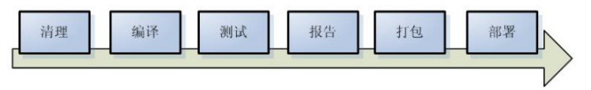
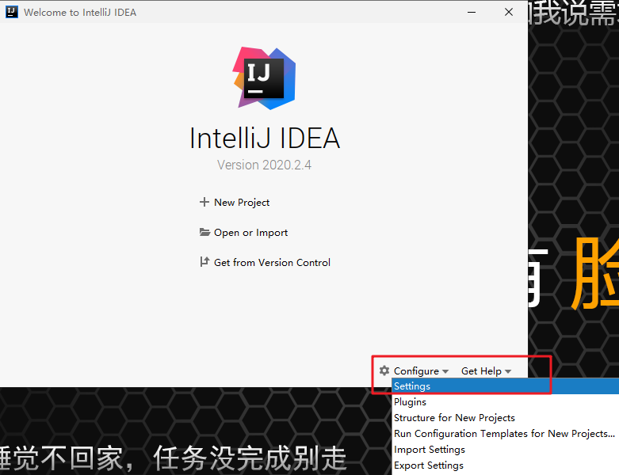
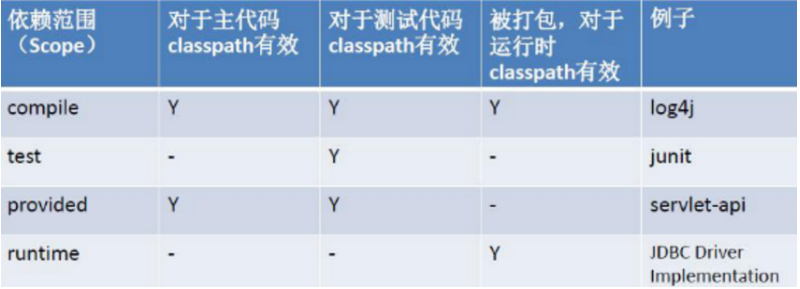

# Maven课堂笔记

# 1、Maven概述

## 1.1 Maven简介

Maven翻译为“专家”，“内行”。Maven是Apache下的一个纯java开发的**开源**项目。

Maven 是一个**项目管理工具**，可以对 Java 项目进行构建、依赖管理。

Maven 也可被用于构建和管理各种项目，例如 C#，Ruby，Scala 和其他语言编写的项目。

Maven创始者希望能够更多的让Java开发人员的日常工作更加容易，帮助理解任何基于Java项目。

## 1.2 Maven的两大功能

**项目构建**和**依赖管理**。

### 1.2.1项目构建

​	项目构建是一个项目从：源代码、编译、测试、打包、部署、运行的过程。

#### 1.2.1.1 传统项目构建过程

​	原来构建项目的过程如下：以web项目为例

​	1）在idea中创建一个java web工程

​	2）在工程中编写源代码及配置文件等

​	3）对源代码进行编译，java源文件编译成.class文件

​	4）执行Junit单元测试

​	5）将工程打成war包部署至tomcat运行

#### 1.2.1.2 Maven项目构建过程

​	Maven将项目构建的过程进行**标准化**，每个阶段使用一个命令完成，下图展示了构建过程的一些阶段：



```
清理:删除以前的编译结果，为重新编译做好准备。
编译:将Java源程序编译为字节码文件。
测试:针对项目中的关键点进行测试，确保项目在迭代开发过程中关键点的正确性。
报告:在每一次测试后以标准的格式记录和展示测试结果。
打包:将一个包含诸多文件的工程封装为一个压缩文件用于安装或部署。Java 工程对应 jar 包，Web工程对应war包。
安装:在Maven环境下特指将打包的结果——jar包或war包安装到本地仓库中。
部署:将打包的结果部署到远程仓库或将war包部署到服务器上运行
```

#### 1.2.1.3 项目的构建方式

##### 1、Ant

Ant只是一个项目构建工具，它没有集成依赖管理。

Ant在进行项目构建时，它没有对项目目录结构进行约定，需要手动指定源文件、类文件等目录地址。同时它执行task时，需要显示指定依赖的task，这样会造成大量的代码重复。

##### 2、Maven

Maven不仅是一个项目构建工具，更是一个项目管理工具。它在项目构建工程中，比ant更全面，更灵活。	Maven在进行项目构建时，它对项目目录结构拥有约定，知道你的源代码在哪里，类文件应该放到哪里去。它拥有生命周期的概念，Maven的生命周期是有顺序的，在执行后面的生命周期的任务时，不需要显示的配置前面任务的生命周期。例如执行 mvn install 就可以自动执行编译，测试，打包等构建过程

#####  3、Gradle 

一个开源的自动化构建系统，建立在Apache Ant和Maven Apache概念的基础上，并引入了基于Groovy的特定领域语言（DSL），而不是使用Apache Maven宣布的项目配置XML形式。

### 1.2.2 什么是依赖管理

​	什么是依赖？一个java项目可能要使用一些第三方的jar包才可以运行，那么我们说这个java项目依赖了这些第三方的jar包。

​	例如大家前面学过的javaWeb中需要的连接数据库的jar包、数据源的jar包等等。

​	什么是依赖管理？就是对项目所有依赖的jar包进行规范化管理。

#### 1.2.2.1 传统项目的依赖管理

传统的项目工程要管理所依赖的jar包完全靠人工进行，程序员从网上下载jar包添加到项目工程中。

手动拷贝jar包添加到工程中的问题是：

1、没有对jar包的版本统一管理，容易导致版本冲突。

2、从网上找jar包非常不方便，有些jar找不到。

3、jar包添加到工程中导致工程过大。 

#### 1.2.2 .2 Maven项目的依赖管理

Maven项目管理所依赖的jar包不需要手动向工程添加jar包，只需要在pom.xml（Maven工程的配置文件）添加jar包的坐标，自动从Maven仓库中下载jar包运行。

使用Maven依赖管理添加jar的好处：

1、通过pom.xml文件对jar包的版本进行统一管理，可避免版本冲突。

2、Maven团队维护了一个非常全的Maven仓库，里边包括了当前使用的jar包，Maven工程可以自动从Maven仓库下载jar包，非常方便。

## 1.3 使用Maven的好处

通过上边介绍传统项目和Maven项目在项目构建及依赖管理方面的区别，Maven有如下的好处：

1、一步构建

Maven对项目构建的过程进行标准化，通过一个命令即可完成构建过程。

2、依赖管理

Maven工程不用手动导jar包，通过在pom.xml中定义坐标从Maven仓库自动下载，方便且不易出错。

3、Maven的跨平台，可在window、linux上使用。

4、Maven遵循规范开发，有利于提高大型团队的开发效率，降低项目的维护成本，公司都会考虑使用Maven来构建项目。

# 2、Maven的安装与配置

## 2.1 Maven的下载

我们已经在资料包中提供好了Maven的安装包，课程使用的版本是3.3.9版本。

如果大家需要其他版本，自行从网站 http://Maven.apache.org/download.cgi 下载。

## 2.2 Maven的安装

将下载好的Maven安装包解压到一个不含有中文和空格的目录中。

 安装包解压即可使用。


```
目录说明：
	bin目录： 该目录包含了 mvn 运行的脚本
	boot目录： Maven运行需要类加载器 
	conf目录： 该目录包含了一个非常重要的文件 settings.xml。直接修改该文件，就能在机器上全局地定制 Maven 的行为 
	lib目录： Maven运行依赖jar包
```

##  2.3 配置Maven环境变量

前提必须有java的环境变量（推荐使用JDK8）：


配置Maven环境变量

 

通过 mvn -v命令检查 Maven是否安装成功

 

## 2.4 修改Maven的配置文件

找到Maven安装路径下的settings.xml配置文件


### 2.4.1 配置默认的JDK版本

Maven默认使用jdk1.7，我们常用的是jdk1.8，所以直接在配置文件中修改。

```xml
<profile>  
      <id>jdk-1.8</id>  
      <activation>  
        <activeByDefault>true</activeByDefault>  
        <jdk>1.8</jdk>  
      </activation>  
      <properties>  
        <Maven.compiler.source>1.8</Maven.compiler.source>  
        <Maven.compiler.target>1.8</Maven.compiler.target>  
        <Maven.compiler.compilerVersion>1.8</Maven.compiler.compilerVersion>  
      </properties>   
</profile>
```


# 3 Maven的核心概念 

## 3.1 Maven的目录结构

**Maven默认约定了一套目录结构**，在通过Maven创建了项目以后，项目的目录结构就是以这套目录结构作为模板创建的。虽然Maven提供了很多的模板，但是基本的目录结构都是固定的。

```
Maven约定的目录结构：
myFirstMavenProject
        |-- src
        |-- |-- main
        |-- |-- |-- java —— 项目的源代码所在的目录
        				com.lina.entity
        				com.lina.dao
        |-- |-- |-- resources —— 项目的资源文件所在的目录
        |-- |-- |-- webapp —— 如果是web项目，则该目录是web应用源代码所在的目录
        |-- |-- |-- |--WEB-INF
        |-- |-- |-- |-- |-- web.xml
        |-- |-- test
        |-- |-- |-- java ——测试代码所在的目录,如JUnit测试类
        				com.lina.dao.test
        |-- |-- |-- resources ——测试相关的资源文件所在的目录
        |-- target   —— 项目构建的输出文件，如.class、.jar、.war文件（不需要创建，会自动生成）
        |-- pom.xml  ——Maven项目核心配置文件,项目的描述文件
```

## 3.2 Maven的仓库

在 Maven中可以将仓库理解位一个位置，一个专门存放项目中依赖的第三方库的位置。

### 3.2.1 maven仓库的分类

maven的仓库可以分为**本地仓库和远程仓库**。

#### 3.2.1.1 本地仓库

本地仓库相当于一个缓存，在电脑上是一个文件夹，我们可以设置这个文件夹的路径（具体怎么设置会在下面的配置体现）,工程第一次需要某种jar包时，会从远程仓库（互联网）下载并保存到本地仓库中（在程序员的电脑上），当第二次使用时，不需要去远程仓库下载，会先去本地仓库中找，如果找不到才会去远程仓库上下载。

默认情况下，每个用户在自己的用户目录下都有一个路径名为 .m2/respository/ 的仓库目录。

#### 3.2.1.2 远程仓库

​	远程仓库中分为**中央仓库和私服**两类。

##### 3.2.1.2.1 中央仓库

中央仓库中的jar包由专业团队（Maven团队）维护，中央仓库中存放了全世界大多数流行的开源软件的jar包，**是Maven默认的远程仓库**。

要浏览中央仓库的内容，Maven 社区提供了一个 URL：http://search.Maven.org/#browse。使用这个仓库，开发人员可以搜索所有可以获取的代码库。

##### 3.2.1.2.2 私服

私服是另一种特殊的远程仓库，为了节省带宽和时间，应该在局域网内架设一个私有的仓库服务器，用其代理所有外部的远程仓库。内部的项目还能部署到私服上供其他项目使用。除了中央仓库和私服，还有很多其他公开的远程仓库，常见的有java.net Maven库(http://download.java.net/maven/2/)和jboss Maven库(http://repository.jboss.com/maven2/)等


### 3.2.2 配置本地仓库

当你运行 Maven 命令，Maven 将下载依赖的文件到你指定的路径中。

在Maven的安装路径下的conf文件中的setting.xml文件下添加如下内容：

> PS：自己先新建一个文件夹作为本地仓库，路径不要有中文和非法字符。

```xml
<!--  配置本地仓库  -->
<localRepository>D:\repository</localRepository>
```


### 3.2.3 配置远程仓库镜像

Maven默认的远程仓库是Maven团队维护的中央仓库，由于网络原因，去中央仓库下载jar包需要到国外的网站，不太便捷，速度慢，于是我们可以选择把国内的阿里云的Maven仓库作为中央仓库镜像。

修改 Maven 根目录下的 conf 文件夹中的 settings.xml 文件，在 mirrors 节点上，添加内容如下：

```xml
<!--  配置阿里云镜像  -->
	<mirror>
			<id>nexus-aliyun</id>
			<name>Nexus aliyun</name>
			<url>http://Maven.aliyun.com/nexus/content/groups/public/</url>
			<mirrorOf>*</mirrorOf>
	</mirror>
<!-- 其中各个标签的含义是：
    id:当前镜像的唯一标识
    mirrorOf:将哪个远程仓库当做中央仓库镜像，中央仓库的id是central，所以将阿里云的Maven仓库设置为中央仓库镜像时,其值必须设置为central
    name:为当前的中央仓库镜像起一个名字，便于开发者阅读
    url:阿里云Maven仓库的地址
-->
```


## 3.3 Maven的核心文件pom.xml

POM( Project Object Model，项目对象模型 ) 是 Maven 工程的基本工作单元，是一个XML文件，包含了项目的基本信息，用于描述项目如何构建，声明项目依赖，等等。

执行任务或目标时，Maven 会在当前目录中查找 POM。它读取 POM，获取所需的配置信息，然后执行目标。

```xml
<project xmlns="http://Maven.apache.org/POM/4.0.0" 
xmlns:xsi="http://www.w3.org/2001/XMLSchema-instance" 
xsi:schemaLocation="http://Maven.apache.org/POM/4.0.0 
http://Maven.apache.org/xsd/Maven-4.0.0.xsd">
  <!-- Maven模型的版本 -->
  <modelVersion>4.0.0</modelVersion>
  <!-- 公司或者组织的唯一标志，并且配置时生成的路径也是由此生成， 如com.companyname.project-group，Maven会将该项目打成的jar包放本地路径：/com/companyname/project-group -->
  <groupId>com.lina.Maven</groupId>
  <!-- 项目的唯一ID，一个groupId下面可能多个项目，就是靠artifactId来区分的  -->
  <artifactId>HelloWorld</artifactId>
  <!-- 当前项目版本号：同一个项目开发过程中可以发布多个版本，此处标示0.0.1版 -->
  <!-- 当前项目版本号：每个工程发布后可以发布多个版本，依赖时调取不同的版本，使用不同的版本号 
		当前项目版本号，snapshot为快照版本即非正式版本，release为正式发布版本
	-->
  <version>0.0.1-snapshot</version>
  <!--打包类型，一般有jar、war、pom等-->
  <packaging>jar</packaging>
  <!-- 名称：可省略 ,常用于 Maven 生成的文档。-->
  <name>Hello</name>
  <!--项目描述：可省略,常用于 Maven 生成的文档--> 
  <description > </description>
  <!-- 项目依赖构件配置，配置项目依赖构件的坐标 -->
   <dependencies>
            <!-- 依赖设置 ，可以有多个dependency节点-->
            <dependency>
                <!-- 依赖组织名称 -->
                <groupId>junit</groupId>
                <!-- 依赖项目名称 -->
                <artifactId>junit</artifactId>
                <!-- 依赖版本名称 -->
                <version>4.12</version>
                <!-- 依赖范围：test包下依赖该设置 -->
                <scope>test</scope>
            </dependency>
   </dependencies>
   <!-- 项目构建配置，配置编译、运行插件等。-->
   <build>......</build>
</project>
```

## 3.4 Maven的坐标

### 3.4.1什么是坐标

在平面几何中坐标（x,y）可以标识平面中唯一的一点。在Maven中坐标就是为了定位一个唯一确定的jar包。

Maven世界拥有大量构件，我们需要找一个用来唯一标识一个构建的统一规范。拥有了统一规范，就可以把查找工作交给机器. 

### 3.4.2 Maven坐标主要组成

groupId：定义当前Maven项目组织名称

artifactId：定义实际项目名称

 version：定义当前项目的当前版本或者是所依赖的jar包的版本

```xml
<groupId>com.lina</groupId>  
<artifactId>demoProject</artifactId>  
<version>0.0.1-SNAPSHOT</version>     
```

## 3.5 Maven的生命周期

### 3.5.1 什么是生命周期

Maven生命周期就是为了对所有的构建过程进行抽象和统一。包括项目清理、初始化、编译、打包、测试、部署等几乎所有构建步骤。生命周期可以理解为构建工程的步骤。

### 3.5.2 Maven三大生命周期

Maven拥有三套**相互独立**的生命周期,分别是clean、default和site. 

clean Lifecycle： 在进行真正的构建之前进行一些清理工作。 mvn clean

default Lifecycle： 构建的核心部分，编译，测试，打包，部署等等。 

site Lifecycle： 生成项目报告，站点，发布站点。

#### 3.5.2.1 clean生命周期

clean的目的是**清理项目**。

每套生命周期都由一组阶段(Phase)组成，我们平时在命令行输入的命令总会对应于一个特定的阶段。比如，运行mvn clean ，这个的clean是Clean生命周期的一个阶段。有Clean生命周期，也有clean阶段。

```
包含3个阶段:
1.pre-clean 执行一些清理前需要完成的工作
2.clean 清理上一次构建过程中生成的文件，比如编译后的class文件等
3.post-clean 执行一些清理后需要完成的工作
```

#### 3.5.2.2 default生命周期- 构建项目

所有生命周期中**最核心的部分**，绝大部分工作都发生在这个生命周期中。

咱们只介绍一些比较重要和常用的阶段：

```
generate-resources： 产生主代码中的资源在classpath中的包
process-resource：  复制并处理资源文件，至目标目录，准备打包。 
compile: 编译项目的主源码.一般来说:编译src/main/java目录下的java文件至项目输出的主classpath目录中
test-compile:编译项目的测试代码,是编译src/test/java目录下的java文件至项目输出的测试classpath目录中
test:使用单元测试框架运行测试,测试代码不会被打包或部署.
package:打包成可发布的格式
install: 将包安装到Maven本地仓库,供本地其他Maven项目使用
deploy:将最终的包复制到远程仓库,供其他开发人员和Maven项目使用
```

PS：运行任何一个阶段的时候，它前面的所有阶段都会被运行，这也就是为什么我们运行mvn install 的时候，代码会被编译，测试，打包。此外，Maven的插件机制是完全依赖Maven的生命周期的，因此理解生命周期至关重要。

参考资料地址:http://Maven.apache.org/guides/introduction/introduction-to-the-lifecycle.html

#### 3.5.2.3 site生命周期-生成项目站点

目的:建立和发布项目站点 

```
pre-site 执行一些在生成项目站点之前需要完成的工作.
site 生成项目站点文档
post-site 执行一些在生成项目站点之后需要完成的工作.
site-deploy 将生成的项目站点发布到服务器上
```

# 4、Idea搭建Maven项目

## 4.1 IDEA集成Maven插件

​	通过入门程序中命令行的方式使用Maven工作效率不高，可以在开发工具中集成Maven软件，idea是一个开发工具，Maven是一个项目管理工具，Maven有一套项目构建的规范，在idea集成Maven软件，最终通过idea创建Maven工程。

1、打开IDEA，进入主界面后点击 configure，然后点击 settings



2、在上面的快捷查找框中输入Maven，查找与Maven相关的设置，然后点击Maven,按如图配置。


## 4.2 定义Maven坐标

每个Maven工程都需要定义本工程的坐标，坐标是Maven对jar包的身份定义。

例如：定义一个入门程序的坐标

```xml
<!--项目名称，定义为组织名+项目名，类似包名-->
<groupId>com.lina</groupId>
<!-- 模块名称 -->
<artifactId>my-first-Maven</artifactId>
<!-- 当前项目版本号，snapshot为快照版本即非正式版本，release为正式发布版本 -->
<version>0.0.1-SNAPSHOT</version>
<packaging >jar</packaging>
<!--packaging 表示打包类型
    jar：执行package会打成jar包
    war：执行package会打成war包
    pom ：用于Maven工程的继承，通常父工程设置为pom
 -->
```

## 4.3 创建Maven的java工程

### 4.3.1 使用骨架创建Maven的java工程

1、选择Create New Project按钮


2、选中左侧的Maven，并将Create from archetype选中，在下方选择骨架quickstart，点击Next。


3、填写项目的名称以及存储的位置。点击下方的Artifact Coordinates，填写项目坐标的基本信息。


4、确认信是否正确


5、生成的目录结构


6、手动将Maven文件夹补齐。


7、同样在test文件夹下创建resources文件夹，最后的目录结构：


### 4.3.2 不使用骨架创建Maven的java工程

1、新建一个工程，不使用骨架时直接在Maven下点击Next按钮


2、填写项目的名称以及存储的位置。点击下方的Artifact Coordinates，填写项目坐标的基本信息。


3、新建的项目test文件夹下没有resources文件夹，我们需要手动将Maven文件夹补齐。最后的目录结构:


## 4.4 创建Maven的java web工程

### 4.4.1 使用骨架创建Maven的java web工程

1、选中左侧的Maven，并将Create from archetype选中，在下方选择骨架webapp，点击Next


2、填写项目的名称以及存储的位置。点击下方的Artifact Coordinates，填写项目坐标的基本信息


3、创建的目录结构如下


4、补齐其他文件夹后的目录


### 4.4.2 不使用骨架创建Maven的java web工程

1、新建项目,选择Maven。因为不使用骨架创建Web项目,所以不勾选Create from archetype，直接点击Next


2、编辑项目名,编辑好后点击Finish


 3、不使用骨架的Web项目已经创建完成了,下面是基本的结构,没有web目录


4、我们需要手动添加Web目录,按照以下顺序添加web目录。


5、点击Artifacts,加入刚才创建的内容


6、现在项目基本创建完成,点击OK ，就完成了，下面就有Maven的web项目基本目录


## 4.5 构建完整的Web项目

首先咱们将刚刚创建的web项目中编写一个jsp页面和servlet，然后可以通过配置的tomcat插件方式运行项目

pom.xml文件中添加如下内容

```xml
<packaging>war</packaging>

    <dependencies>
        <!--jar依赖管理-->
        <dependency>
            <groupId>javax.servlet</groupId>
            <artifactId>javax.servlet-api</artifactId>
            <version>4.0.1</version>
            <scope>provided</scope>
        </dependency>
        <dependency>
            <groupId>javax.servlet.jsp</groupId>
            <artifactId>jsp-api</artifactId>
            <version>2.0</version>
            <scope>provided</scope>
        </dependency>
    </dependencies>

    <build>
        <plugins>
            <!--tomcat插件-->
            <plugin>
                <groupId>org.apache.tomcat.maven</groupId>
                <artifactId>tomcat7-maven-plugin</artifactId>
                <version>2.2</version>
               <configuration>
                    <port>80</port><!--tomcat访问端口-->
                    <path>/lina</path><!--项目访问路径-->
                </configuration>
            </plugin>
        </plugins>
    </build>
```

编写servlet

```java
package com.lina.servlet;

import javax.servlet.ServletException;
import javax.servlet.annotation.WebServlet;
import javax.servlet.http.HttpServlet;
import javax.servlet.http.HttpServletRequest;
import javax.servlet.http.HttpServletResponse;
import java.io.IOException;

@WebServlet("/hello")
public class HelloServlet extends HttpServlet {
    @Override
    protected void doGet(HttpServletRequest req, HttpServletResponse resp) throws ServletException, IOException {
        System.out.println("hello-----------");
        resp.getWriter().write("hello maven");
    }

    @Override
    protected void doPost(HttpServletRequest req, HttpServletResponse resp) throws ServletException, IOException {
        this.doPost(req, resp);
    }
}

```

webapp文件夹下面添加index.jsp页面

```jsp
<%@ page contentType="text/html;charset=UTF-8" language="java" %>
<html>
<head>
    <title>Title</title>
</head>
<body>
    <h1>hello index------------</h1>
</body>
</html>
```

配置tomcat插件运行的方式


点击运行按钮：


运行结果：


# 5、Maven常用指令

> PS：Maven的命令需要在pom.xml所在目录中执行以下命令。

## 5.1 mvn compile

执行 mvn compile命令，完成编译操作.

执行完毕后，会生成target目录，该目录中存放了编译后的字节码文件。


## 5.2 mvn clean

执行 mvn clean命令,执行完毕后，会将target目录删除。


## 5.3 mvn test

执行 mvn test命令，完成单元测试操作。执行完毕后，会在target目录中生成新的文件夹：	surefire-reports（测试报告）、test-classes（测试的字节码文件）

## 5.4 Maven  package

执行 mvn package命令，完成打包操作

执行完毕后，会在target目录中生成一个文件，该文件可能是jar、war

## 5.5 mvn install

执行 mvn install命令，完成将打好的jar包安装到本地仓库的操作

执行完毕后，会在本地仓库中出现安装后的jar包，方便其他工程引用

## 5.6 mvn clean compile 命令

cmd 中录入 mvn clean compile 命令

组合指令，先执行clean，再执行compile，通常应用于上线前执行，清除测试类 

## 5.7 mvn clean test 命令

cmd 中录入 mvn clean test 命令

组合指令，先执行clean，再执行test，通常应用于测试环节

## 5.8 mvn clean package 命令

cmd 中录入 mvn clean package命令

组合指令，先执行clean，再执行package，将项目打包，通常应用于发布前

```
执行过程：
    清理————清空环境
    编译————编译源码
    测试————测试源码
    打包————将编译的非测试类打包
```

## 5.9 mvn clean install 命令

​		cmd 中录入 mvn clean install 查看仓库，当前项目被发布到仓库中

​		组合指令，先执行clean，再执行install，将项目打包，通常应用于发布前

```
执行过程：
    清理————清空环境
    编译————编译源码
    测试————测试源码
    打包————将编译的非测试类打包
    部署————将打好的包发布到资源仓库中
```

# 6、Maven的传递性和依赖性

## 6.1 依赖管理

就是对项目中jar 包的管理。可以在pom文件中定义jar包的GAV坐标，管理依赖。

依赖声明主要包含如下元素：

```xml
 <dependencies>
        <dependency>
            <groupId>junit</groupId>
            <artifactId>junit</artifactId>
            <version>4.10</version>
            <scope>test</scope>
        </dependency>
</dependencies>
```

Maven依赖管理的原理分析


## 6.2  依赖范围(scope标签的取值)



### 6.2.1 compile-默认值

编译范围，默认scope的值，在工程环境的 classpath（编译环境）和打包（如果是WAR包，会包含在WAR包中）时候都有效。

### 6.2.2 provided

容器或JDK已提供范围，表示该依赖包已经由目标容器（如tomcat）和JDK提供，只在编译的classpath中加载和使用，打包的时候不会包含在目标包中 。最常见的是j2ee规范相关的servlet-api和jsp-api等jar包，一般由servlet容器提供，无需在打包到war包中，如果不配置为provided，把这些包打包到工程war包中，在tomcat6以上版本会出现冲突无法正常运行程序（版本不符的情况）。

### 6.2.3 runtime

一般是运行和测试环境使用，编译时候不用加入classpath，打包时候会打包到目标包中。一般是通过动态加载或接口反射加载的情况比较多。也就是说程序只使用了接口，具体的时候可能有多个，运行时通过配置文件或jar包扫描动态加载的情况。典型的包括：JDBC驱动等。

### 6.2.4 test

测试范围，一般是单元测试场景使用，在编译环境加入classpath，但打包时不会加入，如junit等。

### 6.2.5 system（一般不用，不同机器可能不兼容）

系统范围，与provided类似，只是标记为该scope的依赖包需要明确指定基于文件系统的jar包路径。因为需要通过systemPath指定本地jar文件路径，所以该scope是不推荐的。如果是基于组织的，一般会建立本地镜像，会把本地的或组织的基础组件加入本地镜像管理，避过使用该scope的情况。

## 6.3 依赖传递

### 6.3.1  直接依赖和间接依赖

如果B中使用A，C中使用B，则称B是C的**直接依赖，**而称A是C的**间接依赖**。

C直接依赖B

C间接依赖A


###  6.3.2  依赖范围对传递依赖的影响


左边第一列表示第一直接依赖范围

上面第一行表示第二直接依赖范围

中间的交叉单元格表示传递性依赖范围。

定义在<scope></scope>标签

总结：

(1) 当第二依赖的范围是compile的时候，传递性依赖的范围与第一直接依赖的范围一致。

(2) 当第二直接依赖的范围是test的时候，依赖不会得以传递。

(3) 当第二依赖的范围是provided的时候，只传递第一直接依赖范围也为provided的依赖，且传递性依赖的范围同样为 provided；

(4) 当第二直接依赖的范围是runtime的时候，传递性依赖的范围与第一直接依赖的范围一致，但compile例外，此时传递的依赖范围为runtime；

## 6.4 依赖冲突

(1) 如果直接与间接依赖中包含有同一个坐标不同版本的资源依赖，以直接依赖的版本为准（就近原则）

(2) 如果直接依赖中包含有同一个坐标不同版本的资源依赖，以配置顺序下方的版本为准

## 6.5 可选依赖

<optional> true/false </optional>用于设置是否可选，也可以理解为jar包是否向下传递。

在依赖中添加optional选项决定此依赖是否向下传递，如果是true则不传递，如果是false就传递，默认为false。

## 6.6 排除依赖

Maven 的传递依赖能自动将间接依赖引入项目中来，这样极大地简化了项目中的依赖管理，但是有时候间接依赖的关联包可以因为版本或其他原因，并不是我们想要的版本，那该怎么办呢？

这种做法就是排除依赖。那怎么实现排除依赖呢？实现排除依赖还是比较简单的，在直接依赖的配置里面添加 exclusions→exclusion 元素，指定要排除依赖的 groupId 和 artifactId 就行，如下面代码所示。

```
<dependency>
  <groupId>junit</groupId>
  <artifactId>junit</artifactId>
  <version>4.11</version>
  <scope>test</scope>
  <exclusions>
    <exclusion>
      <groupId>org.hamcrest</groupId>
      <artifactId>hamcrest-core</artifactId>
    </exclusion>
  </exclusions>
</dependency>
```

说明:排除依赖包中所包含的依赖关系，不需要添加版本号。

# 7、Maven插件

Maven的核心仅仅定义了抽象的生命周期，具体的任务都是交由插件完成的。每个插件都能实现一个功能，每个功能就是一个插件目标。Maven的生命周期与插件目标相互绑定，以完成某个具体的构建任务。

 例如compile就是插件Maven-compiler-plugin的一个插件目标。 

## 7.1 Maven编译插件

```xml
<build>
        <plugins>
            <plugin>
                <groupId>org.apache.maven.plugins</groupId>
                <artifactId>maven-compiler-plugin</artifactId>
                <version>3.8.0</version>
                <configuration>
                    <source>1.8</source>
                    <target>1.8</target>
                </configuration>
            </plugin>
        </plugins>
    </build>
```

##  7.2 Tomcat插件

我们之前创建的web项目都需要额外配置tomcat以后才能运行项目，现在Maven提供了tomcat插件，这样我们就无需再添加额外的tomcat了。

步骤1:创建Maven类型的web工程

步骤2: pom.xml文件中添加插件信息

```xml
<plugins>
    <plugin>
        <!-- 配置插件 -->
        <groupId>org.apache.tomcat.maven</groupId>
        <artifactId>tomcat7-maven-plugin</artifactId>
        <version>2.2</version>
        <configuration>
            <port>8080</port><!-- tomcat的端口 -->
            <path>/</path><!-- 项目的访问路径-->
        </configuration>
    </plugin>
</plugins>
```

步骤3:点击“add configuration”,按照图片中的步骤添加tomcat命令，运行tomcat插件


   	 命令:tomcat7:run 运行tomcat7（推荐，但是需要添加插件）

# 8、Maven私服-了解

问题：项目组编写了一个通用的工具类，其它项目组将类拷贝过去使用，当工具类修改bug后通过邮件发送给各各项目组，这种分发机制不规范可能导致工具类版本不统一。

解决方案：项目组将写的工具类通过Maven构建，打成jar，将jar包发布到公司的Maven仓库中（私服），公司其它项目通过Maven依赖管理从仓库自动下载jar包。

公司在自己的局域网内搭建自己的远程仓库服务器，称为私服，私服服务器即是公司内部的Maven远程仓库，每个员工的电脑上安装Maven软件并且连接私服服务器，员工将自己开发的项目打成jar并发布到私服服务器，其它项目组从私服服务器下载所依赖的构件（jar）。

私服还充当一个代理服务器，当私服上没有jar包会从互联网中央仓库自动下载，如下图：


私服作用：

1、将自己的工程打包jar发布到私服

2、从私服下载jar包到自己的工程中

