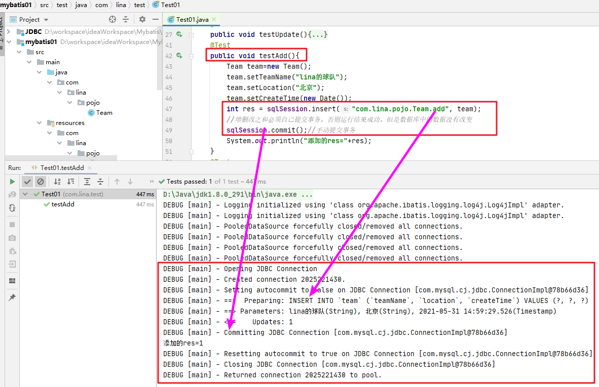
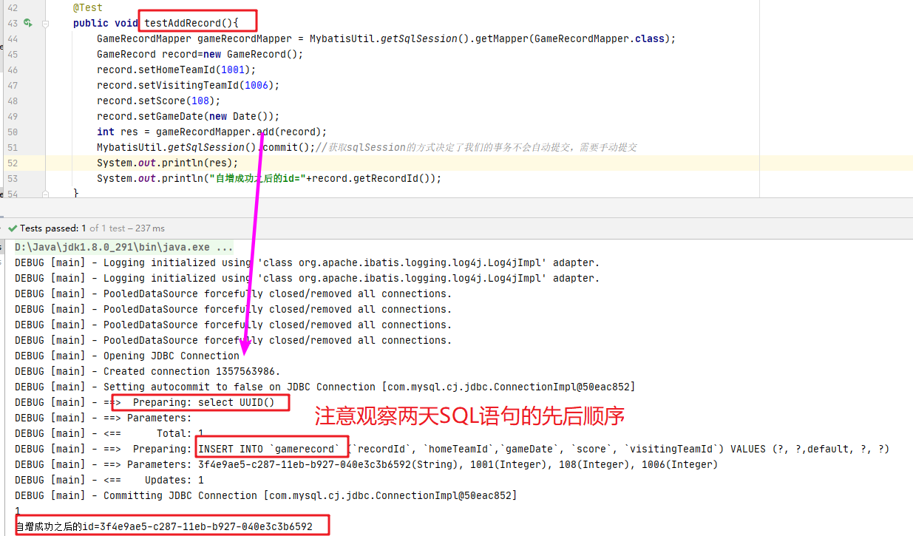
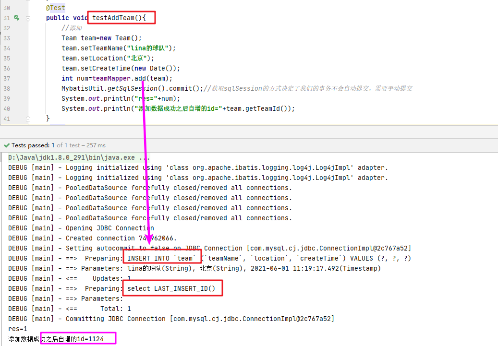

# Mybatis课堂笔记

# 1、Mybatis概述

## 1.1 Mybatis概念

MyBatis 本是 apache 的一个开源项目 iBatis, 2010 年这个项目由 apache software foundation 迁移到了 google code，并且改名为 MyBatis 。2013 年 11 月迁移到 Github。iBATIS 一词来源于“internet”和“abatis”的组合，是一个基于 Java 的**持久层**框架。iBATIS 提供的持久层框架包括 SQL Maps 和 Data Access Objects（DAO）。

Mybatis 基于java的持久层框架，它的内部封装了JDBC，让开发人员只需要关注SQL语句本身，不需要花费精力在驱动的加载、连接的创建、Statement的创建等复杂的过程。 

Mybatis通过XML或注解的方式将要执行的各种的statement配置起来，并通过java对象和statement中的sql的动态参数进行映射,生成最终执行的SQL语句，最后由mybatis框架执行SQL，并将结果直接映射为java对象。 

采用了**ORM思想**解决了实体类和数据库表映射的问题。对**JDBC进行了封装**，屏蔽了JDBCAPI底层的访问细节，避免我们与jdbc的api打交道，就能完成对数据的持久化操作。

```
O--Object  java对象
R- Relation  关系，就是数据库中的一张表
M-mapping  映射
```

## 1.2 JDBC编程

```java
public class TestJDBC {
    public static void main(String[] args) {
        Connection conn = null;
        PreparedStatement ps = null;
        ResultSet rs = null;
        try {
            //加载驱动
            Class.forName("com.mysql.cj.jdbc.Driver");
            String url="jdbc:mysql://localhost:3306/mybatis?serverTimezone=GMT";
            //获取连接
            conn= DriverManager.getConnection(url,"root","root");
            //SQL语句
            String sql="select * from team;";
            ps=conn.prepareStatement(sql);
            //执行查询
            rs = ps.executeQuery();
            //遍历结果集
            List<Team> list=new ArrayList<>();
            while (rs.next()){
                Team team=new Team();
                team.setTeamName(rs.getString("teamName"));
                team.setTeamId(rs.getInt("teamId"));
                team.setCreateTime(rs.getDate("createTime"));
                team.setLocation(rs.getString("location"));
                list.add(team);
            }
            list.forEach(team -> System.out.println(team));
        }catch (Exception e){
            e.printStackTrace();
        }finally {
            try {
                //关闭资源
                if (rs != null){
                    rs.close();
                }
                if (ps != null){
                    ps.close();
                }
                if (conn != null){
                    conn.close();
                }
            } catch (Exception e) {
                e.printStackTrace();
            }
        }
    }
}
```

## 1.3 Mybatis解决的问题

1、数据库连接的创建、释放连接的频繁操作造成资源的浪费从而影响系统的性能。

2、SQL语句编写在代码中，硬编码造成代码不容易维护，实际应用中SQL语句变化的可能性比较大，一旦变动就需要改变java类。

3、使用preparedStatement的时候传递参数使用占位符，也存在硬编码，因为SQL语句变化，必须修改源码。

4、对结果集的解析中也存在硬编码。

# 2、Mybatis入门案例

## 2.1 创建数据库和表

```sql
CREATE TABLE `team` (
  `teamId` int NOT NULL AUTO_INCREMENT COMMENT '球队ID',
  `teamName` varchar(50) DEFAULT NULL COMMENT '球队名称',
  `location` varchar(50) DEFAULT NULL COMMENT '球队位置',
  `createTime` date DEFAULT NULL COMMENT '球队建立时间',
  PRIMARY KEY (`teamId`)
) ENGINE=InnoDB AUTO_INCREMENT=1003 DEFAULT CHARSET=utf8mb4 COLLATE=utf8mb4_0900_ai_ci;
```

## 2.2 创建maven项目，添加Mybatis的jar依赖

```xml
<dependencies>
        <dependency>
            <groupId>org.mybatis</groupId>
            <artifactId>mybatis</artifactId>
            <version>3.5.6</version>
        </dependency>
        <dependency>
            <groupId>mysql</groupId>
            <artifactId>mysql-connector-java</artifactId>
            <version>8.0.23</version>
        </dependency>
        <dependency>
            <groupId>junit</groupId>
            <artifactId>junit</artifactId>
            <version>4.12</version>
            <scope>test</scope>
        </dependency>
    </dependencies>
    <build>
        <plugins>
            <plugin>
                <groupId>org.apache.maven.plugins</groupId>
                <artifactId>maven-compiler-plugin</artifactId>
                <version>3.8.0</version>
                <configuration>
                    <source>1.8</source>
                    <target>1.8</target>
                </configuration>
            </plugin>
        </plugins>
    </build>
```

## 2.3 编写Mybatis的配置文件

一般情况下：配置文件的名称可以自定义，课程中使用mybatis.xml。配置文件放置在java/resources中。

头文件去官网中复制粘贴。在这里给大家提供一个中文的网站。[Mybatis网址](https://mybatis.org/mybatis-3/zh/index.html)

```xml
<?xml version="1.0" encoding="UTF-8" ?>
<!DOCTYPE configuration
        PUBLIC "-//mybatis.org//DTD Config 3.0//EN"
        "http://mybatis.org/dtd/mybatis-3-config.dtd">
<configuration>
    <!--配置 mybatis 环境-->
    <environments default="development">
        <!--id:数据源的名称-->
        <environment id="development">
            <!--事务类型：使用 JDBC 事务,使用 Connection 的提交和回滚-->
            <transactionManager type="JDBC"></transactionManager>
            <!--数据源 dataSource：创建数据库 Connection 对象
             		type: POOLED 使用数据库的连接池 
             -->
            <dataSource type="POOLED">
                <!--连接数据库的四大参数
					注意数据库版本使用的是MySQL8，如果是mysql5的话，driver和url都不一样，参考学过的JDBC-->
                <property name="driver" value="com.mysql.cj.jdbc.Driver"/>
                <property name="url" value="jdbc:mysql://localhost:3306/mybatis?serverTimezone=GMT&amp;useUnicode=true&amp;characterEncoding=utf-8&amp;useSSL=false"/>
                <property name="username" value="root"/>
                <property name="password" value="root"/>
            </dataSource>
        </environment>
    </environments>
</configuration>
```

## 2.4 编写实体类

**实体类中的属性必须与表中的列名保持一致**

```java
package com.lina.pojo;
import java.util.Date;
/**
 * ClassName: Team
 * 球队的实体类
 * @author wanglina
 * @version 1.0
 */
public class Team {
    private Integer teamId;
    private String teamName;
    private String location;
    private Date createTime;

    @Override
    public String toString() {
        return "Team{" +
                "teamId=" + teamId +
                ", teamName='" + teamName + '\'' +
                ", location='" + location + '\'' +
                ", createTime=" + createTime +
                '}';
    }
    //省略set get方法
}
```

## 2.5 编写ORM映射文件

我们是针对实体类Team.java和表Team进行ORM映射. 

Mybatis框架中，ORM映射是针对SQL语句进行，Mybatis框架将SQL语句抽取到了XML中。所以我们需要针对每个实体类编写XML映射文件。

### 2.5.1 XML映射文件必须与实体类在同一个包下面

### 2.5.2 XML映射文件名称必须是实体类名称一致

头文件在网站复制即可。

```xml
<?xml version="1.0" encoding="UTF-8" ?>
<!DOCTYPE mapper
        PUBLIC "-//mybatis.org//DTD Mapper 3.0//EN"
        "http://mybatis.org/dtd/mybatis-3-mapper.dtd">
<!--namespace="名称必须与映射的类的名字一致，是完全限定名"-->
<mapper namespace="com.lina.pojo.Team">
	<!-- id="自定义名称，id不能重复；相当于dao中的方法名称"
	     resultType="使用的要求：实体类中的属性名与表中的列名一致"
	-->
    <select id="queryAll" resultType="com.lina.pojo.Team">
        select * from team;
    </select>
</mapper>
```

## 2.6 将映射文件注册到mybatis的配置文件中

```xml
<?xml version="1.0" encoding="UTF-8" ?>
<!DOCTYPE configuration
        PUBLIC "-//mybatis.org//DTD Config 3.0//EN"
        "http://mybatis.org/dtd/mybatis-3-config.dtd">
<configuration>
    <environments default="development">
        <environment id="development">
            ......
        </environment>
    </environments>
    <!-- 注册映射文件 -->
    <mappers>
        <mapper resource="com/lina/pojo/Team.xml"/>
    </mappers>
</configuration>
```

## 2.7 配置映射文件的扫描位置

pom.xml文件配置映射文件的扫描路径

```xml
<build>
        <resources>
            <resource>
                <directory>src/main/java</directory><!--所在的目录-->
                <includes><!--包括目录下的.properties,.xml 文件都会扫描到-->
                    <include>**/*.properties</include>
                    <include>**/*.xml</include>
                </includes>
                <filtering>false</filtering>
            </resource>
        </resources>
        <plugins>
            <!--省略-->
        </plugins>
    </build>
```

## 2.8 使用Mybatis框架的核心接口测试

```java
package com.lina.test;

import com.lina.pojo.Team;
import org.apache.ibatis.io.Resources;
import org.apache.ibatis.session.SqlSession;
import org.apache.ibatis.session.SqlSessionFactory;
import org.apache.ibatis.session.SqlSessionFactoryBuilder;
import org.junit.Test;

import java.io.IOException;
import java.io.Reader;
import java.util.List;

public class Test01 {
    @Test
    public void test01(){
        try {
            //1、读取mybatis的配置文件
            Reader reader= Resources.getResourceAsReader("mybatis.xml");
            //2、创建SqlSessionFactory对象，目的获取sqlSession的创建工长
            SqlSessionFactory sqlSessionFactory=new SqlSessionFactoryBuilder().build(reader);
            //3、创建sqlSession
            SqlSession sqlSession = sqlSessionFactory.openSession();
            //4、执行SQL语句
            List<Team> teamList = sqlSession.selectList("com.lina.pojo.Team.queryAll");
            //5、遍历结果
            for (Team team : teamList) {
                System.out.println(team);
            }
            //6、关闭资源
            sqlSession.close();
        } catch (IOException e) {
            e.printStackTrace();
        }
    }
}
```

## 2.9入门案例的增删改查

### 2.9.1 根据ID查询单个对象

Team.xml的映射文件中添加：

```xml
	<!--
		根据ID查询
		parameterType="参数的类型"，目前只支持一个参数
		where teamId=#{id}： #{id}表示参数  id-自定义，只需要符合命名规范即可，没有实际对应意义
	 -->
    <select id="findById" parameterType="int" resultType="com.lina.pojo.Team">
        select * from team where teamId=#{id}
    </select>
```

测试类中添加如下内容：

```java
private SqlSession sqlSession;

@Test
    public void testFindById(){
        Team team= sqlSession.selectOne("com.lina.pojo.Team.queryById",1001);
        System.out.println(team);
    }

@Before//是在@Test方法执行之前执行的方法
    public void before() throws IOException {
        //1、读取mybatis的配置文件
        Reader reader= Resources.getResourceAsReader("mybatis.xml");
        //2、创建SqlSessionFactory对象，目的获取sqlSession的创建工长
        SqlSessionFactory sqlSessionFactory=new SqlSessionFactoryBuilder().build(reader);
        //3、创建sqlSession
        sqlSession = sqlSessionFactory.openSession();
    }

    @After////是在@Test方法执行之后执行的方法
    public void after(){
        sqlSession.close();
    }
```

### 2.9.2 增删改

Team.xml的映射文件中添加：

```xml
   <!--根据主键删除一个球队-->
    <delete id="del" parameterType="int">
        delete from team where teamId=${id}
    </delete>

    <!--更新一个球队-->
    <update id="update" parameterType="com.lina.pojo.Team">
        UPDATE `team` SET `teamName` = #{teamName},
        `location` = #{location}, `createTime` = #{createTime} WHERE `teamId` = #{teamId}
    </update>

    <!--添加一个球队
            parameterType：参数的类型 将对象作为参数
            #{值} 值必须是实体类中的属性名 其实就是占位符? -->
    <insert id="add"  parameterType="com.lina.pojo.Team" >
        INSERT INTO `team` (`teamName`, `location`, `createTime`)
         VALUES (#{teamName}, #{location}, #{createTime})
    </insert>
```

测试类中添加如下方法：

```java
	@Test
    public void testDel(){
       int res= sqlSession.delete("com.lina.pojo.Team.del",1113);
       sqlSession.commit();
        System.out.println("删除的结果是："+res);
    }
    @Test
    public void testUpdate(){
        Team team = sqlSession.selectOne("com.lina.pojo.Team.queryById", 1115);
        if(team!=null) {
            team.setTeamName("lian 球队");
            team.setLocation("天津");
            team.setCreateTime(new Date());
            int res = sqlSession.update("com.lina.pojo.Team.update", team);
            //手动提交事务
            sqlSession.commit();
            System.out.println("更新的结果：" + res);
        }else{
            System.out.println("球队ID不存在");
        }
    }
    @Test
    public void testAdd(){
        Team team=new Team();
        team.setTeamName("lina的球队");
        team.setLocation("北京");
        team.setCreateTime(new Date());
        int res = sqlSession.insert("com.lina.pojo.Team.add", team);
        //增删改之和必须自己提交事务，否则运行结果成功，但是数据库中的数据没有改变
        sqlSession.commit();//手动提交事务
        System.out.println("添加的res="+res);
    }
```

# 3、配置日志文件

## 3.1 添加jar依赖

```xml
<dependency>
    <groupId>log4j</groupId>
    <artifactId>log4j</artifactId>
    <version>1.2.17</version>
</dependency>
```

## 3.2 添加日志配置文件

在resource下添加log4j.properties配置文件

```properties
# Global logging configuration  info  warning  error
log4j.rootLogger=DEBUG,stdout
# Console output...
log4j.appender.stdout=org.apache.log4j.ConsoleAppender
log4j.appender.stdout.layout=org.apache.log4j.PatternLayout
log4j.appender.stdout.layout.ConversionPattern=%5p [%t] - %m%n
```

## 3.3 在mybatis配置文件中添加日志的配置

```xml
<configuration>
    <!--配置日志，注意顺序：查看属性点击configuration进入查看即可-->
    <settings>
        <setting name="logImpl" value="LOG4J" />
    </settings>
    ......
```

## 3.4 结果



# 4、Mybatis对象分析

## 4.1 Resources

Resources 类，顾名思义就是资源，用于读取资源文件。其有很多方法通过加载并解析资源文件，返回不同类型的 IO 流对象。

## 4.2 SqlSessionFactoryBuilder

SqlSessionFactory 的创 建 ， 需要使用 SqlSessionFactoryBuilder对象的build() 方 法 。其实使用SqlSessionFactoryBuilder的原因是将SqlSessionFactory这个复杂对象的创建交由Builder来执行，也就是使用了**建造者设计模式**。

```
建造者模式: 又称生成器模式,是一种对象的创建模式。 可以将一个产品的内部表象与产品的生成过程分割开来, 从而可以使一个建造过程生成具有不同的内部表象的产品(将一个复杂对象的构建与它的表示分离, 使得同样的构建过程可以创建不同的表示). 这样用户只需指定需要建造的类型就可以得到具体产品,而不需要了解具体的建造过程和细节.
在建造者模式中,角色分指导者(Director)与建造者(Builder): 用户联系指导者, 指导者指挥建造者, 最后得到产品. 建造者模式可以强制实行一种分步骤进行的建造过程.
```

## 4.3 SqlSessionFactory

SqlSessionFactory 接口对象是一个重量级对象（系统开销大的对象），是线程安全的，所以一个应用只需要一个该对象即可。创建 SqlSession 需要使用 SqlSessionFactory 接口的的 openSession()方法。

```
默认的 openSession()方法没有参数，它会创建有如下特性的 SqlSession：
	1、会开启一个事务（也就是不自动提交）。
	2、将从由当前环境配置的 DataSource 实例中获取 Connection 对象。事务隔离级别将会使用驱动或数据源的默认设置。
	3、预处理语句不会被复用，也不会批量处理更新。

openSession(true)：创建一个有自动提交功能的 SqlSession 
openSession(false)：创建一个非自动提交功能的 SqlSession，需手动提交
openSession()：同 openSession(false)
```

## 4.4 SqlSession

SqlSession 接口对象用于执行持久化操作。一个SqlSession 对应着一次数据库会话一次会话以SqlSession 对象的创建开始，以 SqlSession 对象的关闭结束。

SqlSession 接口对象是线程不安全的，所以每次数据库会话结束前,需要马上调用其 close()方法，将其关闭。再需要会话再去创建。 SqlSession 在方法内部创建，使用完毕后关闭。

SqlSession 类中有超过 20 个方法，我们常用的几乎都是执行语法相关的方法。

这些方法被用来执行定义在 SQL 映射的 XML 文件中的 SELECT、INSERT、UPDATE 和 DELETE 语句。它们都会自行解释，每一句都使用语句的 ID 属性和参数对象，参数可以是原生类型（自动装箱或包装类）、JavaBean、POJO 或 Map。

```java
<T> T selectOne(String statement, Object parameter)
<E> List<E> selectList(String statement, Object parameter)
<K,V> Map<K,V> selectMap(String statement, Object parameter, String mapKey)
int insert(String statement, Object parameter)
int update(String statement, Object parameter)
int delete(String statement, Object parameter)
/*
    selectOne 和 selectList 的不同仅仅是 selectOne 必须返回一个对象或 null 值。如果返回值多于一个，那么就会抛出异常。selectMap 稍微特殊一点，因为它会将返回的对象的其中一个属性作为 key 值，将对象作为 value 值，从而将多结果集转为 Map 类型值。因为并不是所有语句都需要参数，所以这些方法都重载成不需要参数的形式。
*/
```

## 4.5 Mybatis架构


```
1、Mybatis.xml文件是mybatis框架的全局配置文件，配置了mybatis框架运行的环境等信息。
Mapper1.xml.....是SQL的映射文件，文件中配置了所有的操作数据库的sql语句，这些文件需要在全局配置文件中加载。
2、通过mybatis环境等配置信息构建SqlSessionFactroy ,相当于是产生连接池
3、由会话工厂创建SqlSession即会话（连接），操作数据库需要通过SqlSession进行的。
4、Mybatis底层自定义了Executor执行器的接口操作数据库，Executor接口有两个实现，一个基本的执行器，一个是缓存的执行器。
5、Mapped statement 也是mybatis框架一个底层的封装对象，他包装了mybatis配置信息以及sql映射信息。Mapper.xml文件中的一个SQL语句对应一个Mapped statement对象，sql的id就是Mapped statement的id。
    6、Mapped statement对SQL执行输入参数的定义，输入参数包括HashMap、基本类型、pojo,Executor通过Mapped statemen在执行SQL语句前将输入java对象映射到sql语句中，执行完毕SQL之后，输出映射就是JDBC编码中的对preparedStatement 执行结果的定义。
```

# 5、使用原有的Dao方式开发

## 5.1 创建工具类

### 5.1.1 ThreadLocal

ThreadLocal并非是一个线程的本地实现版本，它并不是一个Thread，而是threadlocalvariable(线程局部变量)。也许把它命名为ThreadLocalVar更加合适。线程局部变量(ThreadLocal)其实的功用非常简单，就是**为每一个使用该变量的线程都提供一个变量值的副本**，是Java中一种较为特殊的线程绑定机制，是每一个线程都可以独立地改变自己的副本，而不会和其它线程的副本冲突。

示例:

```java
package com.kkb.test;

import java.util.ArrayList;
import java.util.List;

/**
 * ClassName: ThreadLocalTest
 *
 * @author wanglina
 * @version 1.0
 */
public class ThreadLocalTest {
    //可以理解为一个容器：特殊点：只能盛放一个数据
    private ThreadLocal<String> threadLocal=new ThreadLocal<>();
    private List<String> list=new ArrayList<String>();

    class MyThread1 extends Thread{
        @Override
        public void run() {
            threadLocal.set("贾宝玉1");
            list.add("AAAA");
            System.out.println("MyThread1---threadLocal-----"+threadLocal.get());
            System.out.println("MyThread1---list-----"+list.get(0));
        }
    }
    class MyThread2 extends Thread{
        @Override
        public void run() {
            threadLocal.set("林黛玉2");
            list.add("BBBB");
            System.out.println("MyThread2---threadLocal-----"+threadLocal.get());
            System.out.println("MyThread2---list-----"+list.get(0));
        }
    }

    public static void main(String[] args) {
        ThreadLocalTest test=new ThreadLocalTest();
        MyThread1 t1=test.new MyThread1();
        MyThread2 t2=test.new MyThread2();
        t1.start();
        t2.start();
    }

    public static void main1(String[] args) {
        ThreadLocalTest test=new ThreadLocalTest();
        //添加数据
        test.threadLocal.set("wangLina");
        test.threadLocal.set("贾宝玉");//再次添加会覆盖前面的值
        //取出数据
        String s = test.threadLocal.get();
        System.out.println(s);
    }
}

```

### 5.1.2 工具类

```java
package com.lina.utils;

import org.apache.ibatis.io.Resources;
import org.apache.ibatis.session.SqlSession;
import org.apache.ibatis.session.SqlSessionFactory;
import org.apache.ibatis.session.SqlSessionFactoryBuilder;

import java.io.IOException;
import java.io.Reader;

/**
 * ClassName: SessionUtil
 * 连接操作的工具类
 * @author wanglina
 * @version 1.0
 */
public class MybatisUtil {
    private static ThreadLocal<SqlSession> threadLcoal = new ThreadLocal<SqlSession>();
    private static SqlSessionFactory SqlSessionFactory;
    /**
     *
     * 加载配置文件
     */
    static{
        try{
            Reader reader = Resources.getResourceAsReader("mybatis.xml");
            SqlSessionFactory = new SqlSessionFactoryBuilder().build(reader);
        }catch(IOException e){
            e.printStackTrace();
            throw new RuntimeException(e);
        }
    }

    /**
     * 获取SqlSession
     * @return
     */
    public static SqlSession getSqlSession(){
        //从当前线程获取
        SqlSession sqlSession = threadLcoal.get();
        if(sqlSession == null){
            sqlSession = SqlSessionFactory.openSession();
            //将sqlSession与当前线程绑定
            threadLcoal.set(sqlSession);
        }
        return sqlSession;
    }
    /**
     * 关闭Session
     */
    public static void closeSqlSession(){
        //从当前线程获取
        SqlSession sqlSession = threadLcoal.get();
        if(sqlSession != null){
            sqlSession.close();
            threadLcoal.remove();
        }
    }
}
```

## 5.2 创建TeamDao接口和实现类

```java
package com.lina.dao;
import com.lina.pojo.Team;
import java.util.List;
/**
 * ClassName: TeamDao
 * 原有的dao写法
 * @author wanglina
 * @version 1.0
 */
public interface TeamDao {
    List<Team> queryAll();
    Team queryById(Integer teamId);
    int add(Team team);
    int update(Team team);
    int del(Integer teamId);
}
```

```java
package com.lina.dao;
import com.lina.pojo.Team;
import com.lina.utils.MybatisUtil;
import org.apache.ibatis.session.SqlSession;
import java.util.List;

/**
 * ClassName: TeamDao
 * Team的数据访问层
 * @author wanglina
 * @version 1.0
 */
public class TeamDaoImpl implements TeamDao {

    /**
     * 查询所有球队
     * @return
     */
    public List<Team> queryAll(){
        SqlSession sqlSession = MybatisUtil.getSqlSession();
        List<Team> teamList = sqlSession.selectList("com.lina.pojo.Team.findAll");
        return teamList;
    }

    /**
     * 根据id查询单个球队
     * @param teamId
     * @return
     */
    public Team queryById(int teamId){
        SqlSession sqlSession = MybatisUtil.getSqlSession();
        Team team=sqlSession.selectOne("com.lina.pojo.Team.findById",teamId);
        return team;
    }

    /**
     * 添加球队
     * @param team
     * @return
     */
    public int add(Team team){
        SqlSession sqlSession = MybatisUtil.getSqlSession();
        int num = sqlSession.insert("com.lina.pojo.Team.add", team);
        sqlSession.commit();//必须提交才能让增删改生效
        return num;
    }

    /**
     * 更新球队
     * @param team
     * @return
     */
    public int update(Team team){
        SqlSession sqlSession = MybatisUtil.getSqlSession();
        int num = sqlSession.insert("com.lina.pojo.Team.update", team);
        sqlSession.commit();//必须提交才能让增删改生效
        return num;
    }

    /**
     * 根据id删除球队
     * @param teamId
     * @return
     */
    public int del(int teamId){
        SqlSession sqlSession = MybatisUtil.getSqlSession();
        int num = sqlSession.insert("com.lina.pojo.Team.del", teamId);
        sqlSession.commit();//必须提交才能让增删改生效
        return num;
    }
}

```

## 5.3 测试

```java
package com.lina.test;
import com.lina.dao.TeamDao;
import com.lina.dao.TeamDaoImpl;
import com.lina.pojo.Team;
import org.junit.Test;
import java.util.Date;
import java.util.List;

/**
 * ClassName: TestTeam
 * 测试类
 * @author wanglina
 * @version 1.0
 */
public class TestTeamDao {
    private TeamDao teamDao=new TeamDaoImpl();
    @Test
    public void testDel(){
        int num = teamDao.del(1048);
        System.out.println(num);
    }
    @Test
    public void testUpdate(){
        Team team = teamDao.queryById(1052);
        team.setTeamName("lina");
        team.setLocation("bj");
        int num = teamDao.update(team);
        System.out.println(num);
    }
    @Test
    public void testAdd(){
        Team team=new Team();
        team.setTeamName("lina的球队");
        team.setLocation("北京");
        team.setCreateTime(new Date());
        int num = teamDao.add( team);
        System.out.println(num);
    }

    @Test
    public void test02(){
        Team team = teamDao.queryById(1001);
        System.out.println(team);
    }
    @Test
    public void test01(){
        List<Team> teams = teamDao.queryAll();
        teams.forEach(team -> System.out.println(team));
    }
}
```

# 6、使用Mapper的接口编写Mybatis项目

## 6.1 什么是Mapper接口

在前面例子中自定义 Dao 接口实现类时发现一个问题：Dao 的实现类其实并没有干什么实质性的工作，它仅仅就是通过 SqlSession 的相关 API 定位到映射文件 mapper 中相应 id 的 SQL 语句，真正对 DB 进行操作的工作其实是由框架通过 mapper 中的 SQL 完成的。

所以，MyBatis 框架就抛开了 Dao 的实现类，直接定位到映射文件 mapper 中的相应 SQL 语句，对DB 进行操作。这种对 Dao 的实现方式称为 **Mapper接口 的动态代理方式**。

Mapper 动态代理方式无需程序员实现 Dao 接口。**接口是由 MyBatis 结合映射文件自动生成的<font color=red>动态代理</font>**实现的。

## 6.2 实现步骤

### 6.2.1 编写接口TeamMapper.java

```java
package com.lina.mapper;
import com.lina.pojo.Team;
import java.util.List;

/**
 * ClassName: TeamMapper
 * Mapper接口
 * @author wanglina
 * @version 1.0
 */
public interface TeamMapper {
    List<Team> queryAll();
    Team queryById(int teamId);
    int add(Team team);
    int update(Team team);
    int del(int teamId);
}
```

创建TeamMapper.xml文件,与Team.xml内容几乎一样，只有namespace="com.lina.mapper.TeamMapper"修改为接口的完全限定名

```xml
<?xml version="1.0" encoding="UTF-8" ?>
<!DOCTYPE mapper
        PUBLIC "-//mybatis.org//DTD Mapper 3.0//EN"
        "http://mybatis.org/dtd/mybatis-3-mapper.dtd">
<!--namespace=“完全限定名，接口的完全限定名”-->
<mapper namespace="com.lina.mapper.TeamMapper">
	<!--省略内容，复制Team.xml中的内容即可-->
</mapper>

```

在mybatis.xml配置文件中注册映射文件

```xml
	<mappers>
        <!--省略其他-->
        <mapper resource="com/lina/mapper/TeamMapper.xml"/>
    </mappers>
```

### 6.2.2  getMapper方法获取代理对象

只需调用 SqlSession 的 getMapper()方法，即可获取指定接口的实现类对象。

```java
package com.lina.test;

import com.lina.mapper.TeamMapper;
import com.lina.pojo.Team;
import com.lina.utils.MybatisUtil;
import org.apache.ibatis.session.SqlSession;
import org.junit.Test;

import java.util.Date;
import java.util.List;
/**
 * ClassName: Test03_testMapper
 * TeamMapper接口测试
 * @author wanglina
 * @version 1.0
 */
public class Test03_testMapper {
    //通过动态代理的方式获取了接口的实现类--动态代理对象
    private TeamMapper teamMapper=MybatisUtil.getSqlSession().getMapper(TeamMapper.class);
    @Test
    public void testDel(){
        //删除
        int num=teamMapper.del(2000);
        MybatisUtil.getSqlSession().commit();
        System.out.println(num);
    }
    @Test
    public void testUpdate(){
        //更新
        Team team1=teamMapper.queryById(1001);
        team1.setTeamName("lina------");
        int num=teamMapper.update(team1);
        MybatisUtil.getSqlSession().commit();
        System.out.println(num);
    }
    @Test
    public void testAdd(){
        Team team=new Team();
        team.setTeamName("勇士");
        team.setLocation("");
        team.setCreateTime(new Date());
        int num=teamMapper.add(team);
        MybatisUtil.getSqlSession().commit();//获取sqlSession的方式决定了我们的事务不会自动提交，需要手动提交
        System.out.println(num);
    }
    @Test
    public void testFindById(){
        Team team= teamMapper.queryById(1002);
        System.out.println(team);
    }
    @Test
    public void testQueryAll(){
        //查询所有
        List<Team> teamList = teamMapper.queryAll();
        teamList.forEach(t-> System.out.println(t));
    }
}

```

## 6.3 实现原理


# 7、增删改查中的细节

## 7.1 插入数据的时候获取自增的id

### 7.1.1 案例准备

#### 7.1.1.1 添加一张新表

```sql
CREATE TABLE `gamerecord` (
  `recordId` varchar(36) CHARACTER SET utf8mb4 COLLATE utf8mb4_0900_ai_ci NOT NULL,
  `homeTeamId` int DEFAULT NULL COMMENT '主队ID',
  `gameDate` datetime DEFAULT CURRENT_TIMESTAMP COMMENT '比赛日期',
  `score` int DEFAULT NULL COMMENT '得分',
  `visitingTeamId` int DEFAULT NULL COMMENT '客队ID',
  PRIMARY KEY (`recordId`),
  KEY `homeTeamId` (`homeTeamId`),
  KEY `visitingTeamId` (`visitingTeamId`),
  CONSTRAINT `gamerecord_ibfk_1` FOREIGN KEY (`homeTeamId`) REFERENCES `team` (`teamId`),
  CONSTRAINT `gamerecord_ibfk_2` FOREIGN KEY (`visitingTeamId`) REFERENCES `team` (`teamId`)
) ENGINE=InnoDB DEFAULT CHARSET=utf8mb4 COLLATE=utf8mb4_0900_ai_ci;
```

#### 7.1.1.2 实体类

```java
package com.lina.pojo;
import java.util.Date;
/**
 * ClassName: GameRecord
 * 球队记录实体类
 * @author wanglina
 * @version 1.0
 */
public class GameRecord {
    private String recordId;
    private Integer homeTeamId;
    private Date gameDate;
    private Integer score;
    private Integer visitingTeamId;
    //省略set get
}
```

#### 7.1.1.3 mapper接口

```java
package com.lina.mapper;
import com.lina.pojo.GameRecord;
/**
 * ClassName: GameRecord
 * GameRecordMapper接口 
 * @author wanglina
 * @version 1.0
 */
public interface GameRecordMapper {
    int add(GameRecord record);
}

```

### 7.1.2 修改配置文件

添加GameRecordMapper.xml文件

```xml
<?xml version="1.0" encoding="UTF-8" ?>
<!DOCTYPE mapper
        PUBLIC "-//mybatis.org//DTD Mapper 3.0//EN"
        "http://mybatis.org/dtd/mybatis-3-mapper.dtd">
<!--namespace="名称必须与映射的类的名字一致，是完全限定名"-->
<mapper namespace="com.lina.mapper.GameRecordMapper">
    <!--
        添加一条比赛记录
	 -->
    <insert id="add" parameterType="com.lina.pojo.GameRecord"  >
        <!--插入数据之前先获取36位字符串作为id放入属性recordId中
            order="AFTER/BEFORE" 在insert执行之前还是之后
            resultType="返回值的类型"
        -->
        <selectKey keyProperty="recordId" order="BEFORE" resultType="java.lang.String">
            select uuid()
        </selectKey>
        INSERT INTO `mybatis`.`gamerecord` (`recordId`, `homeTeamId`, `gameDate`, `score`, `visitingTeamId`)
        VALUES (#{recordId}, #{homeTeamId},default, #{score}, #{visitingTeamId})
	</insert>

</mapper>
```

修改TeamMapper.xml文件中的insert节点

```xml
<!--添加一个球队
    parameterType="com.lina.pojo.Team" 将对象作为参数，
    #{值} 值必须是实体类中的属性名称，其实就是占位符？
    -->
    <insert id="add" parameterType="com.lina.pojo.Team" >
        <!--新增成功之后将自增的ID赋值给参数属性teamId
        keyProperty:表示新增的id值赋值到哪个属性值红
        order：AFTER/BEFORE两个取值，表示selectKey中的sql语句在insert语句之前还是之后执行
        resultType：表示返回值类型
        -->
        <selectKey keyProperty="teamId" order="AFTER" resultType="java.lang.Integer">
            select LAST_INSERT_ID()
        </selectKey>
        INSERT INTO `team` (`teamName`, `location`, `createTime`)
        VALUES (#{teamName}, #{location}, #{createTime})
    </insert>
```

### 7.1.3 测试

```java
 @Test
    public void testAddRecord(){
        GameRecordMapper gameRecordMapper = MybatisUtil.getSqlSession().getMapper(GameRecordMapper.class);
        GameRecord record=new GameRecord();
        record.setHomeTeamId(1001);
        record.setVisitingTeamId(1006);
        record.setScore(108);
        record.setGameDate(new Date());
        int res = gameRecordMapper.add(record);
        MybatisUtil.getSqlSession().commit();//获取sqlSession的方式决定了我们的事务不会自动提交，需要手动提交
        System.out.println(res);
        System.out.println("自增成功之后的id="+record.getRecordId());
    }

```





## 7.2 输入映射

### 7.2.1 parameterType

parameterType：接口中方法参数的类型，类型必须是完全限定名或别名（稍后讲别名）。该属性非必须，因为Mybatis框架能自行判断具体传入语句的参数，默认值为未设置（unset)。<select>,<insert>,<update>,<delete>都可以使用 parameterType 指定参数类型。

### 7.2.2 传递单个参数

当接口中的方法只有一个参数的时候，直接使用#{任意名称}传参即可，#{}中的名称与方法中的参数名称无关。


### 7.2.3 传递多个参数

当接口中方法有多个参数的时候，有以下方式传参：

#### 7.2.3.1  通过参数下标索引

接口正常书写，映射文件中SQL语句的占位符必须用 arg0 agr1…,或param1 param2…

> 注意：mybatis-3.3 之前的版本使用#{0},#{1}方式， 从 mybatis3.4 开始使用#{arg0}方式。

TeamMapper接口添加如下内容：

```Java
 List<Team> queryByRange1(Integer min, Integer max);
```

TeamMapper.xml配置文件中添加如下：

```xml
<!--多个参数：标签中不需要parameterType属性
    方式1：通过下标索引的方式,还有两种方式（太难记了，可以忽略，看看演示就好啦）
    select * from team where teamId &gt;=#{arg0} and teamId &lt;=#{arg1}; 也可以，注意下表索引
		细节1：
        	mybatis3.3版本之前：可以直接写#{0} #{1}
        	从mybatis3.4开始：#{arg0} #{arg1}... 或者是 #{param1} #{param2}...
        细节2：
			sql语句中不能使用小于号，使用转移符号替换;大于号没有限制，也可以使用转义符号替换&gt;
    -->
    <select id="queryByRange1" resultType="com.lina.pojo.Team">
        select * from team where teamId >=#{param1} and teamId &lt;=#{param2};
    </select>
```

测试类添加方法：

```java
package com.lina.test;
import com.lina.mapper.TeamMapper;
import com.lina.pojo.Team;
import com.lina.util.MybatisUtil;
import org.junit.Test;
import java.util.List;

/**
 * ClassName: TestTeamMapperArg
 * 测试输入映射:多个参数
 * @author wanglina
 * @version 1.0
 */
public class TestTeamMapperArg {
    private TeamMapper teamMapper= MybatisUtil.getSqlSession().getMapper(TeamMapper.class);
    @Test
    public void test01(){
        List<Team> teams = teamMapper.queryByRange1(1004, 1010);
        teams.forEach(team -> System.out.println(team));
    }
}
```

#### 7.2.3.2  通过@Param注解

在方法的形参前面加入@Param("自定义参数名称")，mapper文件中使用#{自定义参数名称}的方式传参。

TeamMapper接口添加如下内容：

```java
List<Team> queryByRange2(@Param("min") Integer min, @Param("max") Integer max);
```

TeamMapper.xml配置文件中添加如下：

```xml
    <!--方式2：通过注解的方式：
		#{}中的名称必须与接口的方法中的参数注解@Param()保持一致
        select * from team where teamId >=#{param1} and teamId &lt;= #{param2}; 不推荐，但是语法也是正确的，但是不能使用arg0，arg1......
    -->
    <select id="queryByRange2" resultType="com.lina.pojo.Team">
        select * from team where teamId >=#{min} and teamId &lt;= #{max};
    </select>
```

测试类添加方法：

```java
    @Test
    public void test02(){
        List<Team> teams = teamMapper.queryByRange2(1005, 1011);
        teams.forEach(team -> System.out.println(team));
    }
```

#### 7.2.3.3 通过map来传递多个参数

Map 集合可以存储多个值，使用Map向 mapper 文件一次传入多个参数。Map 集合使用 String的 key，Object 类型的值存储参数。 mapper 文件使用 # { key } 引用参数值

TeamMapper接口添加如下内容：

```java
List<Team> queryByRange3(Map<String,Object> map);
```

TeamMapper.xml配置文件中添加如下：

```xml
<!--方式3：通过map来传递多个参数:映射文件中的参数占位符必须和map中的String类型的字段名称一样-->
    <select id="queryByRange3" resultType="com.lina.pojo.Team">
        select * from team where teamId >=#{min} and teamId &lt;= #{max};
    </select>
```

测试类添加方法：

```java
@Test
    public void test03(){
        TeamMapper teamDao= sqlSession.getMapper(TeamMapper.class);       
        Map<String, Object> map=new HashMap<>();
        map.put("min",1001);
        map.put("max",2000);
        List<Team> teamList3 = teamDao.queryByRange3(map);
        for (Team team : teamList3) {
            System.out.println(team);
        }
    }
```

#### 7.2.3.4 通过pojo类传递多个参数

与map传递多个参数类似，要求映射文件中的参数占位符必须和pojo类中的属性完全一致。

实体类：

```java
package com.lina.vo;

/**
 * ClassName: QueryVO
 * 自己封装的查询条件
 * @author wanglina
 * @version 1.0
 */
public class QueryVO {
    private String name;
    private Integer min;
    private Integer max;
    private String location;
	//省略set get
}

```

TeamMapper接口添加如下内容：

```java
List<Team> queryByCondition(QueryVO vo);
```

TeamMapper.xml配置文件中添加如下：

```xml
<!--方式4：通过pojo类传递多个参数:映射文件中的参数占位符必须和pojo类中的字段完全一致-->
<select id="queryByCondition" resultType="com.lina.pojo.Team">
        select * from team
        where teamId>=#{min} and teamId&lt;=#{max}
        and teamName like #{name} and location=#{location}
    </select>
```

测试类添加方法：

```java
@Test
    public void test04(){
        QueryVO vo=new QueryVO();
        vo.setLocation("洛杉矶");
        vo.setName("%球队%");
        vo.setMin(1001);
        vo.setMax(1111);
        List<Team> teams = teamMapper.queryByCondition(vo);
        teams.forEach(team -> System.out.println(team));
    }
```

## 7.3 #{} 和 ${}的区别--面试中喜欢出的考题

### 7.3.1 #{} 

#{}：**表示一个占位符**，通知Mybatis 使用实际的参数值代替。并使用 PrepareStatement 对象执行 sql 语句, #{…}代替sql 语句的“?”。这个是Mybatis 中的首选做法，安全迅速。

```xml
<select id="queryById" parameterType="int" resultType="com.lina.pojo.Team">
        select * from team where teamId=#{id}
    </select>
<!--Mybatis执行的时候是：
	String sql="select * from team where teamId=?";
	PreparedStatement ps = conn.prepareStatement(sql);
	ps.setInt(1,1001);
	where teamId=? 实际就是 where teamId=#{id}
	ps.setInt(1,1001) 中的1001会替换#{id}
-->
```

### 73.2 ${}

${}：**表示字符串原样替换**，通知Mybatis 使用$包含的“字符串”替换所在位置。使用 Statement或者PreparedStatement 把 sql 语句和${}的内容连接起来。一般用在替换表名，列名，不同列排序等操作。

例如：根据球队名称，球队位置查询球队列表

方式1：

TeamMapper接口添加如下内容：

```java
List<Team> queryByName(String teamName);
    List<Team> queryByLocation(String location);
   
```

TeamMapper.xml配置文件中添加如下：

```xml
<select id="queryByName" resultType="com.lina.pojo.Team">
        select * from team where teamName=#{teamName}
    </select>
    <select id="queryByLocation" resultType="com.lina.pojo.Team">
        select * from team where location=#{location}
    </select>

```

测试类添加方法：

```java
	 @Test
    public void test05(){
        System.out.println("根据球队名称查询：");
        List<Team> teams = teamMapper.queryByName("lina的球队");
        teams.forEach(team -> System.out.println(team));
        System.out.println("根据球队位置查询：");
        List<Team> teams2 = teamMapper.queryByLocation("洛杉矶");
        teams2.forEach(team -> System.out.println(team));
    }
```

方式2：使用不同列作为查询条件

TeamMapper接口添加如下内容：

```java
 List<Team> queryByFiled(@Param("column") String column,@Param("columnValue") String columnValue);
```

TeamMapper.xml配置文件中添加如下：

```xml
    <select id="queryByFiled" resultType="com.lina.pojo.Team">
        select * from team where ${column}=#{columnValue}
    </select>
```

测试类添加方法：

```java
	@Test
    public void test06(){
        System.out.println("根据球队名称查询：");
        List<Team> teams = teamMapper.queryByFiled("teamName","lina的球队");
        teams.forEach(team -> System.out.println(team));
        System.out.println("根据球队位置查询：");
        List<Team> teams2 = teamMapper.queryByFiled("location","洛杉矶");
        teams2.forEach(team -> System.out.println(team));
    }
```

## 7.4 输出映射

### 7.4.1 resultType

resultType: 执行 sql 得到 ResultSet 转换的类型，使用类型的完全限定名或别名。如果返回的是集合，设置的是集合元素的类型，而不是集合本身。resultType 和 resultMap，不能同时使用。

#### 7.4.1.1 输出简单类型

案例：返回球队的总记录数

TeamMapper接口添加如下内容：

```java
int getCount();
```

TeamMapper.xml配置文件中添加如下：

```xml
<!-- 只有返回的结果是单行的时候，返回值类型才可以指定为基本类型
 	如果是单行多列，也取不到后面的列的值;
    如果返回多行会报异常：TooManyResultsException-->
<select id="getCount" resultType="java.lang.Integer">
	select count(teamId) from team
</select>
```

测试类添加方法：

```java
 @Test
    public void test07(){
        int count = teamMapper.getCount();
        System.out.println("总共的行数："+count);
    }
```

#### 7.4.1.2 输出pojo类型

 案例：参考之前的查询所有球队信息

```java
List<Team> queryAll();
```

```xml
<!--接口方法返回是集合类型，但是映射文件中的resultType需要指定集合中的类型，不是集合本身。-->
<select id="queryAll" resultType="com.lina.pojo.Team">
    select * from team;
</select>
```

#### 7.4.1.3 输出Map类型

当我们只需要查询表中几列数据的时候可以将sql的查询结果作为Map的key和value。一般使用的是Map<Object,Object>.

Map 作为接口返回值，sql 语句的查询结果最多只能有一条记录。大于一条记录会抛出TooManyResultsException异常。

如果有多行，使用List<Map<Object,Object>>.

案例：根据id查询球队名称和位置。

TeamMapper接口添加如下内容：

```java
Map<Object,Object> queryTwoColumn(int teamId);
List<Map<Object,Object>> queryTwoColumnList();
```

TeamMapper.xml配置文件中添加如下：

```xml
<select id="queryTwoColumn"  resultType="java.util.HashMap">
    select teamName,location from team where teamId=#{id}
</select>
<select id="queryTwoColumnList"  resultType="java.util.HashMap">f
    select teamName,location from team
</select>
```

测试类添加方法：

```java
@Test
    public void test08(){
        Map<String, Object> map = teamMapper.queryTwoColumn();
        System.out.println(map);
    }
    @Test
    public void test09(){
        List<Map<String, Object>> list = teamMapper.queryTwoColumnList();
        for (Map<String, Object> map : list) {
            System.out.println(map);
        }

    }
```

### 7.4.2 resultMap

resultMap 可以自定义 sql 的结果和 java 对象属性的映射关系。更灵活的把列值赋值给指定属性。

常用在列名和 java 对象属性名不一样的情况。

使用方式：

1.先定义 resultMap,指定列名和属性的对应关系。

2.在<select>中把 resultType 替换为 resultMap。

TeamMapper.java接口中添加方法：

```java
List<Team> queryAll2();
```

TeamMapper.xml映射文件添加：

```xml
<!--resultMap 和resultType不能同时出现
    resultMap：是引用的自己创建resultMap的id-->
    <select id="queryAll2" resultMap="baseResultMap">
        select * from team;
    </select>
    <!--创建resultMap：相当于自己编写表中的列与实体类中的属性的映射
        id:resultMap的名称，要求唯一
        type：期待要映射为java的类型
    -->
    <resultMap id="baseResultMap" type="com.lina.pojo.Team">
        <!--一般主键列用id,其余列用result
            column：表示数据库表中的列名，不区分大小写
            property：表示实体类中的对应的属性名，区分大小写
            javaType：实体类中的对应的属性的类型，可以省略，mybatis会自己推断
            jdbcType="数据库中的类型column的类型" 一般省略
        -->
        <id column="teamId" property="teamId" javaType="java.lang.Integer" ></id>
        <result column="teamName" property="teamName" javaType="java.lang.String"></result>
        <result column="location" property="location" javaType="java.lang.String"></result>
        <result column="createTime" property="createTime" javaType="java.util.Date"></result>
    </resultMap>
```

测试：

```java
	@Test
    public void test10(){
        List<Team> teams = teamMapper.queryAll2();
        teams.forEach(team-> System.out.println(team));
    }
```

### 7.4.3 数据库表中列与实体类属性不一致的处理方式

案例准备工作：创建表：

```sql
use mybatis;
DROP TABLE IF EXISTS `users`;
CREATE TABLE `users`  (
  `user_id` int NOT NULL AUTO_INCREMENT COMMENT '用户id',
  `user_name` varchar(50) CHARACTER SET utf8mb4 COLLATE utf8mb4_0900_ai_ci NULL DEFAULT NULL COMMENT '用户姓名',
  `user_age` int NULL DEFAULT NULL COMMENT '用户年龄',
  PRIMARY KEY (`user_id`) USING BTREE
) ENGINE = InnoDB CHARACTER SET = utf8mb4 COLLATE = utf8mb4_0900_ai_ci ROW_FORMAT = Dynamic;

INSERT INTO `users` VALUES (1, '贾宝玉', 14);
INSERT INTO `users` VALUES (2, '林黛玉', 13);
INSERT INTO `users` VALUES (3, '薛宝钗', 15);

SET FOREIGN_KEY_CHECKS = 1;
```

#### 7.4.3.1  使用列别名和resultType

实体类Users.java

```java
public class Users {
    private Integer userId;
    private String userName;
    private Integer userAge;

    @Override
    public String toString() {
        return "Users{" +
                "userId=" + userId +
                ", userName='" + userName + '\'' +
                ", userAge=" + userAge +
                '}';
    }
```

接口UsersMapper.java

```java
public interface UsersMapper {
    Users queryByID(int userId);
}
```

映射文件UsersMapper.xml

```xml
<?xml version="1.0" encoding="UTF-8" ?>
<!DOCTYPE mapper
        PUBLIC "-//mybatis.org//DTD Mapper 3.0//EN"
        "http://mybatis.org/dtd/mybatis-3-mapper.dtd">
<mapper namespace="com.lina.mapper.UsersMapper">
    <!--方式1：resultType中的实体类的属性作为查询语句中的别名，让别名和属性保持一致-->
    <select id="queryByID" resultType="com.lina.pojo.Users">
        select user_id as userId,user_name as userName,user_age as userAge from users where user_id=#{id};
    </select>
</mapper>
```

测试类TestUsersMapper.java

```java
package com.lina.test;
import com.lina.mapper.UsersMapper;
import com.lina.pojo.Users;
import com.lina.util.MybatisUtil;
import org.junit.Test;
/**
 * ClassName: TestUsersMapper
 * 测试类
 * @author wanglina
 * @version 1.0
 */
public class TestUsersMapper {
    private UsersMapper usersMapper= MybatisUtil.getSqlSession().getMapper(UsersMapper.class);

    @Test
    public void test01(){
        Users user = usersMapper.queryByID(1);
        System.out.println(user);
    }
}
```

#### 7.4.3.2  使用resultMap

接口UsersMapper.java添加方法

```java
Users queryByID2(int userId);
```

映射文件UsersMapper.xml添加如下内容：

```xml
	<!--方式2：通过resultMap自行映射-->
	<select id="queryByID2" resultMap="baseMap">
        select * from users where user_id=#{id};
    </select>
    <resultMap id="baseMap" type="com.lina.pojo.Users">
        <id column="user_id" property="userId"/>
        <result column="user_name" property="userName"/>
        <result column="user_age" property="userAge"/>
    </resultMap>
```

测试：

```java
@Test
    public void test02(){
        Users user = usersMapper.queryByID2(1);
        System.out.println(user);
    }
```

# 8、Mybatis的全局配置文件

案例中使用的 mybatis.xml就是Mybatis的全局配置文件。

全局配置文件需要在头部使用约束文件

```xml
<?xml version="1.0" encoding="UTF-8" ?>
<!DOCTYPE configuration
        PUBLIC "-//mybatis.org//DTD Config 3.0//EN"
        "http://mybatis.org/dtd/mybatis-3-config.dtd">
```

## 8.1 配置的内容

MyBatis 的配置文件包含了会深深影响 MyBatis 行为的设置和属性信息。 配置文档的顶层结构如下：

```
configuration（配置）
    properties--属性：加载外部的配置文件，例如加载数据库的连接信息
    Settings--全局配置参数：例如日志配置
    typeAliases--类型别名
    typeHandlers----类型处理器
    objectFactory-----对象工厂
    Plugins------插件：例如分页插件
    Environments----环境集合属性对象
    	environment（环境变量）
            transactionManager（事务管理器）
            dataSource（数据源）
    Mappers---映射器：注册映射文件用
```

## 8.2 属性（properties）

属性可以在外部进行配置，并可以进行动态替换。我们既可以在 properties 元素的子元素中设置（例如DataSource节点中的properties节点），也可以在 Java 属性文件中配置这些属性。

数据源中有连接数据库的四个参数数据，我们一般都是放在专门的属性文件中，mybatis的全局配置文件直接从属性文件中读取数据即可。

1、在 resources 目录创建 jdbc.properties 文件，文件名称可以自定义。

```properties
jdbc.driver=com.mysql.cj.jdbc.Driver
jdbc.url=jdbc:mysql://127.0.0.1:3306/mybatis?useUnicode=true&characterEncoding=utf-8&useSSL=false&serverTimezone=GMT
jdbc.username=root
jdbc.password=root
```

2、mybatis的全局配置文件引入属性文件

```xml
<properties resource="jdbc.properties"/>
```

3、使用属性文件中的值

```xml
<dataSource type="POOLED">
    <property name="driver" value="${jdbc.driver}"/>
    <property name="url" value="${jdbc.url}"/>
    <property name="username" value="${jdbc.username}"/>
    <property name="password" value="${jdbc.password}"/>
</dataSource>
```

## 8.3 设置 settings

 MyBatis 中极为重要的调整设置，它们会改变 MyBatis 的运行时行为.例如我们配置的日志就是应用之一。其余内容参考[设置文档](参考文档/Mybatis配置文件中的设置)

```xml
<!--配置日志-->
<settings>
    <setting name="logImpl" value="LOG4J"/>
</settings>
```

## 8.4 类型别名  typeAliases 

类型别名可为 Java 类型设置一个缩写名字。 它仅用于 XML 配置，意在降低冗余的全限定类名书写。

### 8.4.1 Mybatis中已经支持的别名

下面是一些为常见的 Java 类型内建的类型别名。它们都是不区分大小写的，注意，为了应对原始类型的命名重复，采取了特殊的命名风格。

| 别名       | 映射的类型 |
| :--------- | :--------- |
| _byte      | byte       |
| _long      | long       |
| _short     | short      |
| _int       | int        |
| _integer   | int        |
| _double    | double     |
| _float     | float      |
| _boolean   | boolean    |
| string     | String     |
| byte       | Byte       |
| long       | Long       |
| short      | Short      |
| int        | Integer    |
| integer    | Integer    |
| double     | Double     |
| float      | Float      |
| boolean    | Boolean    |
| date       | Date       |
| decimal    | BigDecimal |
| bigdecimal | BigDecimal |
| object     | Object     |
| map        | Map        |
| hashmap    | HashMap    |
| list       | List       |
| arraylist  | ArrayList  |
| collection | Collection |
| iterator   | Iterator   |

### 8.4.2 自定义别名

```xml
	<!--自定义类型别名-->
    <typeAliases>
        <!--对单个的实体类定义别名-->
        <typeAlias type="com.lina.pojo.Team" alias="Team"/>
        <!--推荐写法：批量定义别名：扫描指定包下的所有类，同时别名定义为类名，别名的首字母大小写都可以-->
        <package name="com.lina.pojo"/>
    </typeAliases>
```

## 8.5  映射器 Mappers

配置有多种方式：

### 8.5.1、 使用相对于类路径的资源引用

```
语法：<mapper resource=""/>

使用相对于类路径的资源,从 classpath 路径查找文件
例如：<mapper resource="com/lina/mapper/TeamMapper.xml" />  
```

### 8.5.2、使用映射器接口实现类的完全限定类名

```
语法:<mapper class=""/>

使用的mapper接口的完全限定名
要求：接口和映射文件同包同名
例如<mapper class="com.lina.mapper.GameRecordMapper"/>
```

### 8.5.3、将包内的映射器接口实现全部注册为映射器--推荐

```
语法:<package name=""/>

指定包下的所有Mapper接口
如：<package name="com.lina.mapper"/> 
注意：此种方法要求 Mapper接口名称和 mapper 映射文件名称相同，且在同一个目录中。
```

## 8.6 dataSource标签

Mybatis 中访问数据库支持连接池技术，而且是采用的自己的连接池技术。在 Mybatis 的 mybatis.xml配置文件中，通过<dataSource type="pooled">来实现 Mybatis 中连接池的配置。MyBatis 在初始化时，根据<dataSource>的 type 属性来创建相应类型的的数据源 DataSource。

Mybatis 的数据源分为三类：

```
UNPOOLED: 不使用连接池的数据源
POOLED:使用连接池的数据源
JNDI：使用JNDI实现的数据源
前两个数据源都实现javax.sql.DataSource接口
```


## 8.7 事务

### 8.7.1、默认是需要手动提交事务的

Mybatis 框架是对 JDBC 的封装，所以 Mybatis 框架的事务控制方式，本身也是用 JDBC 的 Connection对象的 commit(), rollback() .Connection 对象的 setAutoCommit()方法来设置事务提交方式的。自动提交和手工提交、 

`<transactionManager  type="JDBC"/>`

该标签用于指定 MyBatis所使用的事务管理器。MyBatis 支持两种事务管理器类型：**JDBC** **与** **MANAGED**。 

JDBC：使用JDBC的事务管理机制，通过Connection对象的 commit()方法提交，通过rollback()方法 回滚。默认情况下，mybatis将自动提交功能关闭了，改为了手动提交，观察日志可以看出，所以我们在程序中都需要自己提交事务或者回滚事务。


MANAGED：由容器来管理事务的整个生命周期（如Spring容器）。

### 8.7.2、自动提交事务


```
SqlSessionFactory的openSession方法由重载，可以设置自动提交的方式。
如果sqlSession = SqlSessionFactory.openSession(true);参数设置为true，再次执行增删改的时候就不需要执行session.commit()方法，事务会自动提交。
```

# 9、Mybatis中的关系映射

表结构如图（建表的SQL语句在资料包中）：


## 9.1 对一关系的映射

### 9.1.1 实体类

```java
public class Player {
    private Integer playerId;
    private String playerName;
    private Integer playerNum;
    private Integer teamId;
    //多对一的体现：多方持有一方的对象 要有get方法
    private Team team1;//关联对象--多个球员可以属于同一个球队；
    private Team team2;//关联对象--多个球员可以属于同一个球队；
    private Team team3;//关联对象--多个球员可以属于同一个球队；
    //省略set get 和toString方法
```

### 9.1.2 mapper接口

```java
public interface PlayerMapper {
    Player queryById(int playerId);
    Player queryById1(int playerId);
    Player queryById2(int playerId);
    Player queryById3(int playerId);
}
```

### 9.1.3 对一映射方式1：通过关联对象打点调用属性的方式

> 要求：两表的连接查询

### 9.1.4 对一映射方式2：直接引用关联对象的Mapper映射

> 要求：1、两表的连接查询
>
> ​			2、关联对象中已经存在被引用的resultMap

### 9.1.5 对一映射方式3：直接引用关联对象的单独查询的方法

> 要求：1、不需要两表的连接查询
>
> ​			2、关联对象中已经存在被引用的查询方法

```xml
<?xml version="1.0" encoding="UTF-8"?>
<!DOCTYPE mapper PUBLIC "-//mybatis.org//DTD Mapper 3.0//EN" "http://mybatis.org/dtd/mybatis-3-mapper.dtd">
<mapper namespace="com.lina.mapper.PlayerMapper">

  <select id="queryById" resultType="Player">
    select * from player  where playerId=#{id}
  </select>

  <select id="queryById1"  resultMap="JoinTeamResult1">
    select * from player p inner join team t
    on p.teamId=t.teamId where playerId=#{id}
  </select>

  <select id="queryById2"  resultMap="JoinTeamResult2">
    select * from player p inner join team t
    on p.teamId=t.teamId where playerId=#{id}
  </select>

  <select id="queryById3"  resultMap="JoinTeamResult3">
    select * from player  where playerId=#{id}
  </select>

  <resultMap id="baseResultMap" type="com.lina.pojo.Player">
    <id column="playerId" property="playerId"></id>
    <result column="playerName" property="playerName"></result>
    <result column="playerNum" property="playerNum"></result>
    <result column="teamId" property="teamId"></result>
  </resultMap>

  <!-- 方式1:通过关联对象打点调用属性的方式
		要求：连接查询
		如果连接查询，一般单独定义resultMap
		extends="表示继承的其他的resultMap的id"
	 -->
  <resultMap id="JoinTeamResult1" type="Player" extends="baseResultMap">
    <id column="teamId" property="team1.teamId"></id>
    <result column="teamName" property="team1.teamName"></result>
    <result column="location" property="team1.location"></result>
    <result column="teamName" property="team1.teamName"></result>
    <result column="createTime" property="team1.createTime"></result>
  </resultMap>

  <!--方式2:直接引用关联对象的Mapper映射：要求连接查询
			property="关联对象的属性名"
			javaType="关联对象的类型"
			resultMap="关联对象的命名空间中的resultMap"
		 -->
  <resultMap id="JoinTeamResult2" type="Player" extends="baseResultMap">
    <association property="team2" javaType="Team"
                 resultMap="com.lina.mapper.TeamMapper.baseResultMap"></association>
  </resultMap>

  <!--方式3:直接引用关联对象的单独查询的方法：要求：关联对象的Maper中必须要求有单独的查询方法
			property="关联对象的属性名"
			javaType="关联对象的类型"
			select="关联对象的单独查询的语句"
			column="外键列"
		 -->
  <resultMap id="JoinTeamResult3" type="Player" extends="baseResultMap">
    <association property="team3" javaType="Team"
                 select="com.lina.mapper.TeamMapper.queryById" column="teamId"></association>
  </resultMap>
</mapper>
```

### 9.1.6 测试

```java
package com.lina.test;
import com.lina.mapper.PlayerMapper;
import com.lina.mapper.TeamMapper;
import com.lina.pojo.Player;
import com.lina.pojo.Team;
import com.lina.utils.MybatisUtil;
import org.junit.Test;
import java.util.List;
/**
 * ClassName: TestPlayerMapper
 * 测试类
 * @author wanglina
 * @version 1.0
 */
public class TestPlayerMapper {
    PlayerMapper playerMapper= MybatisUtil.getSqlSession().getMapper(PlayerMapper.class);

    @Test
    public void test01(){
        Player player = playerMapper.queryById1(1);
        System.out.println(player);
    }

    @Test
    public void test02(){
        Player player = playerMapper.queryById2(1);
        System.out.println(player);
    }

    @Test
    public void test03(){
        Player player = playerMapper.queryById3(1);
        System.out.println(player);
    }
}

```

## 9.2 对多关系的映射

修改实体类Team.java：

```java
public class Team {
    private Integer teamId;
    private String teamName;
    private String location;
    private Date createTime;
    //一对多的体现：一方持有多方的对象
    private List<Player> playerList1;//关联对象--一个球队可以拥有多个球员
    private List<Player> playerList2;//关联对象--一个球队可以拥有多个球员
```

TeamMapper.java接口中添加方法：

```java
public interface TeamMapper {
    Team queryById1(int teamId);
    Team queryById2(int teamId);
```

PlayerMapper.java接口中添加方法：

```java
public interface PlayerMapper {
	List<Player> queryByTeamId(int teamId);
```

### 9.2.1 方式1：连接查询+引用关联对象的结果映射

### 9.2.2 方式2：引用关联对象的单独查询的方法

TeamMapper.xml添加

```xml
<select id="queryById1" resultMap="joinResult1">
        select * from team t join  player p
        on t.teamId=p.teamId where t.teamId=#{id};
    </select>

    <select id="queryById2" resultMap="joinResult2">
        select * from team where teamId=#{id};
    </select>

    <!--方式1：
		对多的连接查询：对多使用collection
		property="关联对象的集合名称"
		javaType="关联对象的集合类型"
		ofType="关联对象的集合的泛型"
		resultMap="引用关联对象的结果映射"
	 -->
    <resultMap id="joinResult1" type="Team" extends="baseResultMap">
        <collection property="playerList1" javaType="java.util.ArrayList" ofType="Player"
        resultMap="com.lina.mapper.PlayerMapper.baseResultMap"></collection>
    </resultMap>

    <!--方式2：
		对多的连接查询：对多使用collection
		property="关联对象的集合名称"
		javaType="关联对象的集合类型"
		ofType="关联对象的集合的泛型"
		select="引用关联对象的单独查询的方法"：使用的前提是关联对象中该方法可用
		column="引用关联对象的单独查询的方法的参数,一般是外键"
	 -->
    <resultMap id="joinResult2" type="Team" extends="baseResultMap">
        <collection property="playerList2" javaType="java.util.ArrayList"
                    select="com.lina.mapper.PlayerMapper.queryByTeamId" column="teamId"></collection>
    </resultMap>
```

PlayerMapper.xml添加如下内容：

```xml
  <select id="queryByTeamId" resultType="Player">
    select * from player  where teamId=#{id}
  </select>
```

### 9.2.3测试：

```java
public class TestPlayerMapper { 
    TeamMapper teamMapper=MybatisUtil.getSqlSession().getMapper(TeamMapper.class);
    @Test
    public void test04(){
        Team team = teamMapper.queryById1(1025);
        System.out.println(team);
    }

    @Test
    public void test05(){
        Team team = teamMapper.queryById2(1025);
        System.out.println(team);
    }
    @Test
    public void test01(){
        Player player = playerMapper.queryById1(1);
        System.out.println(player);
    }
}
```

# 10、动态SQL

动态 SQL 是 MyBatis 的强大特性之一。如果你使用过 JDBC 或其它类似的框架，你应该能理解根据不同条件拼接 SQL 语句有多痛苦，例如拼接时要确保不能忘记添加必要的空格，还要注意去掉列表最后一个列名的逗号。利用动态 SQL，可以彻底摆脱这种痛苦。

使用动态 SQL 并非一件易事，但借助可用于任何 SQL 映射语句中的强大的动态 SQL 语言，MyBatis 显著地提升了这一特性的易用性。

咱们之前学习过 JSTL，所以动态 SQL 元素会让你感觉似曾相识。在 MyBatis 之前的版本中，需要花时间了解大量的元素。借助功能强大的基于 OGNL 的表达式，MyBatis 3 替换了之前的大部分元素，大大精简了元素种类，现在要学习的元素种类比原来的一半还要少。

## 10.1  where标签在select中的使用

案例：球队的多条件查询

```java
		/*原有的多条件分析：都是通过java中的字符串拼接实现
		String sql="select * from team   where 1 = 1 ";
         // 如果用户输入了名称，就模糊查询
        and teamName like '%?%'
         // 如果用户输入了日期，按照日期区间查询
        and createTime> ? and createTime< ?
        //如果输入了地区，按照地区查询
        and location =?";*/
        if(vo.getName()!=null && !"".equals(vo.getName().trim())){
            sql+=" and teamName like '%"+vo.getName().trim()+"%'";
        }
        if(vo.getBeginTime()!=null ){
            sql+=" and getEndTime>"+vo.getBeginTime();
        }
        if(vo.getBeginTime()!=null ){
            sql+=" and createTime<="+vo.getEndTime();
        }
        if(vo.getLocation()!=null && !"".equals(vo.getLocation().trim())){
            sql+=" and location ="+vo.getLocation().trim();
        }
```

自己封装的查询条件类QueryTeamVO.java：

```java
package com.lina.pojo;
import java.util.Date;
/**
 * ClassName: QueryVO
 * 自己封装的球队查询条件
 * @author wanglina
 * @version 1.0
 */
public class QueryTeamVO {
    private String name;
    private Date beginTime ;
    private Date endTime;
    private String location;
	//省略set get
}
```

TeamMapper.java接口添加：

```java
List<Team> queryByVO(QueryTeamVO vo);
```

TeamMapper.xml映射文件添加：

```xml
	<!--多条件查询：
        模糊查询的写法可以使用3种方式：
        方式1： and teamName like #{name} ,传递参数的时候带上%，例如vo.setName("%人%")
        方式2： and teamName like ‘%${name}%’ 传递参数的时候没有%，例如vo.setName("人")
        方式3：  and teamName like concat(concat('%',#{name}),'%')  例如vo.setName("人")
            concat(str1,str2)函数是字符串拼接使用-->
<select id="queryByVO" parameterType="QueryVO" resultMap="baseResultMap">
        select * from team
        <where>
            <!-- 如果用户输入了名称，就模糊查询   and teamName like '%?%'-->
            <if test="name!=null ">
                and teamName like concat(concat('%',#{name}),'%')
            </if>
            <if test="beginTime!=null ">
                and createTime>=#{beginTime}
            </if>
            <if test="endTime!=null ">
                and createTime&lt;=#{endTime}
            </if>
            <if test="location!=null ">
                and location like #{location}
            </if>
        </where>
    </select>
```

测试：

```java
package com.lina.test;
import com.lina.mapper.TeamMapper;
import com.lina.pojo.QueryTeamVO;
import com.lina.pojo.Team;
import com.lina.util.MybatisUtil;
import org.junit.Test;
import java.util.Date;
import java.util.List;
/**
 * ClassName: TestSQL
 * 测试类
 * @author wanglina
 * @version 1.0
 */
public class TestSQL {
    private TeamMapper teamMapper= MybatisUtil.getSqlSession().getMapper(TeamMapper.class);
    @Test
    public void test1()throws ParseException{
        QueryTeamVO vo=new QueryTeamVO();
        vo.setName("人");//依次添加查询条件观察控制台的SQL语句
        SimpleDateFormat sf=new SimpleDateFormat("yyyy-MM-dd");
        Date beginTime = sf.parse("1950-1-1");
        Date endTime = sf.parse("1999-1-1");
        vo.setBeginTime(beginTime);//依次添加查询条件观察控制台的SQL语句
        vo.setEndTime(endTime);//依次添加查询条件观察控制台的SQL语句
        vo.setLocation("%城%");//依次添加查询条件观察控制台的SQL语句
        List<Team> teamList = teamMapper.queryByVO(vo);
        for (Team team : teamList) {
            System.out.println(team);
        }
    }
}
```


## 10.2 set标签在update中的使用

### 10.2.1 更新的原有写法

TeamMapper.java接口中的方法：

```java
int update(Team team);
```

TeamMapper.xml映射文件对应的内容：

```xml
<update id="update" parameterType="com.lina.pojo.Team">
   update team set teamName=#{teamName},location=#{location},createTime=#{createTime}
   where teamId=#{teamId}
</update>
```

测试类中添加测试方法：

```java
@Test
    public void test2(){
        Team team=new Team();
        team.setTeamId(1055);
        team.setTeamName("lina");
        int update = teamMapper.update(team);
        MybatisUtil.getSqlSession().commit();
        System.out.println(update);
    }
```


### 10.2.2 使用set标签构建动态的SQL语句

TeamMapper.java接口中添加方法：

```java
int update1(Team team);
```

TeamMapper.xml映射文件对应的内容：

```xml
<update id="update1" parameterType="com.lina.pojo.Team">
    update team
    <set>
        <if test="teamName!=null">
            teamName=#{teamName},
        </if>
        <if test="location!=null">
            location=#{location},
        </if>
        <if test="createTime!=null">
            createTime=#{createTime},
        </if>
    </set>
    where teamId=#{teamId}
</update>
```

测试类：

```java
@Test
    public void test2(){
        Team team=new Team();
        team.setTeamId(1055);
        team.setTeamName("lina");
        int update = teamMapper.update1(team);
        MybatisUtil.getSqlSession().commit();
        System.out.println(update);
    }
```


## 10.3 forEach标签

### 10.3.1 批量添加

TeamMapper.java接口中添加方法：

```java
void addList(List<Team> list);
```

TeamMapper.xml映射文件对应的内容：

```xml
<!--批量添加-->
    <insert id="addList" parameterType="arraylist">
        INSERT INTO team (teamName,location) VALUES
        <!--collection:要遍历的集合；参数是集合类型，直接写list
        item:遍历的集合中的每一个数据
        separator：将遍历的结果用，分割-->
        <foreach collection="list" item="t" separator=",">
            (#{t.teamName},#{t.location})
        </foreach>
    </insert>
```

测试类：

```java
@Test
    public void test3(){
        List<Team> list=new ArrayList<>();
        for(int i=1;i<=3;i++){
            Team team=new Team();
            team.setTeamName("lina"+i);
            team.setLocation("bj"+i);
            list.add(team);
        }
        teamMapper.addList(list);
        MybatisUtil.getSqlSession().commit();
    }
```

### 10.3.2 批量删除

TeamMapper.java接口中添加方法：

```java
void delList(List<Integer> list);
```

TeamMapper.xml映射文件对应的内容：

```xml
<delete id="delList" >
        delete from team where teamId  in
        <!--collection:要遍历的集合；参数是集合类型，直接写list
        item:遍历的集合中的每一个数据
        separator：将遍历的结果用，分割
        open="(" close=")"：表示将遍历结果用open close包裹起来-->
        <foreach collection="list" item="teamId" separator="," open="(" close=")">
            #{teamId}
        </foreach>
    </delete>
```

测试类：

```java
@Test
    public void test4() {
        List<Integer> list = new ArrayList<>();
        list.add(1109);
        list.add(1110);
        list.add(1111);
        teamMapper.delList(list);
        MybatisUtil.getSqlSession().commit();
    }
```

# 11 、分页插件

## 11.1 jar依赖

```xml
		<dependency>
            <groupId>com.github.pagehelper</groupId>
            <artifactId>pagehelper</artifactId>
            <version>5.1.10</version>
        </dependency>
```

## 11.2 在Mybatis全局配置文件中添加插件配置

```xml
<!-- 引入 pageHelper插件 -->
    <!--注意这里要写成PageInterceptor, 5.0之前的版本都是写PageHelper, 5.0之后要换成PageInterceptor-->
    <plugins>
        <plugin interceptor="com.github.pagehelper.PageInterceptor">
            <!--reasonable：分页合理化参数，默认值为false,直接根据参数进行查询。
              当该参数设置为 true 时，pageNum<=0 时会查询第一页， pageNum>pages（超过总数时），会查询最后一页。
				方言可以省略，会根据连接数据的参数url自动推断-->
            <!--<property name="reasonable" value="true"/>-->
        </plugin>
    </plugins>
```

## 11.3 使用插件

```java
@Test
    public void test5() {
        // PageHelper.startPage 必须紧邻查询语句，而且只对第一条查询语句生效
        PageHelper.startPage(2,5);
        List<Team> teams = teamMapper.queryAll();//查询语句结尾不能有分号
        teams.forEach(team-> System.out.println(team));
        PageInfo<Team> info=new PageInfo<>(teams);
        System.out.println("分页信息如下：");
        System.out.println("当前页:"+info.getPageNum());
                System.out.println("总页数:"+info.getPages());
        System.out.println("前一页:"+info.getPrePage());
        System.out.println("后一页:"+info.getNextPage());
        System.out.println("navigatepageNums:"+info.getNavigatepageNums());
        for (int num : info.getNavigatepageNums()) {
            System.out.println(num);
        }
        }
```

PageInfo.java的部分源码：

```java
package com.github.pagehelper;
import java.util.Collection;
import java.util.List;
/**
 * 对Page<E>结果进行包装
 * <p/>
 * 新增分页的多项属性，主要参考:http://bbs.csdn.net/topics/360010907
 *
 * @author liuzh/abel533/isea533
 * @version 3.3.0
 * @since 3.2.2
 * 项目地址 : http://git.oschina.net/free/Mybatis_PageHelper
 */
@SuppressWarnings({"rawtypes", "unchecked"})
public class PageInfo<T> extends PageSerializable<T> {
    //当前页
    private int pageNum;
    //每页的数量
    private int pageSize;
    //当前页的数量
    private int size;
    //由于startRow和endRow不常用，这里说个具体的用法
    //可以在页面中"显示startRow到endRow 共size条数据"

    //当前页面第一个元素在数据库中的行号
    private int startRow;
    //当前页面最后一个元素在数据库中的行号
    private int endRow;
    //总页数
    private int pages;
    //前一页
    private int prePage;
    //下一页
    private int nextPage;
    //是否为第一页
    private boolean isFirstPage = false;
    //是否为最后一页
    private boolean isLastPage = false;
    //是否有前一页
    private boolean hasPreviousPage = false;
    //是否有下一页
    private boolean hasNextPage = false;
    //导航页码数
    private int navigatePages;
    //所有导航页号
    private int[] navigatepageNums;
    //导航条上的第一页
    private int navigateFirstPage;
    //导航条上的最后一页
    private int navigateLastPage;
```

# 12、Mybatis缓存

## 12.1 缓存作用

缓存是一般的ORM 框架都会提供的功能，目的就是提升查询的效率和减少数据库的压力。将经常查询的数据存在缓存（内存）中，用户查询该数据的时候不需要从磁盘（关系型数据库文件）上查询，而是直接从缓存中查询，提高查询效率，解决高并发问题。

MyBatis 也有一级缓存和二级缓存，并且预留了集成第三方缓存的接口。

Mybatis的缓存结构体系：


## 12.2 一级缓存：自动开启,SqlSession级别的缓存

在操作数据库时需要构造 sqlSession对象，在对象中有一个(内存区域)数据结构（HashMap）用于存储缓存数据。不同的sqlSession之间的缓存数据区域（HashMap）是互相不影响的。

一级缓存的作用域是同一个SqlSession，在同一个sqlSession中两次执行相同的sql语句，第一次执行完毕会将数据库中查询的数据写到缓存（内存），第二次会从缓存中获取数据将不再从数据库查询，从而提高查询效率。

当一个sqlSession结束后该sqlSession中的一级缓存也就不存在了。

Mybatis默认开启一级缓存，存在内存中(本地缓存)不能被关闭，可以调用clearCache()来清空本地缓存，或者改变缓存的作用域。

### 12.2.1 一级缓存分析

工作原理图：


当用户发起第一次查询team=1001的时候，先去缓存中查找是否有team=1001的对象；如果没有，继续向数据中发送查询语句，查询成功之后会将teamId=1001的结果存入缓存中； 

当用户发起第2次查询team=1001的时候，先去缓存中查找是否有team=1001的对象，因为第一次查询成功之后已经存储到缓存中，此时可以直接从缓存中获取到该数据，意味着不需要再去向数据库发送查询语句。 

如果SqlSession执行了commit(有增删改的操作)，此时该SqlSession对应的缓存区域被整个清空，目的避免脏读。 

前提：SqlSession未关闭。

测试类：

```java
package com.lina.test;
import com.lina.pojo.Team;
import com.lina.util.MybatisUtil;
import org.apache.ibatis.session.SqlSession;
import org.junit.Test;

/**
 * ClassName: TestCache
 * 测试mybatis缓存
 * @author wanglina
 * @version 1.0
 */
public class TestCache {
    private SqlSession sqlSession= MybatisUtil.getSqlSession();
    //测试一级缓存：自动开启，sqlSession级别的缓存
    @Test
    public void test1() {
        Team t1=sqlSession.selectOne("com.lina.mapper.TeamMapper.queryById",1001);//第一次查询，先查缓存，此时缓存中没有，继续向数据库发送查询语句
        System.out.println(t1);//查询完毕之后数据被自动存入缓存区域
        Team t2=sqlSession.selectOne("com.lina.mapper.TeamMapper.queryById",1001);//第二次查询，因为缓存中已经有了该数据，可以直接获取，不需要发送查询语句
        System.out.println(t2);
        MybatisUtil.closeSqlSession();//关闭连接，缓存清空
        sqlSession=MybatisUtil.getSqlSession();//再次获取连接，此时缓存为空
        Team t3=sqlSession.selectOne("com.lina.mapper.TeamMapper.queryById",1001);//新连接下第一次查询，肯定发送查询语句
        System.out.println(t3);//查询完毕之后数据被自动存入缓存区域
        int num=sqlSession.delete("com.lina.mapper.TeamMapper.del",10000);
        sqlSession.commit();//提交之后缓存被整个清空
        System.out.println("删除结果："+num);
        Team t4=sqlSession.selectOne("com.lina.mapper.TeamMapper.queryById",1001);//第二次查询，因为缓存已经被上一次的提交清空了，所以还是需要发送查询语句
        System.out.println(t4);
        sqlSession.close();
    }
}
```

### 12.2.2 清空缓存的方式

1、 session.clearCache( ) ;
		2、 execute update(增删改) ;
		3、 session.close( );
		4、 xml配置 `flushCache="true"`；
		5、 rollback；
		6、 commit。

## 12.3 二级缓存:Mapper级别的缓存

多个SqlSession去操作同一个Mapper的sql语句，多个SqlSession去操作数据库得到数据会存在二级缓存区域，多个SqlSession可以共用二级缓存，二级缓存是跨SqlSession的。

二级缓存是多个SqlSession共享的，其作用域是mapper的同一个namespace。

不同的sqlSession两次执行相同namespace下的sql语句参数相同即最终执行相同的sql语句，第一次执行完毕会将数据库中查询的数据写到缓存（内存），第二次会从缓存中获取数据将不再从数据库查询，从而提高查询效率。

Mybatis默认没有开启二级缓存，需要在setting全局参数中配置开启二级缓存。

如果缓存中有数据就不用从数据库中获取，大大提高系统性能。

二级缓存原理图：


### 12.3.1 使用二级缓存步骤

二级缓存是mapper范围级别的，**默认不启用**。

1、在Mybatis框架的全局配置文件中开启二级缓存


```xml
<!--是否开启二级缓存，默认false-不开启, true：开启-->
        <setting name="cacheEnabled" value="true"/>
```

2、在需要二级缓存的Mapper中添加缓存标志


3、实体类必须实现Serializable接口


4、测试二级缓存

> 如果两个session不是从同一个Factory获取，那么二级缓存将不起作用。

```java
/*
     测试2级缓存:前提3点：全局配置文件开启了二级缓存；TeamMapper.xml配置了缓存；Team实体类实现了序列化接口
     */
    @Test
    public void test2() {
        SqlSession sqlSession1 = MybatisUtil.getSqlSession();
        Team t1 = sqlSession1.selectOne("com.lina.mapper.TeamMapper.queryById", 1001);//先查缓存，没有，先数据库，查询完毕写入二级缓存
        System.out.println(t1);
        MybatisUtil.closeSqlSession();//关闭连接，一级缓存清空，二级缓存存在

        SqlSession sqlSession2 = MybatisUtil.getSqlSession();
        Team t2 = sqlSession2.selectOne("com.lina.mapper.TeamMapper.queryById", 1001);//先查缓存，有，直接获取，不需要查询数据库
        System.out.println(t2);
        MybatisUtil.closeSqlSession();//关闭连接，一级缓存清空，二级缓存存在

        SqlSession sqlSession3 = MybatisUtil.getSqlSession();
        int num = sqlSession3.delete("com.lina.mapper.TeamMapper.del", 10000);//删除成功
        System.out.println("删除的结果：" + num);
        sqlSession3.commit();//提交之后清空二级缓存
        MybatisUtil.closeSqlSession();//关闭连接，缓存清空

        SqlSession sqlSession4 = MybatisUtil.getSqlSession();
        Team t3 = sqlSession4.selectOne("com.lina.mapper.TeamMapper.queryById", 1001);////先查缓存，曾经有，但是上一个提交已经清空了缓存，所以只能去数据库中查询，查询完毕写入二级缓存
        System.out.println(t3);
        MybatisUtil.closeSqlSession();//关闭连接，缓存清空
    }
```

### 12.3.2 二级缓存的禁用

对于变化比较频繁的SQL，可以禁用二级缓存。

在开始了二级缓存的XML中对应的statement中设置useCache=false禁用当前Select语句的二级缓存，意味着该SQL语句每次只需都去查询数据库，不会查询缓存。

useCache默认值是true。对于一些很重要的数据尽不放在二级缓存中。

### 12.3.3 缓存的属性配置

```xml
	<cache>
		<property name="eviction" value="LRU"/><!--回收策略为LRU-->
		<property name="flushInterval" value="60000"/><!--自动刷新时间间隔为60S-->
		<property name="size" value="1024"/><!--最多缓存1024个引用对象-->
		<property name="readOnly" value="true"/><!--只读-->
	</cache>
```

源码：

```java
@Documented
@Retention(RetentionPolicy.RUNTIME)
@Target(ElementType.TYPE)
public @interface CacheNamespace {
  Class<? extends Cache> implementation() default PerpetualCache.class;
  Class<? extends Cache> eviction() default LruCache.class;
  long flushInterval() default 0;
  int size() default 1024;
  boolean readWrite() default true;
  boolean blocking() default false;
  Property[] properties() default {};
}
/**属性介绍:
    1.映射语句文件中的所有select语句将会被缓存；
    2.映射语句文件中的所有CUD操作将会刷新缓存；
    3.缓存会默认使用LRU（Least Recently Used）算法来收回；
        3.1、LRU – 最近最少使用的:移除最长时间不被使用的对象。
        3.2、FIFO – 先进先出:按对象进入缓存的顺序来移除它们。
        3.3、SOFT – 软引用:移除基于垃圾回收器状态和软引用规则的对象。
        3.4、WEAK – 弱引用:更积极地移除基于垃圾收集器状态和弱引用规则的对象。

    4.缓存会根据指定的时间间隔来刷新(默认情况下没有刷新间隔，缓存仅仅调用语句时刷新)；
    5.缓存会存储列表集合或对象(无论查询方法返回什么)，默认存储1024个对象。
        6.缓存会被视为是read/write（可读/可写）的缓存，意味着检索对象不是共享的，而且可以安全地被调用者修改，而不干扰其他调用者或线程所做的潜在修改。
```

如果想在命名空间中共享相同的缓存配置和实例，可以使用cache-ref 元素来引用另外一个缓存。

```xml
<cache-ref namespace="com.lina.mapper.TeamMapper" />
//引用TeamMapper命名空间中的cache。
```

# 13、反向生成插件

## 13.1 插件的配置

在pom.xml文件中的<build>中<plugins>中添加如下插件配置

```xml
    <!--反向生成插件-->
                <plugin>
                    <groupId>org.mybatis.generator</groupId>
                    <artifactId>mybatis-generator-maven-plugin</artifactId>
                    <version>1.3.5</version>
                    <configuration>
                        <!--配置文件的路径-->
                        <configurationFile>src/main/resources/generatorConfig.xml</configurationFile>
                        <overwrite>true</overwrite>
                    </configuration>
                    <dependencies>
                        <dependency>
                            <groupId>org.mybatis.generator</groupId>
                            <artifactId>mybatis-generator-core</artifactId>
                            <version>1.3.5</version>
                        </dependency>
                    </dependencies>
                </plugin>    
```

generatorConfig.xml内容

```xml
<?xml version="1.0" encoding="UTF-8"?>
<!DOCTYPE generatorConfiguration
        PUBLIC "-//mybatis.org//DTD MyBatis Generator Configuration 1.0//EN"
        "http://mybatis.org/dtd/mybatis-generator-config_1_0.dtd">

<!-- 配置生成器 -->
<generatorConfiguration>
    <!--1、数据库驱动jar:添加自己的jar路径 -->
    <classPathEntry
            location="D:\repository\mysql\mysql-connector-java\8.0.23\mysql-connector-java-8.0.23.jar" />

    <context id="MyBatis" targetRuntime="MyBatis3">
    
        <!--去除注释 -->
        <commentGenerator>
            <property name="suppressAllComments" value="true" />
        </commentGenerator>

        <!--2、数据库连接 -->
        <jdbcConnection driverClass="com.mysql.cj.jdbc.Driver"
                        connectionURL="jdbc:mysql://127.0.0.1:3306/mybatis?useUnicode=true&amp;characterEncoding=utf-8&amp;useSSL=false&amp;serverTimezone=GMT"
                        userId="root"
                        password="root">
        </jdbcConnection>

        <!-- 默认false，把JDBC DECIMAL 和 NUMERIC 类型解析为 Integer;
        为 true时把JDBC DECIMAL和NUMERIC类型解析为java.math.BigDecimal -->
        <javaTypeResolver>
            <property name="forceBigDecimals" value="false" />
        </javaTypeResolver>

        <!--3、生成实体类 指定包名 以及生成的地址 （可以自定义地址，但是路径不存在不会自动创建
        使用Maven生成在target目录下，会自动创建） -->
        <javaModelGenerator targetPackage="com.lina.pojo"
                            targetProject="src\main\java">
            <property name="trimStrings" value="true" />
        </javaModelGenerator>
        <!--4、生成SQLmapper.xml映射文件 -->
        <sqlMapGenerator targetPackage="com.lina.mapper"
                         targetProject="src\main\resources">
        </sqlMapGenerator>
        <!--5、生成Dao（Mapper）接口文件,-->
        <javaClientGenerator type="XMLMAPPER"
                             targetPackage="com.lina.mapper"
                             targetProject="src\main\java">
        </javaClientGenerator>

        <!--6、要生成哪些表(更改tableName和domainObjectName就可以) -->
        <!-- tableName:要生成的表名
        enableCountByExample:Count语句中加入where条件查询，默认为true开启
        enableUpdateByExample:Update语句中加入where条件查询，默认为true开启
        enableDeleteByExample:Delete语句中加入where条件查询，默认为true开启
        enableSelectByExample:Select多条语句中加入where条件查询，默认为true开启
        selectByExampleQueryId:Select单个对象语句中加入where条件查询，默认为true开启
        -->
        <table tableName="Team"
               enableCountByExample="false"
               enableUpdateByExample="false"
               enableUpdateByPrimaryKey="false"
               enableDeleteByExample="false"
               enableDeleteByPrimaryKey="false"
               enableSelectByExample="false"
               selectByExampleQueryId="false">
            <property name="useActualColumnNames" value="true"/>
        </table>
    </context>
</generatorConfiguration>
```

注意只能运行一次,运行完毕显示**BUILD SUCCESS**即为成功。


## 13.2 使用反向生成中的多条件查询方法

```java
package com.lina.test;

import com.lina.util.MybatisUtil;
import org.junit.Test;
import org.xzk.mapper.TeamMapper;
import org.xzk.pojo.Team;
import org.xzk.pojo.TeamExample;

import java.util.List;

/**
 * ClassName: TestGenerator
 * 测试类
 * @author wanglina
 * @version 1.0
 */
public class TestGenerator {

    private TeamMapper mapper= MybatisUtil.getSqlSession().getMapper(TeamMapper.class);
    @Test
    public void test1(){
        Team team = mapper.selectByPrimaryKey(1001);
        System.out.println(team);
    }

    @Test
    public void test2(){
        //为多条件排序查询服务
        TeamExample example=new TeamExample();
        //看做条件的容器
        TeamExample.Criteria criteria = example.createCriteria();
        //往容器中添加条件
        criteria.andTeamNameLike("%人%");
        criteria.andTeamIdBetween(1001,1020);
        List<Team> teams = mapper.selectByExample(example);
        for (Team team : teams) {
            System.out.println(team);
        }

    }

}

```


