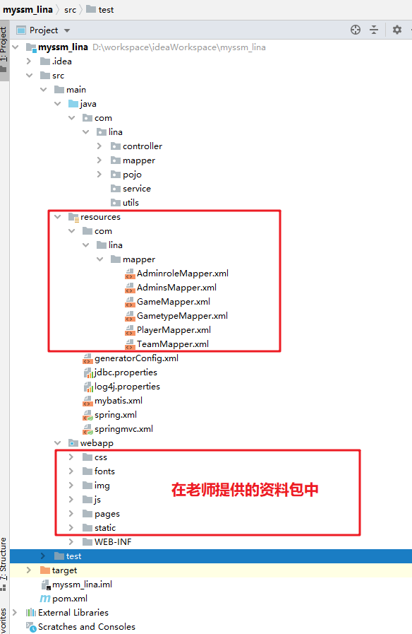

# SSM框架整合

# 1、整合步骤

## 1.1 创建maven项目

创建的细节请参考视频。

## 1.2 pom.xml引入jar依赖

```xml
<packaging>war</packaging>
    <!--SSM整合  spring mybatis mysql等 -->
    <!-- 集中定义依赖版本号 -->
    <properties>
        <spring.version>5.2.13.RELEASE</spring.version>
        <mybatis.version>3.5.6</mybatis.version>
        <mybatis.spring.version>1.3.3</mybatis.spring.version>
        <pagehelper.version>5.1.10</pagehelper.version>
        <mysql.version>8.0.23</mysql.version>
        <druid.version>1.2.3</druid.version>
        <servlet-api.version>4.0.1</servlet-api.version>
        <jackson.version>2.9.6</jackson.version>
        <log4j.version>1.2.17</log4j.version>
        <junit.version>4.12</junit.version>
    </properties>
    <dependencies>
        <!-- spring -->
        <dependency>
            <groupId>org.springframework</groupId>
            <artifactId>spring-webmvc</artifactId>
            <version>${spring.version}</version>
        </dependency>
        <dependency>
            <groupId>org.springframework</groupId>
            <artifactId>spring-tx</artifactId>
            <version>${spring.version}</version>
        </dependency>
        <dependency>
            <groupId>org.springframework</groupId>
            <artifactId>spring-jdbc</artifactId>
            <version>${spring.version}</version>
        </dependency>
        <dependency>
            <groupId>org.springframework</groupId>
            <artifactId>spring-aspects</artifactId>
            <version>${spring.version}</version>
        </dependency>
        <dependency>
            <groupId>commons-fileupload</groupId>
            <artifactId>commons-fileupload</artifactId>
            <version>1.3.1</version>
        </dependency>
        <!-- Mybatis -->
        <dependency>
            <groupId>org.mybatis</groupId>
            <artifactId>mybatis</artifactId>
            <version>${mybatis.version}</version>
        </dependency>
        <dependency>
            <groupId>org.mybatis</groupId>
            <artifactId>mybatis-spring</artifactId>
            <version>${mybatis.spring.version}</version>
        </dependency>
        <!-- 分页插件 -->
        <dependency>
            <groupId>com.github.pagehelper</groupId>
            <artifactId>pagehelper</artifactId>
            <version>${pagehelper.version}</version>
        </dependency>
        <!-- MySql -->
        <dependency>
            <groupId>mysql</groupId>
            <artifactId>mysql-connector-java</artifactId>
            <version>${mysql.version}</version>
        </dependency>
        <!-- 连接池 -->
        <dependency>
            <groupId>com.alibaba</groupId>
            <artifactId>druid</artifactId>
            <version>${druid.version}</version>
        </dependency>
        <!-- servlet -->
        <dependency>
            <groupId>javax.servlet</groupId>
            <artifactId>javax.servlet-api</artifactId>
            <version>${servlet-api.version}</version>
            <scope>provided</scope>
        </dependency>
        <!-- Jackson Json处理工具包 -->
        <dependency>
            <groupId>com.fasterxml.jackson.core</groupId>
            <artifactId>jackson-databind</artifactId>
            <version>${jackson.version}</version>
        </dependency>
        <!-- log4j -->
        <dependency>
            <groupId>log4j</groupId>
            <artifactId>log4j</artifactId>
            <version>${log4j.version}</version>
        </dependency>
        <!-- junit -->
        <dependency>
            <groupId>junit</groupId>
            <artifactId>junit</artifactId>
            <version>${junit.version}</version>
            <scope>test</scope>
        </dependency>
        <dependency>
            <groupId>org.springframework</groupId>
            <artifactId>spring-test</artifactId>
            <version>${spring.version}</version>
        </dependency>
        <!--@Resource注解的依赖-->
        <dependency>
            <groupId>javax.annotation</groupId>
            <artifactId>javax.annotation-api</artifactId>
            <version>1.3.2</version>
        </dependency>
    </dependencies>

    <!-- 插件配置 -->
    <build>
        <resources>
            <resource>
                <directory>src/main/java</directory><!--所在的目录-->
                <includes><!--包括目录下的.properties,.xml 文件都会被扫描到-->
                    <include>**/*.properties</include>
                    <include>**/*.xml</include>
                </includes>
                <filtering>false</filtering>
            </resource>
        </resources>
        <plugins>
            <!-- 设置项目的编译版本 -->
            <plugin>
                <groupId>org.apache.maven.plugins</groupId>
                <artifactId>maven-compiler-plugin</artifactId>
                <configuration>
                    <source>1.8</source>
                    <target>1.8</target>
                    <encoding>UTF-8</encoding>
                </configuration>
            </plugin>
            <!-- 设置tomcat插件 -->
            <plugin>
                <groupId>org.apache.tomcat.maven</groupId>
                <artifactId>tomcat7-maven-plugin</artifactId>
                <version>2.2</version>
                <configuration>
                    <!-- 指定端口 -->
                    <port>8088</port>
                    <!-- 请求路径 -->
                    <path>/</path>
                    <uriEncoding>UTF-8</uriEncoding>
                </configuration>
            </plugin>
            <!--反向生成插件-->
            <plugin>
                <groupId>org.mybatis.generator</groupId>
                <artifactId>mybatis-generator-maven-plugin</artifactId>
                <version>1.3.5</version>
                <configuration>
                    <!--配置文件的路径-->
                    <configurationFile>src/main/resources/generatorConfig.xml</configurationFile>
                    <overwrite>true</overwrite>
                </configuration>
                <dependencies>
                    <dependency>
                        <groupId>org.mybatis.generator</groupId>
                        <artifactId>mybatis-generator-core</artifactId>
                        <version>1.3.5</version>
                    </dependency>
                </dependencies>
                </plugin>
        </plugins>
    </build>
```

## 1.3 编写Mybatis的配置文件

Mybatis的配置文件mybatis.xml

```xml
<?xml version="1.0" encoding="UTF-8" ?>
<!DOCTYPE configuration
        PUBLIC "-//mybatis.org//DTD Config 3.0//EN"
        "http://mybatis.org/dtd/mybatis-3-config.dtd">
<configuration>
    <settings>
        <setting name="logImpl" value="LOG4J" />
    </settings>
    <!--spring 接管其他的工作 数据源  映射文件注册 插件-->
</configuration>
```

日志配置文件文件log4j.properties：

```properties
# Global logging configuration  info  warning  error
log4j.rootLogger=DEBUG,stdout
# Console output...
log4j.appender.stdout=org.apache.log4j.ConsoleAppender
log4j.appender.stdout.layout=org.apache.log4j.PatternLayout
log4j.appender.stdout.layout.ConversionPattern=%5p [%t] - %m%n
```

## 1.4 编写Spring的配置文件spring.xml

连接数据库的参数配置文件jdbc.properties

> 注意案例中使用的数据库版本是MySQL8

```properties
jdbc.driver=com.mysql.cj.jdbc.Driver
jdbc.url=jdbc:mysql://127.0.0.1:3306/myssm_lina?useUnicode=true&characterEncoding=utf-8&useSSL=false&serverTimezone=GMT
jdbc.username=root
jdbc.password=root
```

```xml
<?xml version="1.0" encoding="UTF-8"?>
<beans xmlns="http://www.springframework.org/schema/beans"
       xmlns:xsi="http://www.w3.org/2001/XMLSchema-instance"
       xmlns:context="http://www.springframework.org/schema/context"
       xmlns:tx="http://www.springframework.org/schema/tx"
       xsi:schemaLocation="http://www.springframework.org/schema/beans http://www.springframework.org/schema/beans/spring-beans.xsd
        http://www.springframework.org/schema/context http://www.springframework.org/schema/context/spring-context.xsd
        http://www.springframework.org/schema/tx http://www.springframework.org/schema/tx/spring-tx.xsd
        ">

    <!-- 扫描包 -->
    <context:component-scan base-package="com.lina.mapper,com.lina.service"></context:component-scan>

    <!-- spring 整合mybatis部分 -->
    <context:property-placeholder location="classpath*:jdbc.properties"/>
    <bean id="dataSource" 	class="com.alibaba.druid.pool.DruidDataSource">
        <!--可以根据url自动检查出驱动-->
        <property name="driverClassName" value="${jdbc.driver}"></property>
        <property name="url" value="${jdbc.url}"></property>
        <property name="username" value="${jdbc.username}"></property>
        <property name="password" value="${jdbc.password}"></property>
    </bean>
    <bean id="sqlSessionFactory" class="org.mybatis.spring.SqlSessionFactoryBean">
        <!-- 如果有的话，在这里加载mybatis的配置文件-->
        <property name="configLocation" value="classpath*:mybatis.xml"></property>
        <property name="dataSource" ref="dataSource"></property>
        <!-- 配置类型别名 -->
        <property name="typeAliasesPackage" value="com.lina.pojo"></property>
        <!-- 映射文件扫描 -->
       <property name="mapperLocations" value="classpath:com/lina/mapper/*.xml"></property>
        <!-- 插件 -->
        <property name="plugins">
            <array>
                <bean class="com.github.pagehelper.PageInterceptor">
                    <property name="properties">
                        <value>
                            reasonable=true
                        </value>
                    </property>
                </bean>
            </array>
        </property>
    </bean>
    <!-- 映射mybatis的目录 -->
    <!--Mapper接口所在的包名 spring自动查询指定 包下的mapper
	有了MapperScannerConfigurer就不需要我们去为每个映射接口去声明一个bean了。大大缩减了开发的效率。-->
    <bean id="mapperScannerConfigurer" class="org.mybatis.spring.mapper.MapperScannerConfigurer">
        <property name="sqlSessionFactoryBeanName" value="sqlSessionFactory"/>
        <property name="basePackage" value="com.lina.mapper"></property>
    </bean>

    <!-- 通过注解方式实现事务 -->
    <tx:annotation-driven transaction-manager="transactionManager"/>
    <bean id="transactionManager" class="org.springframework.jdbc.datasource.DataSourceTransactionManager">
        <property name="dataSource" ref="dataSource"></property>
    </bean>

</beans>
```

## 1.5 编写SpringMVC的配置文件springmvc.xml

```xml
<?xml version="1.0" encoding="UTF-8"?>
<beans xmlns="http://www.springframework.org/schema/beans"
       xmlns:xsi="http://www.w3.org/2001/XMLSchema-instance"
       xmlns:context="http://www.springframework.org/schema/context"
       xmlns:mvc="http://www.springframework.org/schema/mvc"
       xsi:schemaLocation="http://www.springframework.org/schema/beans http://www.springframework.org/schema/beans/spring-beans.xsd
        http://www.springframework.org/schema/context http://www.springframework.org/schema/context/spring-context.xsd
        http://www.springframework.org/schema/mvc http://www.springframework.org/schema/mvc/spring-mvc.xsd
        ">
    <!--springmvc的配置文件:控制器的bean对象都在这里扫描-->
    <context:component-scan base-package="com.lina.controller"/>
    <mvc:annotation-driven/>
    <!--视图解析器-->
    <bean id="internalResourceViewResolver" class="org.springframework.web.servlet.view.InternalResourceViewResolver">
        <property name="prefix" value="/pages/"/>
        <property name="suffix" value=".html"/>
    </bean>
    <!--静态资源处理-->
    <mvc:resources mapping="/img/**" location="/img/"/>
    <mvc:resources mapping="/js/**" location="/js/"/>
    <mvc:resources mapping="/css/**" location="/css/"/>
    <mvc:resources mapping="/fonts/**" location="/fonts/"/>
    <mvc:resources mapping="/static/**" location="/static/"/>
    <mvc:resources mapping="/pages/**" location="/pages/"/>

    <!--文件上传-->
    <bean id="multipartResolver" class="org.springframework.web.multipart.commons.CommonsMultipartResolver">
    </bean>
</beans>
```

## 1.6 导入老师提供的静态资源到webapp文件下


## 1.7 编写web.xml配置文件

```xml
<?xml version="1.0" encoding="UTF-8"?>
<web-app xmlns="http://xmlns.jcp.org/xml/ns/javaee"
         xmlns:xsi="http://www.w3.org/2001/XMLSchema-instance"
         xsi:schemaLocation="http://xmlns.jcp.org/xml/ns/javaee http://xmlns.jcp.org/xml/ns/javaee/web-app_4_0.xsd"
         version="4.0">    
    <welcome-file-list>
        <welcome-file>/pages/index.html</welcome-file>
    </welcome-file-list>

    <!--spring的配置-->
    <context-param>
        <!--contextConfigLocation：表示用于加载 Bean的配置文件
			classpath和classpath*区别：
                classpath：只会到你的class路径中查找找文件。
                classpath*：不仅包含class路径，还包括jar文件中（class路径）进行查找。
		-->
        <param-name>contextConfigLocation</param-name>
        <param-value>classpath*:spring.xml</param-value>
    </context-param>
    <listener>
        <listener-class>org.springframework.web.context.ContextLoaderListener</listener-class>
    </listener>
    <!--SpringMVC的配置-->
    <servlet>
        <servlet-name>dispatcherServlet</servlet-name>
        <servlet-class>org.springframework.web.servlet.DispatcherServlet</servlet-class>
        <!-- 创建前端控制器的时候读取springmvc配置文件启动ioc容器 -->
        <init-param>
            <param-name>contextConfigLocation</param-name>
            <param-value>classpath*:springmvc.xml</param-value>
        </init-param>
        <!-- Tomcat启动就创建此对象 -->
        <load-on-startup>1</load-on-startup>
    </servlet>
    <!-- 配置拦截路径url，所有请求都会被前端控制器拦截处理 -->
    <servlet-mapping>
        <servlet-name>dispatcherServlet</servlet-name>
        <url-pattern>/</url-pattern>
    </servlet-mapping>

    <!-- 使用Rest风格的URI 将页面普通的post请求转为指定的delete或者put请求
原理：在Ajax中发送post请求后，带_method参数，将其修改为PUT，或者DELETE请求-->
    <filter>
        <filter-name>httpMethodFilter</filter-name>
        <filter-class>
            org.springframework.web.filter.HiddenHttpMethodFilter
        </filter-class>
    </filter>
    <filter-mapping>
        <filter-name>httpMethodFilter</filter-name>
        <url-pattern>/*</url-pattern>
    </filter-mapping>

    <!--注册字符集过滤器：post请求中文乱码问题的解决方案-->
    <filter>
        <filter-name>characterEncodingFilter</filter-name>
        <filter-class>org.springframework.web.filter.CharacterEncodingFilter</filter-class>
        <!--指定字符集-->
        <init-param>
            <param-name>encoding</param-name>
            <param-value>UTF-8</param-value>
        </init-param>
        <!--强制request使用字符集encoding-->
        <init-param>
            <param-name>forceRequestEncoding</param-name>
            <param-value>true</param-value>
        </init-param>
        <!--强制response使用字符集encoding-->
        <init-param>
            <param-name>forceResponseEncoding</param-name>
            <param-value>true</param-value>
        </init-param>
    </filter>
    <filter-mapping>
        <filter-name>characterEncodingFilter</filter-name>
        <url-pattern>/*</url-pattern>
    </filter-mapping>
</web-app>
```

## 1.7 测试

启动项目，浏览器访问http://localhost:8088/。看到如图所示页面表示项目整合成功。


# 2、使用mybatis反向生成实体类、dao和映射文件

## 2.1 反向生成配置文件generatorConfig.xml

```xml
<?xml version="1.0" encoding="UTF-8"?>
<!DOCTYPE generatorConfiguration
        PUBLIC "-//mybatis.org//DTD MyBatis Generator Configuration 1.0//EN"
        "http://mybatis.org/dtd/mybatis-generator-config_1_0.dtd">

<!-- 配置生成器:所有标有序号的内容都需要修改为自己的内容或者路径 -->
<generatorConfiguration>
    <!--1、数据库驱动jar:添加自己的jar路径 -->
    <classPathEntry
            location="D:\repository\mysql\mysql-connector-java\8.0.23\mysql-connector-java-8.0.23.jar" />

    <context id="MyBatis" targetRuntime="MyBatis3">

        <!--去除注释 -->
        <commentGenerator>
            <property name="suppressAllComments" value="true" />
        </commentGenerator>

        <!--2、数据库连接 -->
        <jdbcConnection driverClass="com.mysql.cj.jdbc.Driver"
                        connectionURL="jdbc:mysql://127.0.0.1:3306/myssm_lina?useUnicode=true&amp;characterEncoding=utf-8&amp;useSSL=false&amp;serverTimezone=GMT"
                        userId="root"
                        password="root">
        </jdbcConnection>

        <!-- 默认false，把JDBC DECIMAL 和 NUMERIC 类型解析为 Integer;
        为 true时把JDBC DECIMAL和NUMERIC类型解析为java.math.BigDecimal -->
        <javaTypeResolver>
            <property name="forceBigDecimals" value="false" />
        </javaTypeResolver>

        <!--3、生成实体类 指定包名 以及生成的地址 （可以自定义地址，但是路径不存在不会自动创建
        使用Maven生成在target目录下，会自动创建） -->
        <javaModelGenerator targetPackage="com.lina.pojo"
                            targetProject="src\main\java">
            <property name="trimStrings" value="true" />
        </javaModelGenerator>

        <!--4、生成SQLmapper.xml文件 -->
        <sqlMapGenerator targetPackage="com.lina.mapper"
                         targetProject="src\main\resources">
        </sqlMapGenerator>
        <!--5、生成Dao（Mapper）文件,生成接口 -->
        <javaClientGenerator type="XMLMAPPER"
                             targetPackage="com.lina.mapper"
                             targetProject="src\main\java">
        </javaClientGenerator>
        <!--6、要生成哪些表(更改tableName和domainObjectName就可以) -->
        <!-- tableName:要生成的表名
        enableCountByExample:Count语句中加入where条件查询，默认为true开启
        enableUpdateByExample:Update语句中加入where条件查询，默认为true开启
        enableDeleteByExample:Delete语句中加入where条件查询，默认为true开启
        enableSelectByExample:Select多条语句中加入where条件查询，默认为true开启
        selectByExampleQueryId:Select单个对象语句中加入where条件查询，默认为true开启
        -->
        <table tableName="Team">
            <property name="useActualColumnNames" value="true"/>
        </table>
        <table tableName="Player">
            <property name="useActualColumnNames" value="true"/>
        </table>
        <table tableName="game">
            <property name="useActualColumnNames" value="true"/>
        </table>
        <table tableName="GameType">
            <property name="useActualColumnNames" value="true"/>
        </table>
        <table tableName="Admins">
            <property name="useActualColumnNames" value="true"/>
        </table>
        <table tableName="AdminRole">
            <property name="useActualColumnNames" value="true"/>
        </table>
    </context>
</generatorConfiguration>
```

## 2.2运行插件

注意只能运行一次,运行完毕显示**BUILD SUCCESS**即为成功。


### 2.3 测试

```java
package com.lina.test;

import com.lina.mapper.TeamMapper;
import com.lina.pojo.Team;
import org.junit.Test;
import org.junit.runner.RunWith;
import org.springframework.test.context.ContextConfiguration;
import org.springframework.test.context.junit4.SpringJUnit4ClassRunner;

import javax.annotation.Resource;

/**
 * ClassName: TestMapper
 * 测试类
 * @author wanglina
 * @version 1.0
 */
@RunWith(SpringJUnit4ClassRunner.class)
@ContextConfiguration(locations = {"classpath:spring.xml"})
public class TestMapper {
    @Resource
    private TeamMapper teamMapper;
    @Test
    public void test01(){
        Team team = teamMapper.selectByPrimaryKey(1001);
        System.out.println(team);
    }
}

```

## 2.4 生成完毕之后的目录结构



# 3、综合案例

视频中实现了Team表的增删改查，具体步骤参考视频。

