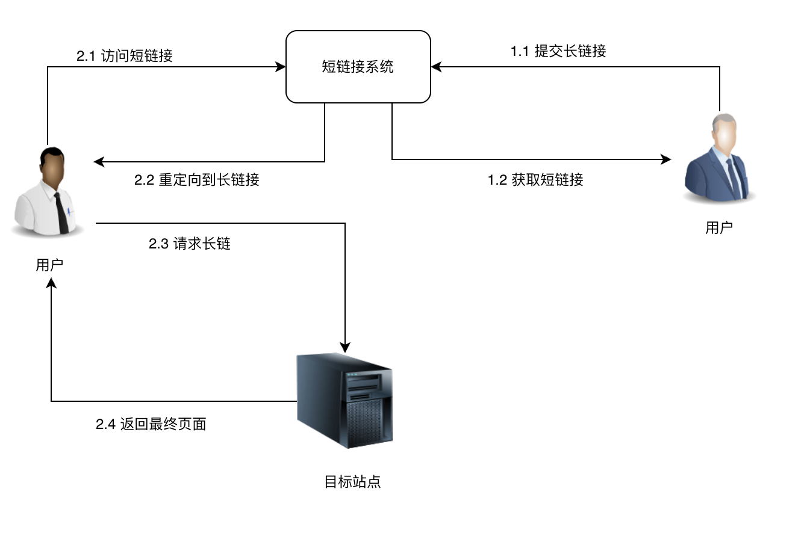

# 第1章 准备工作

## 1.1 课程介绍

### 讲师介绍

- 花名：乔峰

- 职位：技术专家

- 多家一线互联网公司（百度/快手 等）后台研发和架构经验

- 曾带领团队落地百万源码级复杂业务系统模块化，服务化，平台化
- 拥有丰富的带人经验和教学经验，对人才识别和人才培养都有多年的积累


### 什么是短链接系统？

链接系统是一种将长网址转换为短网址的服务，旨在缩短URL并提供更友好的链接形式。长网址可能包含大量字符，不方便分享、输入或记忆，而短链接则将长网址映射到短字符串，使得链接更加简洁和易于使用。



短链接系统的主要优势和应用包括：

1. **便捷分享：** 短链接更短、更易分享，适用于社交媒体、短信、邮件等场景，提供更美观的外观。
2. **提高用户体验：** 短链接可以简化用户输入，减少用户访问链接时的操作，提升用户体验。
4. **推广和营销：** 短链接可以用于推广和营销活动，跟踪广告点击和转化率，帮助优化营销策略。


### 为什么要开着门课？

- 短链接系统在互联网使用非常广泛
- 短链接系统业务逻辑简单，但是可以涉及到很复杂的技术（例如 缓存，异地多活，分库分表）
- 设计一个短链接系统，是国内外很多互联网公司的高频面试题（例如google，Facebook，字节跳动，快手，阿里）


### 课程思路？

- 第一章做好准备工作
- 第二章做系统分析和设计
- 第三章做代码实现
- 第四章讨论系统优化方案


### 课程所使用的技术栈？

- Java17
- springboot3
- jpa
- mysql
- guava
- Junit5
- lombok


### 你能学到什么？

- 掌握短链接系统 系统分析 -> 系统设计 -> 代码实现 -> 系统优化 整个过程的细节
- 掌握系统设计的方法论，从容应对面试以及工作中的设计问题
- 掌握springboot3/jpa/junit5/guava等框架和技术的使用


## 1.2 搭建springboot应用

### 使用阿里云maven仓库

```XML
<repositories>
    <repository>
        <id>nexus-aliyun</id>
        <name>Nexus aliyun</name>
        <url>http://maven.aliyun.com/nexus/content/groups/public</url>
    </repository>
</repositories>
```

### 继承spring boot parent项目

```xml
<parent>
    <groupId>org.springframework.boot</groupId>
    <artifactId>spring-boot-starter-parent</artifactId>
    <version>3.1.0</version>
</parent>
```

### 引入spring boot maven插件

```xml
<build>
    <plugins>
        <plugin>
            <groupId>org.springframework.boot</groupId>
            <artifactId>spring-boot-maven-plugin</artifactId>
        </plugin>
    </plugins>
</build>
```

### 引入spring boot提供的starter

```xml
<dependency>
    <groupId>org.springframework.boot</groupId>
    <artifactId>spring-boot-starter-web</artifactId>
</dependency>

<dependency>
    <groupId>org.springframework.boot</groupId>
    <artifactId>spring-boot-starter-test</artifactId>
    <scope>test</scope>
</dependency>
```

### 引入lombok插件

```xml
<dependency>
    <groupId>org.projectlombok</groupId>
    <artifactId>lombok</artifactId>
    <optional>true</optional>
</dependency>
```

### 增加配置文件application.properties

```properties
spring.application.name=shorten-service
server.port=8888
```

## 1.3 引入orm框架JPA

```xml
<dependency>
    <groupId>org.springframework.boot</groupId>
    <artifactId>spring-boot-starter-data-jpa</artifactId>
</dependency>
```

```xml
<dependency>
    <groupId>com.h2database</groupId>
    <artifactId>h2</artifactId>
    <scope>runtime</scope>
</dependency>
```


## 1.4 连接mysql数据库

```xml
 <dependency>
            <groupId>mysql</groupId>
            <artifactId>mysql-connector-java</artifactId>
            <version>8.0.30</version>
</dependency>
```


```properties
spring.jpa.hibernate.ddl-auto=create-drop
spring.jpa.properties.hibernate.show_sql=true
spring.jpa.properties.hibernate.format_sql=true


spring.datasource.url:jdbc:mysql://localhost:3306/shorten-service?characterEncoding=utf-8&serverTimezone=Asia/Shanghai
spring.datasource.username: root
spring.datasource.password:
spring.datasource.driver-class-name: com.mysql.cj.jdbc.Driver
```


## 1.5 自定义RESTful结果封装类

```Java
public class ResponseResult<T> {
    private String code;
    private String msg;
    private T data;
 }
```