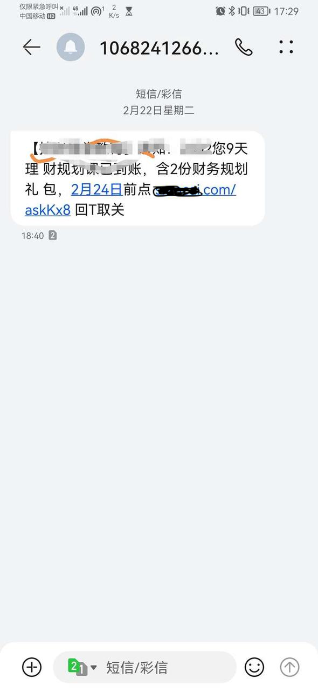

## 2.1场景分析



http://t.cn/A6pVOyxv


### 功能：

* https://www.baidu.com  -> t.cn/abcdef
* 访问的时候，做重定向（301 or 302） 用302方便统计


### 非功能（qps/数据量/接口延迟）：

需要问一下面试官，日活，假设是微博，1亿（100M）


推算写qps：假设每个用户平均一天发0.1个带链接的微博

平均写qps：100M*0.1/86400 约等于 100+

峰值写qps：100*2 大概 200+


推算读qps：假设每个用户平均每天点击一个链接

平均读qps：100M*1/86400 约等于 1k+

峰值：2k+


推算数据量：

100M*0.1 约等于 10M

预估一下每条链接占用100Byte， 10M*100Byte，大概 1G

假设1T硬盘，可以用三年左右


## 2.2服务设计

一个服务就够了


#### 函数（rpc接口）设计

shortKey  encode（longUrl）

longUrl  decode（shortUrl）


#### http接口

POST /shorten

入参：longUrl

出参：shortKey


GET /{shortKey}

返回：

- 正常：状态码302，location:longUrl
- 异常：返回一个降级页面，告诉用户这个短链接不存在


## 2.3实现细节分析

核心算法：如何将longUrl 转换成 shortKey，不同longUrl不能用同一个key？


#### md5（还有其它的hash算法）摘要算法

优点：效率高

缺点：长度比较长，如果截取一部分，但是不能解决冲突的问题


#### 随机数

```Java
while(true) {
    var shortKey = random(longUrl);
    if(dao.notExists(shortKey)) {
        save();
        return;
    }
}
```

优点：实现简单

缺点：数据越多，就越慢。


#### 雪花算法

优点：效率高

缺点：长度比较长，如果截取一部分，但是不能解决冲突的问题；时钟回拨问题不好解决。


#### id自增+base62

> Base62编码是一种将数字、字母大小写都包含的字符串表示形式。它使用了62个字符，分别是0-9、a-z、A-Z，可以作为URL短链接、文件名等场景的字符串表示，相对于16进制或64进制等其他编码，Base62具有更高的可读性和稳定性。
>
> Base62编码的主要应用场景有：
>
> - URL短链接：Base62编码可以将长URL转换为短字符串，提高URL传送效率。
> - 文件命名：Base62编码可以将文件名转换为短字符串，减少文件名——路径的长度，更加有利于文件存储和管理。
> - 防止猜测：Base62编码可以将其他编码方式的数据进行混淆，从而达到一定的防猜测的效果。

5位：62^5=0～9+亿

6位：62^6=0~560+亿

7位：62^7=0～35000+亿

优点：效率高

缺点：依赖自增id；自增id容易被遍历。


## 2.4存储设计

选型-> 设计结构


### 方案一：mysql

| 字段          | 类型          | 备注 |
| ------------- | ------------- | ---- |
| Id            | Int           | 主键 |
| long_url      | varchar(2048) |      |
| creation_time | timestamp     |      |
| expire_time   | timestamp     |      |

uniq：long_url

Index: expire_time


### 方案二：redis

shortKey -> longUrl

longUrl -> shortKey


## 2.5系统设计方法论总结

### 场景分析

功能需求：

一般面试中要多询问面试官，或者自己假设后跟面试官确认

如果是工作中多跟业务方交流


非功能：

一般分析系统的qps，如果没有直接的数据就只能推算，比如通过日活+我们的经验或者行业的经验

- 1k～2k，mysql/pg关系型数据库能顶住

- 10k～50k，hbase/cassadra

- 100k，redis/memcached

- 更高，分布式方案


qps看具体接口，具体场景，需要理解业务

如果是娱乐，社交，一般qps比较高

电商一般是在做活动的时候qps比较高（双十一淘宝2020下单qps大概40w，平时的话几k不到1w）

其它的例如金融，平时没有多少qps


qps峰值更重要


### 服务设计

微服架构的优势：

- 不同业务独立管理，独立演进，独立缩容扩容
- 技术异构
- 系统解耦
- 迭代和部署快
- 故障隔离，资源隔离


### 存储设计

先做技术选型

然后设计数据结构（表结构或者kv结构 等），索引 等，考虑高效写入和查询


### 系统优化

性能

扩展性


