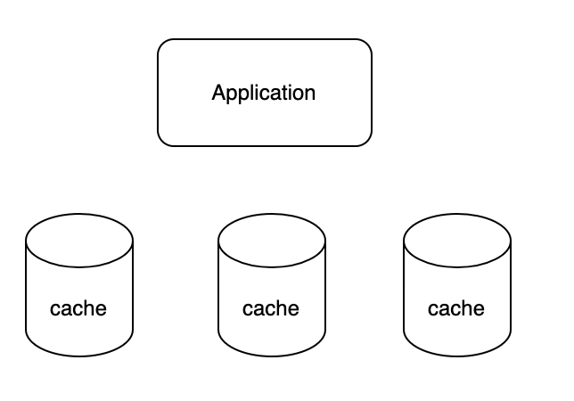
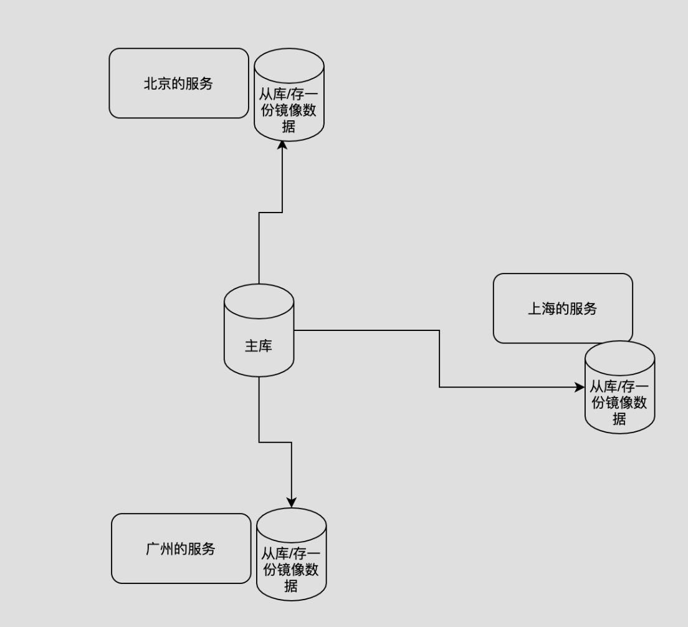
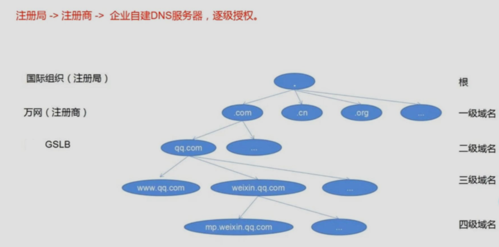

## 4.1 系统提速方案一：引入缓存 

> 缓存是一种将数据临时存储在更快速、更易于访问的位置，以便在将来的访问中能够更快地检索数据的技术或策略。缓存在计算机系统和应用程序中被广泛使用，旨在提高系统的性能、响应速度和资源利用率。它可以减少对慢速数据源（如磁盘、网络）的频繁访问，从而加速数据的读取和处理。
>
> 缓存的工作原理类似于人们在日常生活中使用的记忆方法，如将常用的物品放在容易取用的地方，以便快速找到和使用。在计算机系统中，缓存可以是硬件缓存（如处理器缓存）或软件缓存（如应用程序中的缓存层）。
>
> 
>
> 缓存的使用有助于解决以下问题：
>
> - 高并发访问： 在高并发情况下，数据源可能会受到过大的负载，通过缓存可以减轻数据源的压力，提高系统的性能和响应速度。
> - 频繁访问： 对于频繁被访问的数据，通过缓存可以减少重复的数据读取，提高效率。
> - 数据计算： 对于一些需要复杂计算的数据，将计算结果缓存起来可以节省计算时间和资源。
> - 数据共享： 缓存可以在不同的组件、模块或服务之间共享数据，提高数据的可用性和共享性。
> - 离线访问： 缓存可以在断网或无法连接数据源的情况下，仍然提供某些数据的访问能力。

**短链接是读多写少的场景，访问DB需要经过网络IO和磁盘IO，开销比较大**

**其实不需要每次查数据库，可以引入缓存，例如 localcache/redis/memched**

Application ------> DB

Application -> cache --------> DB


## 4.2 分布式缓存 vs 本地缓存

**分布式缓存：**



1. **概念：** 分布式缓存是一种将缓存数据分布在多个服务器节点上的缓存系统，用于存储和管理大量的数据。

2. **优点：**

   - **可扩展性：** 分布式缓存可以通过增加节点来实现水平扩展，以应对大规模的数据和高并发访问。
   - **高可用性：** 分布式缓存通常采用复制和备份机制，确保即使有节点故障，仍然能够提供可靠的缓存服务。
   - **跨节点共享：** 多个应用实例可以共享同一分布式缓存，提高数据共享和协作能力。
   - **灵活的存储后端：** 分布式缓存可以支持多种后端存储，如内存、磁盘、数据库等。

3. **缺点：**

   - **复杂性：** 部署、配置和管理分布式缓存系统可能较为复杂，需要考虑分布式系统的一些挑战，如一致性、网络延迟等。
   - **性能开销：** 分布式缓存通常需要在网络上进行数据传输，可能引入一些性能开销。

   

**本地缓存：**


1. **概念：** 本地缓存是将缓存数据存储在应用程序的本地内存中，用于临时保存常用的数据。

2. **优点：**

   - **简单性：** 本地缓存相对较简单，不需要搭建额外的分布式缓存系统。
   - **低延迟：** 由于数据存储在本地内存中，本地缓存通常具有低延迟的读取速度。
   - **少量数据：** 本地缓存适用于存储相对较小的数据量，不需要进行分布式存储和管理。

3. **缺点：**

   - **有限的扩展性：** 本地缓存只能在单个应用实例内使用，无法满足多实例和分布式应用的需求。
   - **数据一致性：** 不同应用实例的本地缓存可能存在数据不一致的问题，需要额外的机制来解决。

   

**应用场景：**

- 如果应用需要存储大量数据，需要水平扩展以支持高并发访问，那么分布式缓存是更合适的选择，如Redis、Memcached等。
- 如果应用需要快速读取热点的数据，对数据一致性要求不高，而对性能要求高，可以考虑使用本地缓存，如Guava Cache、Ehcache等。


## 4.3 高性能本地缓存guava cache介绍

Guava Cache是Google Guava库中的一个组件，用于提供本地内存缓存的功能。Guava Cache旨在帮助开发人员在应用程序中实现简单且高效的本地缓存，以加速数据的读取和处理。它适用于那些需要快速访问、频繁读取的数据，如配置信息、计算结果等。

以下是Guava Cache的一些特点和功能：

1. **自动加载和刷新：** Guava Cache支持自动加载缓存项，当缓存中没有某个键对应的值时，可以提供加载函数来生成该值。此外，它还支持定期刷新缓存项，以确保缓存中的数据保持最新。
2. **缓存回收策略：** Guava Cache支持多种缓存回收策略，包括基于大小（元素个数）、权重（元素大小）、时间（过期时间）等。开发人员可以根据需求选择合适的回收策略，以控制缓存的大小和内存占用。
3. **并发支持：** Guava Cache内部使用了并发数据结构，因此它在多线程环境下能够高效地处理并发访问，提供线程安全的缓存操作。
4. **统计信息和监控：** Guava Cache提供了统计信息，可以了解缓存的命中率、命中次数、未命中次数等。这有助于开发人员监控和优化缓存的使用情况。
5. **可配置性：** Guava Cache提供了丰富的配置选项，可以根据具体需求进行配置，如缓存的最大大小、过期时间、回收策略等。

下面是一个使用Guava Cache的简单示例：

```java
import com.google.common.cache.Cache;
import com.google.common.cache.CacheBuilder;

public class GuavaCacheExample {
    public static void main(String[] args) {
        Cache<String, String> cache = CacheBuilder.newBuilder()
                .maximumSize(100) // 设置最大缓存大小
                .build();

        // 将数据放入缓存
        cache.put("key1", "value1");

        // 从缓存中读取数据
        String value = cache.getIfPresent("key1");
        System.out.println("Value: " + value); // 输出: Value: value1
    }
}
```


```xml
<dependency>
            <groupId>com.google.guava</groupId>
            <artifactId>guava</artifactId>
            <version>30.1.1-jre</version>
</dependency>
```


## 4.4 guava cache实战

参考项目源码


## 4.5 系统提速方案二：异地多活 

异地多活（Geographical Redundancy or Geo-Redundancy）是一种架构和部署策略，旨在在不同地理位置（地区、城市、国家等）之间建立多个数据中心或服务副本，以提供高可用性、容灾备份和更好的性能。

异地多活的主要思想是将系统的关键组件、数据和服务分布在不同的地理位置上，以防止单一地点的故障对整个系统的影响。这种架构可以在各种应用和服务中应用，包括网络服务、分布式应用、数据库系统等。

异地多活的优势和特点包括：

1. **高可用性：** 异地多活架构可以在一个地理区域的数据中心发生故障时，自动切换到另一个地理区域的数据中心，从而保证系统的持续可用性。
2. **容灾备份：** 数据在多个地理位置上备份，即使一个数据中心发生灾难性故障，数据仍然可以从其他地方恢复。
3. **降低延迟：** 用户可以从距离更近的数据中心获取数据，从而降低数据传输的延迟，提供更好的性能和用户体验。
4. **法规和合规要求：** 某些法规和合规要求可能需要数据在特定地理位置存储和处理，异地多活可以满足这些要求。
5. **全球分布：** 对于全球用户的应用，异地多活可以使数据和服务更接近用户，提供更快速的访问速度。

在实施异地多活时，需要考虑以下方面：

- **数据同步：** 数据在多个地理位置上需要保持同步，以确保一致性和可用性。常用的方法包括同步数据库、使用分布式存储系统，或者使用专门的数据同步工具。
- **负载均衡：** 需要实现跨多个地理位置的负载均衡，确保流量分配均匀，避免单一地点过载。
- **故障切换：** 当一个地理位置的数据中心发生故障时，需要有自动化的故障切换机制，将流量切换到备用地理位置。
- **数据隔离和安全性：** 需要考虑数据在多个地理位置之间的隔离和安全性，确保敏感数据不被未授权访问。
- **成本和复杂性：** 异地多活涉及多个数据中心和资源，可能会增加成本和复杂性。需要权衡利弊，根据实际需求进行规划。




负载均衡的问题？流量入口不一样怎么处理？全局负载均衡（GSLB），大厂做的

> **Global Server Load Balancing**
>
> **中文:全局负载均衡**
>
> **SLB(Server load balancing)**是对集群内物理主机的负载均衡，而**GSLB**是对物理集群的负载均衡。
>
> 这里的负载均衡可能不只是简单的流量均匀分配,而是会根据策略的不同实现不同场景的应用交付。
>
> **GSLB**是依赖于用户和实际部署环境的互联网资源分发技术，不同的目的对应着一系列不同的技术实现。




## 4.6系统扩展方案：分库分表分析与设计 

假如用mysql，可能一开始估算不对，或者业务发展太快，怎么办？

> 分库分表是一种数据库架构设计方法，用于解决大规模数据存储和处理的问题。它将一个大型数据库拆分成多个小型数据库（分库），同时将每个小型数据库中的数据表进一步拆分成多个子表（分表），从而实现数据的水平分割和分布式存储。
>
> 分库分表的主要目标是提高数据库的性能、可扩展性和负载均衡能力，以应对大量数据和高并发访问的情况。这种架构在互联网应用、大数据应用和分布式系统中广泛应用。
>
> 
>
> **分库分表的作用：**
>
> 1. **提高性能：** 将数据分散到多个小型数据库中，每个数据库只处理部分数据，可以提高查询和写入操作的性能。
> 2. **可扩展性：** 当数据量增大时，可以通过添加新的数据库节点和表来实现水平扩展，无需对整个数据库进行升级或迁移。
> 3. **负载均衡：** 分库分表可以将负载分摊到不同的数据库和表中，避免单一数据库成为瓶颈。
>
> 
>
> **分库分表的挑战和注意事项：**
>
> 1. **数据一致性：** 分库分表会引入数据一致性的问题，需要通过一些机制来保证数据的一致性，如分布式事务。
> 2. **跨库查询：** 跨库查询可能会变得复杂，需要考虑如何处理分布在不同数据库和表中的数据。
> 3. **业务拆分：** 需要合理划分数据库和表的边界，根据业务需求进行拆分，避免出现过于复杂的关联查询。
> 4. **分表键选择：** 选择合适的分表键可以避免数据倾斜和不均匀的问题。


分库分表一般需要根据查询的维度来做，选取合理的shardingKey。

##### 如何选取shardingKey？

- 用id或者shortKey？查询接口很容易实现，实现写接口的时候，只能遍历查询是否有重复数据

- 用longUrl？写接口很容易实现，但是查询的时候只能遍历

- 存两份数据？数据是一样的，分库的规则不同；理论上是可以，但是存储成本比较大，还有数据同步比较麻烦。


##### 基因法

- shardingKey  = hash(longUrl) % 62 ; //也可以模其它的，62^n 就不会浪费

- shortKey =  shardingKey + shortKey; // a + 000001 = a000001

做路由的时候，如果是longUrl参数查询，就hash取模做路由；

如果是shortKey参数的查询，取第一位做路由。


基因法的优缺点：

优点：不需要增加太多存储，也不需要考虑数据一致性问题

缺点：62不够用（拼两位也就是62^2=3844）


## 4.7 作业

- 处理本地缓存的过期时间，避免过期还被访问的情况
- 尝试引入分布式缓存，存放shortKey和longUrl的映射关系